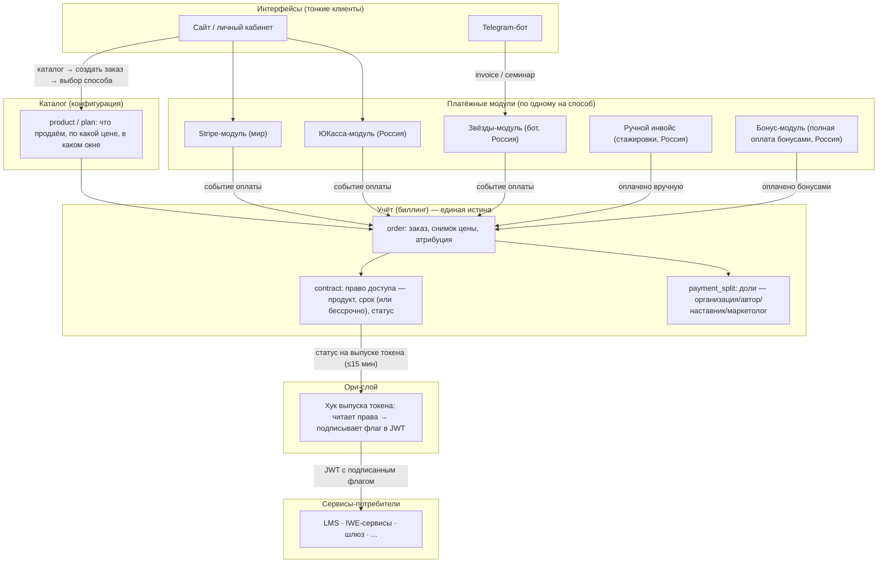

# Архитектура системы оплат и продуктов: мир + Россия

---

## 0. Ключевые идеи (для быстрой ориентации)

Прежде чем читать детали — шесть идей, на которых стоит вся архитектура.

1. **Право доступа шире подписки.** Одна и та же модель описывает не только «кто подписчик», а «кто на что имеет право». Подписка, семинар, запись, участие в группе с наставником, доступ к сообществу — всё это один и тот же вид записи (договор: кто, на что, до какого срока или бессрочно), а не разные механизмы для каждого продукта. ⚠️ *(ревью 10.07, Андрей: как это технически проверяется на стороне сервиса-потребителя, если решение П3 — один флаг в JWT? См. Д10, §11 — вопрос открыт, блокирует §4 и Ф3 ArchGate.)*
2. **Каталог продуктов — это данные, а не код.** Появление нового продукта (ещё один семинар, ещё один тариф, сниженная цена за раннее бронирование, пакет из нескольких семинаров) — это новые строки в справочных таблицах. Три уровня: *продукт* (что продаём) → *тариф* (по какой цене и на каких условиях) → *заказ* (что конкретно купил конкретный человек).
3. **Рассрочка — это график, а не отдельный механизм.** Разовый платёж, подписка с автопродлением и рассрочка отличаются только тем, сколько раз и когда должно пройти списание. Один и тот же планировщик двигает и автопродления подписок, и взносы рассрочки.
4. **Каждый платёж сразу делится на доли.** В момент оплаты система считает, кому какая часть денег причитается: организации, автору, наставнику, партнёру по привлечению. Это собственный лёгкий учёт долей (не через платёжного провайдера), который сразу даёт понимание прибыльности каждого продукта.
5. **Бонус — это скидка, а не отдельные деньги.** Оплата бонусами уменьшает сумму, которую нужно провести через платёжную систему; чек пробивается на фактически уплаченную сумму. Бонус уменьшает бюджет, который потом делится на доли, — то есть скидка ложится на всех участников пропорционально, а не только на организацию.
6. **Мир и Россия разделены по составу продуктов, не только по деньгам.** Пока в мире нет англоязычных наставников — некому вести живые семинары, группы и мастерские на английском, — мировой контур продаёт только подписки. Вся линейка новых продуктов (семинары, группы с наставником, записи, сообщество, мастерские, стажировки, донаты, бонусы) — только в российском контуре. Когда появятся англоязычные наставники, это решение можно пересмотреть отдельной задачей.

---

## 1. Зачем этот документ

Сегодня оплата и подписки живут внутри монолита LMS: он принимает вебхуки провайдеров, ведёт автосписания, хранит «кто подписчик» и сам решает, кому дать доступ. Каждый новый потребитель (бот, сайт, IWE-сервисы) вынужден либо ходить в LMS за статусом, либо заводить собственный учёт — уже сейчас прав доступа три параллельных бухгалтерии.

Первая версия документа (05-07.07.2026) описывала архитектуру для подписок. Эта версия расширяет её до общей модели: подписки, разовые семинары, пакеты семинаров, группы с наставником, записи прошедших мероприятий, доступ к сообществу, мастерские, стажировки, донаты — и всё это с возможностью частичной или полной оплаты бонусами, с прозрачным распределением каждого платежа на доли (автор/наставник/маркетолог/организация) для расчёта прибыльности каждого продукта.

Документ фиксирует: (§2) принципы, согласованные 05.07 и расширенные 07.07; (§3) модель продуктов и каталог как конфигурацию; (§4) целевую архитектуру (схема); (§5) что уже построено; (§6) деньги — доли и юнит-экономику; (§7) бонусы; (§8) как каждый тип продукта ложится на модель; (§9) операционный контур (то, без чего система не заработает); (§10) состав сервисов по контурам; (§11) архитектурные решения Д1-Д9; (§12) план реализации; (§13) что сознательно вне охвата; (§14) открытые вопросы к специалистам.

**Рамка от владельца (Церен, 07.07):** мир и Россия должны быть полностью разделены между собой — и по деньгам, и по составу продуктов. Общими могут быть идеи, концепции и схемы — реализации могут отличаться. Stripe на Россию не работает и уходит миру. Paybox и Ecwid мертвы и в целевую архитектуру не входят. Бот остаётся на Россию. Мир пока продаёт только подписки — потому что нет англоязычных наставников для остальных продуктов.

---

## 2. Основные принципы

**П1. Сервисы платежей — отдельные заменяемые модули.** На каждый способ оплаты — свой модуль: Stripe (мир), ЮКасса (Россия), звёзды Telegram, ручной инвойс (стажировки), бонусы (полная оплата без провайдера). У каждого свой процесс получения денег, свои вебхуки, свои секреты. Модуль можно добавить или заменить, не трогая остальную систему.

**П2. Сервис учёта (биллинг) — единственная истина «кто на что имеет право и кому какая доля».** *(расширено 07.07: было «кто подписчик», стало шире по объёму, не по смыслу)* Все платёжные модули сообщают сюда факт оплаты. Учёт не знает и не хочет знать, чем заплатили — деньгами, звёздами, вручную через админа или бонусами. Модель учёта — договор доступа (contract): продукт + период действия (или бессрочно) + статус + журнал событий. Рядом с правами доступа учёт ведёт леджер долей: каждый платёж раскладывается на части (организация/автор/наставник/маркетолог) в момент оплаты.

**П3. Ори не хранит и не считает права доступа.** При выпуске JWT-токена (не чаще раза в ~15 минут) Ори-слой берёт готовый статус из учёта и включает его в токен как подписанный флаг. Сервисы-потребители проверяют флаг в уже провалидированном токене — и не ходят в биллинг на каждый запрос.

Хук авторизуется в учёте так же, как остальные внутренние сервисы платформы — подписанным service-to-service JWT, без общих секретов между сервисами.

**П4. Интерфейсы не пишут в учёт напрямую.** Бот и сайт — тонкие клиенты: показывают каталог, форму выбора способа оплаты, поле «списать N бонусов», и перенаправляют в нужный платёжный модуль. Факт оплаты в учёт сообщает платёжный модуль, а не интерфейс.

**П5. Мир и Россия: один сервис как код, два изолированных развёртывания — и разный состав продуктов.** Схема данных, событийный контракт и код учёта — общие. Развёртывания полностью раздельные: `billing-world` и `billing-ru` — свои базы данных, свои юрлица (Aisystant Corp / ИП), свои учётки провайдеров, свои секреты, свои домены. *(добавлено 07.07 — см. Д6a)* Состав продуктов тоже разделён: билling-world работает только с подписками; вся остальная линейка продуктов (§8) конфигурируется только в billing-ru.

То же относится к эмитенту токенов: у мира и России — раздельные, не пересекающиеся Ори, без общего identity-provider между контурами.

**П6. Инвариант заменяемости платёжного модуля.** Любой платёжный модуль обязан уметь: (а) проецировать все события жизненного цикла в contract; (б) отдать список активных прав для сверки; (в) деградировать в ручное продление без потери истории; (г) при смене модуля активное право не теряет оплаченный период.

---

## 3. Модель продуктов: каталог как конфигурация

Три уровня разделяют «что продаём» от «как берём деньги» от «что купил конкретный человек»:

- **Продукт** (`product`) — что мы продаём: подписка, семинар, пакет семинаров, запись, группа с наставником, сообщество, мастерская, стажировка, донат, гостевой пропуск. У продукта есть код и набор прав, которые он даёт (`feature_keys`).
- **Тариф** (`plan`) — по какой цене и на каких условиях продаём этот продукт: разовый платёж, рекуррентный платёж (подписка) или рассрочка (график из нескольких платежей); окно продаж (например, сниженная цена при раннем бронировании — это отдельный тариф с датами начала/конца продаж); квота мест (для когорт и семинаров); контур (Россия или мир).
- **Заказ** (`order`) — конкретная покупка конкретным человеком: снимок цены на момент покупки, статус, откуда пришёл (промокод/кампания — для последующего расчёта доли маркетолога), сколько бонусов списано.

Новый тип продукта = новые строки в `product`/`plan`. Деплой кода как способ добавить продукт или изменить цену — запрещён. Правки каталога — через миграции в git (бесплатный аудит-трейл, кто и когда изменил цену), пока справляются пилот и Ильшат; отдельный инструмент для редактирования каталога без разработчика — по мере роста числа продуктов (см. §9, «Админ-инструменты»).

Рассрочка не требует отдельной механики: это тариф типа «рассрочка» с графиком из N платежей (`payment_schedule`) — тот же планировщик списаний, что обслуживает автопродления подписок, двигает и взносы рассрочки.

*(Подтверждено Димой, ревью 10.07: единый механизм — это хорошо, с разными настройками под тип тарифа. В текущей LMS-реализации подписки и рассрочка — два раздельных механизма: исторически не предусмотрели ничего, кроме подписок. Эта версия документа устраняет раздвоение. Для будущего расширения мира за пределы подписок — держать в уме тот же единый механизм с контуро-специфичными настройками, а не заводить второй механизм по образцу LMS; реализовывать не сейчас, см. Д6a.)*

Раннее бронирование не требует движка скидок: это отдельный тариф с окном продаж (`sales_from`/`sales_to`) и своей квотой — паттерн, обкатанный в индустрии на продаже билетов (Eventbrite/Tito): каждая цена — своя строка продаж, без «правил скидок» поверх базовой цены.

Пакет из нескольких семинаров — продукт типа «пакет» со списком компонентов; при оплате один заказ разворачивается в несколько прав доступа (по одному на каждый семинар в пакете) — это важно для возвратов и учёта выручки по каждому семинару отдельно.

---

## 4. Целевая архитектура (схема)

**Три потока (как в v1, дополнены каталогом и долями):**

1. **Оплата.** Пользователь выбирает продукт из каталога → создаётся заказ (снимок цены) → redirect в платёжный модуль (или списание бонусов) → модуль получает вебхук → публикует событие «оплачено» → учёт создаёт право доступа и одновременно раскладывает платёж на доли по действующему правилу.
2. **Продление / график.** Россия: планировщик сам инициирует списание по сохранённому способу оплаты — как для автопродления подписки, так и для очередного взноса рассрочки. Мир: продление ведёт Stripe (managed recurring).
3. **Проверка доступа.** Сервис получает JWT → проверяет флаг → даёт/не даёт доступ. В биллинг не ходит.

Раздельность контуров сохраняется полностью: схема инстанцируется дважды, но **состав каталога в billing-world ограничен только подписками** (Д6a) — остальные продукты в мировой каталог не заводятся.

---

## 5. Что уже существует (аудит 07.07.2026)

<b>Фундамент уже частично построен — краткая сводка фактов</b>

**Работает в проде:**
- Флаг подписки в JWT уже реализован: хук выпуска токена читает таблицу contract + уровень пользователя (tier) и подписывает их в токен.
- Таблица contract живёт и наполняется синхронизацией из LMS (последняя запись — 06.07). Проверка доступа у бота и шлюза уже читает contract.

**Собрано, но холодное (0 боевых событий с апреля):**
- Приёмник вебхуков (Cloudflare Worker, реализована только ЮКасса-ветка), шина событий, проекционные правила «событие → contract». Сквозная проверка пройдена 28.04 — с тех пор боевой трафик так и не переключён: живые деньги идут через LMS.

**Живые деньги сегодня:**
- **Россия:** ~714 плательщиков/год через ЮКассу в LMS; 330 активных подписок с автосписанием; карты (payment_method_id) привязаны к учётке ЮКассы LMS — смена учётки сжигает все привязки. Автосписания — планировщик внутри LMS (10:00 и 21:00).
- **Мир:** 17 активных Stripe-подписок, ни одной с автосписанием. Канал сломан с 25.05 (~$230-300/мес потери). Юрлицо решено — Aisystant Corp (Delaware). На фронте найдено ~6 живых прямых платёжных ссылок Stripe в обход LMS.
- **Мертво:** Paybox (01.2023), Ecwid/Tilda (11.2022), звёзды Telegram (1 тестовый платёж).

**Отложенная (не реализованная) схема, которая теперь размораживается этой версией документа:** полная ERD платёжного домена (РП-246, Ф1.6) — payer, payment, refund, receipt, revenue_share_contract, payment_split, payout. Четыре новые таблицы этой версии (order, payment_schedule, split_rule, payment_split) — это её разморозка, не новый дизайн.

**Бонусы (РП-446):** механизм «Потратить бонусы» в боте практически реализован (Ф1-Ф4b задеплоены): point_balances (баланс), redeemed_events (траты), курс 0.875 ₽/балл, двухфазный резерв (prepare → reserve → confirm) с откатом просроченных резервов.

**Вывод:** строить конвейер с нуля не нужно — нужно достроить платёжные модули, каталог и леджер долей поверх уже спроектированной, но отложенной схемы, и переключить трафик.

---

## 6. Деньги: доли и юнит-экономика

Каждый платёж в момент поступления делится на доли — виртуально, в собственном мини-леджере (не через сплитование провайдера).

**Механика.** При событии «оплачено» биллинг находит действующее правило раздела (`split_rule`: продукт × кампания × партнёр) и одной транзакцией с записью платежа пишет строки `payment_split`: доля автора, доля наставника, доля маркетолога, доля организации, комиссия провайдера. Записи только добавляются (append-only); ошибка исправляется встречной записью (сторно), не удалением. Правило версионируется: изменение процентов создаёт новую версию, старые платежи считаются по правилу, действовавшему на момент оплаты — споров «какой был процент тогда» не возникает.

**Почему не через провайдера.** Сплитование ЮКассы требует регистрации каждого партнёра как отдельного продавца и переговорного подключения через менеджера — избыточно для масштаба в несколько партнёров. Собственный леджер даёт полный контроль (пороги выплат, задержка выплаты на случай возврата) и работает одинаково с любым провайдером.

**Выплаты.** Баланс партнёра = сумма его долей минус уже выплаченное. Выплаты — раз в месяц, вручную по отчёту, пока партнёров немного; переход на автоматизацию — когда партнёров станет больше.

**Юнит-экономика.** Прибыльность любого продукта — один запрос: сумма долей по коду продукта за период, сгруппированная по получателю доли. Это же — база для расчёта эффективности маркетинговых кампаний (сколько заплатили маркетологу против скольких новых покупателей он привёл).

**⚠️ Требует консультации бухгалтера до первых выплат:** при виртуальном разделе денег без корректно оформленных договоров с партнёрами вся сумма, поступившая на счёт ИП, может считаться его доходом целиком — включая чужие доли. Договоры с партнёрами (маркетологи, наставники) должны быть оформлены как услуги, не как посредничество — самозанятым посредническая (агентская) схема запрещена законом.

---

## 7. Бонусы

Бонус — это скидка, не отдельные деньги. Механика полностью переиспользует уже реализованное в РП-446 (точки хранения не меняются: point_balances, redeemed_events, курс 0.875 ₽/балл, двухфазный резерв).

**Частичная оплата.** Сумма к оплате провайдеру = цена − списанные бонусы. Списание бронируется на момент создания заказа, подтверждается по факту оплаты остатка, откатывается по таймауту.

**Полная оплата бонусами.** Сумма к оплате провайдеру = 0 — платёж у провайдера не создаётся; заказ закрывается событием «оплачено бонусами» через ту же шину, что и остальные способы оплаты (это ещё один платёжный модуль, наравне со Stripe/ЮКассой/звёздами — принцип П1 не нарушается). Право доступа выдаётся тем же путём. Чек с нулевой ценой пробивается обязательно — по закону, даже если реальных денег не было.

**Как бонус влияет на доли (решено пилотом 07.07 вечер).** Бонус уменьшает бюджет, который делится на доли: доли автора, наставника, маркетолога и организации считаются от суммы, фактически уплаченной деньгами (после вычета бонусов), а не от полной цены продукта. Скидка ложится на всех участников пропорционально размеру списанных бонусов, а не только на организацию. Это должно быть зафиксировано в соглашении с партнёрами до того, как бонусы станут доступны на партнёрских продуктах — чтобы не было сюрприза «почему моя доля меньше, чем я считал».

**Фискально и юридически.** Бонус оформляется как скидка (не как «встречное предоставление» деньгами) — тогда чек пробивается на уменьшенную сумму, налоговая база меньше, у покупателя не возникает обязанности платить налог с полученного бонуса. Обязательное условие — публичная оферта программы лояльности, доступная не менее 30 дней до применения скидки.

---

## 8. Как каждый тип продукта ложится на модель

Все продукты ниже — только российский контур (§0.6, Д6a). Мировой контур продаёт исключительно подписки.

| # | Продукт | Каталог (тип продукта) | Тариф | Право доступа |
|---|---------|------------------------|-------|----------------|
| 1 | Подписка | подписка | рекуррентный (месяц/год) | с периодом, автопродление — как сейчас, без изменений (единственный тип, доступный и в мире, и в России) |
| 2 | Группа с наставником | группа-когорта (поток с датой старта и квотой мест) | разовый платёж за весь курс ИЛИ рассрочка (график взносов) | на срок работы группы; просрочка взноса → заморозка доступа по настраиваемому правилу, не по коду |
| 3 | Одиночный семинар | семинар | разовый платёж | на дату семинара (доступ в чат/зум) — уже почти работает через вебхук бота |
| 4 | Пакет семинаров + раннее бронирование | пакет (список компонентов) | ранняя цена = отдельный тариф с окном продаж и квотой | заказ разворачивается в отдельное право по каждому семинару в пакете |
| 5 | Записи прошедших семинаров | запись | разовый платёж | бессрочное. Продаётся через сайт (не через бота — Telegram требует продавать цифровые товары только за звёзды; бот только выдаёт готовый доступ) |
| 6 | Доступ к сообществу | сообщество | рекуррентный или разовый | право «сообщество» → флаг в токене / допуск ботом |
| 7 | Группы мастерских | мастерская | как группа с наставником | тот же паттерн, чистая конфигурация |
| 8 | Стажировки | стажировка | рассрочка 3×35% | сейчас — ручные инвойсы регистрируются как оплата вручную (юнит-экономика считается сразу); позже — график автоматизируется тем же планировщиком |
| 9 | Донаты | донат | свободная сумма | право не создаётся; доля «в фонд сообщества» считается как у любого продукта |
| 10 | Оплата бонусами | — свойство заказа, не отдельный продукт | — | работает для ЛЮБОГО продукта: частично (доплата деньгами) или полностью (см. §7) |
| 11 | Гостевые пропуска / рефералы | гостевой пропуск | — (грант без денег) | право на ограниченный срок; включается конфигурацией, когда будет подтверждён спрос |

---

## 9. Операционный контур: что ещё нужно кроме четырёх основных сервисов

Кроме приёма денег, учёта с распределением, каталога условий продаж и интерфейсов позиционирования — без перечисленного ниже система не заработает как продукт для живых людей. Большая часть — не отдельные развёртывания, а модули внутри биллинга или чистая конфигурация.

<b>Полный список ролей операционного контура</b>

1. **Провайдинг прав доступа.** Превращение факта оплаты в реальный доступ: впуск в чат, выдача ссылки на запись, флаг платформе. Уже есть как часть contract — обобщается на новые типы продуктов.
2. **Планировщик списаний и дожим неплатежей.** Один и тот же механизм двигает автопродления подписок и взносы рассрочки: списание по сохранённой карте, повторные попытки при неудаче, период отсрочки, напоминание о предстоящем списании, эскалация просрочки человеку (Ильшату), если автоматика не справилась.
3. **Сверка (reconciliation).** Ежедневная автоматическая проверка: то, что пришло от провайдера, совпадает с тем, что записано в оплатах, совпадает с суммой прав доступа, совпадает с суммой начисленных долей. Расхождение — сигнал в Telegram.
4. **Фискализация чеков.** Чек на продажу и чек на возврат по каждому платежу. Начинаем с готового решения («Чеки от ЮKassa»); отдельно требует решения фискализация ручных инвойсов стажировок (идут не через ЮКассу) и взносов собственной рассрочки — вопрос к бухгалтеру (§14).
5. **Возвраты.** Инициирование возврата у провайдера, отзыв права доступа, отмена начисленных долей, чек на возврат, возврат отдельного взноса рассрочки. Отдельно — сценарий «организатор отменил или перенёс семинар» → массовый возврат/перенос прав одним действием.
6. **Выплаты партнёрам и отчётность.** Ежемесячный расчёт и перевод накопленных долей; выписка партнёру о том, за что и сколько начислено; корректное юридическое оформление (договор услуг, не агентский).
7. **Уведомления покупателю.** Подтверждение оплаты и чек, предупреждение о предстоящем автосписании (обязательная добросовестная практика), сообщение о неудачном списании, напоминание о взносе рассрочки. Канал уже есть (существующий Доставщик) — новый строить не нужно.
8. **Инструменты для оператора (Ильшата).** Завести семинар, поменять цену, открыть окно ранней цены, посмотреть остаток мест, вручную выдать или отозвать доступ, найти платёж по имени клиента — без участия разработчика.
9. **Личный кабинет покупателя.** «Мои покупки, подписки, чеки, график рассрочки», отмена автопродления (обязательное по закону право), замена карты. Сейчас это закрывает LMS — после его демонтажа станет дырой, если не построить заранее.
10. **Привязка оплаты к аккаунту.** Создание или связывание учётной записи в момент оплаты, если человек платит без аккаунта (уже случалось: 16 таких оплат зафиксированы ранее) — для разовых продуктов (семинары, записи) это происходит чаще, чем для подписок.
11. **Учёт мест и очередь ожидания.** Число доступных мест в группе или на семинаре должно учитывать не только оплаченные места, но и незавершённые заказы и резервы — иначе возможна продажа сверх лимита. Место резервируется первым взносом рассрочки.
12. **Привязка к источнику привлечения.** Промокод на заказе — жёсткая привязка доли маркетолога; отдельно — сквозной трекинг источника перехода (от рекламы или ссылки до заказа) для аналитики эффективности каналов.
13. **Аналитика.** Доли считают только оплативших. Отдельно нужно видеть: сколько людей начали оформлять заказ и не закончили, сколько активных подписок и сколько отменяются, сколько мест заполнено в группах.
14. **Оплата от компаний.** Счёт на юрлицо, безналичная оплата, закрывающие документы — нужно для стажировок и оплаты сотрудников компаниями (плательщик может отличаться от того, кто получает доступ).
15. **Комплект юридических документов.** Публичная оферта программы бонусов (без неё — налоговый риск для покупателя), оферта на автосписания (требование ЮКассы), оферта с партнёром по распределению долей.

---

## 10. Состав сервисов по контурам

### 10.1 Мир (юрлицо Aisystant Corp, домен aisystant.com) — только подписки

| Модуль | Роль | Решение |
|---|---|---|
| Stripe-модуль | приём оплат и продления | Stripe Checkout + Stripe Billing (managed recurring) |
| billing-world | учёт подписок мира | своя БД, только сущности подписочного цикла — каталог продуктов и договор долей не подключаются |
| Эмитент токенов мира | флаг в JWT | читает billing-world на выпуске токена; отдельный от российского Ори |
| Интерфейс | выбор тарифа, redirect | сайт aisystant.com |

Причина ограничения (Д6a): в мире пока нет англоязычных наставников для живых продуктов (группы, мастерские, семинары) — расширять каталог мира без них бессмысленно. Когда наставники появятся — вопрос пересматривается отдельно.

### 10.2 Россия (юрлицо ИП, домен system-school.ru) — вся линейка продуктов

| Модуль | Роль | Решение |
|---|---|---|
| ЮКасса-модуль | приём оплат | наследует учётку ЮКассы LMS (тот же shopId) — 330 сохранённых карт переносятся 1-к-1 |
| Звёзды-модуль | оплата в боте | уже в боте; получатель выплат — ИП |
| Ручной инвойс | стажировки (переходно) | регистрация факта оплаты вручную, событие в ту же шину |
| Бонус-модуль | полная/частичная оплата бонусами | реюз реестра баллов РП-446, ноль новых таблиц |
| billing-ru | учёт всех продуктов, договоров, долей | своя БД: contract, order, payment_schedule, split_rule, payment_split |
| Планировщик списаний | автопродления + рассрочки | единый cron, порт логики LMS, расширенный чтением графика взносов |
| Каталог условий продаж | product/plan/split_rule | конфигурация в справочной БД |
| Эмитент токенов России | флаг в JWT | сегодняшний работающий хук |
| Интерфейсы | сайт + бот | тонкие клиенты; записи продаются на сайте, не в боте |

### 10.3 Общее между контурами

- Кодовая база биллинга и схема учёта (П5).
- Формат события «оплачено/продлено/отменено» и формат флага в токене.
- API «интерфейс → платёжный модуль».
- Инвариант заменяемости П6.

---

## 11. Архитектурные решения

**Д1. Два раздельных эмитента токенов** (без изменений). Россия — текущий эмитент; мир — auth-слой aisystant.com.

**Д2. Звёзды Telegram → выплаты в ИП (Россия)** (без изменений).

**Д3. Два бота** (без изменений): российский остаётся, мировой — при появлении спроса.

**Д4. Роли раздельные, деплой стартово совмещённый** (без изменений). Приёмники вебхуков выносятся отдельно сразу.

**Д5. Прямые платёжные ссылки Stripe пересоздаются при запуске мира** (без изменений).

**Д6. Каталог = конфигурация.** Новый тип продукта появляется строками в справочнике. Деплой кода как способ добавить продукт запрещён. Индустриальный консенсус (модели Kill Bill, Stripe Billing, Lago): код проверяет только устойчивые признаки прав доступа, никогда — конкретные идентификаторы тарифов и цен.

**Д6a (решено пилотом 07.07 вечер). Мир — только подписки, вся остальная линейка продуктов — только Россия.** Причина: в мире пока нет англоязычных наставников, чтобы вести живые продукты (группы, мастерские, семинары). Это бизнес-причина, а не архитектурное ограничение навсегда: как только появятся англоязычные наставники, вопрос расширения каталога мира пересматривается отдельной задачей. До этого момента billing-world конфигурируется исключительно с подписочными тарифами. *(Ревью 10.07, Дима: при будущем расширении мира — переиспользовать единый механизм подписки/рассрочки §3 с контуро-специфичными настройками, не заводить второй механизм, как это исторически произошло в LMS.)*

**Д7. Раздел денег — виртуальный, в собственном учёте, не через сплитование провайдера.** Провайдерское разделение (ЮКасса) требует регистрации каждого партнёра как отдельного продавца и подключения через менеджера — избыточно для текущего масштаба (несколько партнёров). Пересмотр — при росте числа партнёров или требовании регулятора.

**Д8. Бонус оформляется как скидка**, не как «встречное предоставление» деньгами. Чек — на фактически уплаченную сумму; при полной оплате бонусами чек нулевой, но обязателен. Условие — публичная оферта программы лояльности.

**Д9 (решено пилотом 07.07 вечер). Бонусная скидка уменьшает бюджет к разделению на доли, пропорционально для всех участников.** Доли автора, наставника, маркетолога и организации считаются от суммы, фактически уплаченной деньгами (после вычета бонусов), а не от полной цены. Зафиксировать в соглашении с партнёрами до запуска бонусов на партнёрских продуктах.

**Д10 (ОТКРЫТО — решение пилота, ревью 10.07, поднято Андреем). Как продукт-специфичные права (не только «подписчик/не подписчик») попадают в проверку доступа, если П3 — один флаг в JWT?**

Дословно (Андрей, 10.07): «Вроде всё так, но первый пункт [§0, идея 1 — "право доступа шире подписки"] не понятен. Если доступ шире подписки, то как это технически реализовать, если решили, что в JWT приходит только флаг. Для этого нужно Keto ставить, и в нём уже правами рулить. Предлагаю пока отложить это».

Затронутые места документа: §0 идея 1, П2/П3 (§2), §4 (целевая архитектура — хук «читает права → подписывает флаг в JWT»).

Проблема по существу: §0 идея 1 и П2 обобщают `contract` до «кто на что имеет право» — по одной записи на каждый продукт. Решение П3 (Ори выпускает JWT не чаще раза в ~15 минут с одним подписанным флагом) было принято в v1 для случая «подписчик/не подписчик» — бинарного флага достаточно. Если прав много (по числу продуктов — семинар X, когорта Y, сообщество...), одного boolean-флага недостаточно, а полноценная система прав (Андрей называет Ory Keto) — новая инфраструктурная зависимость, не заложенная в П3.

Направления, требующие решения пилота (не решено, к обсуждению — не выбирать самостоятельно, см. R15):
- (а) отложить генерализацию проверки доступа целиком — JWT-флаг остаётся «подписчик/не подписчик» до появления полноценного RBAC/ReBAC (Ory Keto или аналог), как предлагает Андрей;
- (б) генерализовать `contract` на уровне биллинга (данные каталога, юнит-экономика, доли — не зависят от механизма проверки в JWT), но проверку доступа к неподписочным продуктам (семинары, когорты, записи) оставить вне JWT-флага — прямым обращением сервиса-потребителя к биллингу или через уже существующие механизмы (бот уже проверяет доступ к семинару по вебхуку, не по JWT);
- (в) закрытый набор product-specific флагов прямо в JWT (без полноценного RBAC), если число одновременно проверяемых продуктов останется небольшим;
- **(г) найдена 10.07 — переиспользовать уже живой в проде паттерн платформы, без Keto.** РП-457 («Модель состояний пользователя», ArchGate пройден, закрыт 08.07) решает ровно эту задачу — «много типов состояния на одного пользователя, единая точка чтения» — для 6 осей человека (Доверие/Оснащённость/Увлечённость/Компетентность/Включённость/Забота). Механизм уже в проде для 3 осей (mastery, belonging-T0→T1, engagement, деплой 07.07): FSM-владелец эмитит доменное событие → adapter превращает его в `{ось, состояние}` → пишет в таблицу-read-model `public.user_axis_state(account_id, axis, state, ...)` → потребители (боты, `digital-twin-mcp`) читают состояние оттуда напрямую — **без JWT, без Keto, без графа отношений**. Ось «Оснащённость» (belonging) уже по модели РП-457 включает `contract`/`tech_tier` — это тот же предмет, что и подписка/продукт WP-467, но пока не подключён к read-model: `gateway-mcp` считает `tech_tier` на каждый запрос напрямую, JWT-хук читает `contract` отдельно. Ограничение прямого переиспользования: `user_axis_state` хранит **одно значение состояния на ось** (например, один тир T0-T4), а не набор независимых прав на много продуктов одновременно — под product-level entitlements (семинар X И когорта Y одновременно) схему read-model придётся расширить (доп. таблица или JSONB-набор), само событийное подключение (event → adapter → read-model) переносится без изменений.

**Рекомендация (не решение пилота, а вывод из факта — см. R15, финальный выбор за пилотом):** направление (г) предпочтительнее (а)/(б)/(в) — не гипотетическая инфраструктура, а уже проверенный, задеплоенный, прошедший ArchGate паттерн этой же платформы для той же проблемы («много состояний вместо одного флага»); не тянет новую зависимость (Keto). Требует отдельного маленького архитектурного решения — как именно расширить `user_axis_state` под множественные product-level права (форма схемы), не сам факт переиспользования паттерна.

**Статус:** отложено по предложению Андрея на выбор конкретного направления. Не блокирует §3, §5, §6, §8 (модель данных каталога, доли, юнит-экономика — не зависят от механизма проверки в JWT), но блокирует финализацию §4 (целевая архитектура) и Ф3 ArchGate до решения пилота.

---

## 12. План реализации

> Сквозные требования каждого этапа: сверка, откат (kill-switch), наблюдаемость, коммуникация с затронутыми людьми, compliance.

### Этап 0 — Фундамент (~1-2 нед)

- Решения Д1-Д9 зафиксированы — документ разослать команде для сведения.
- Реанимировать холодный конвейер вебхуков (стоит с 13.04).
- Аддитивные миграции: contract получает продукт и необязательный срок действия (существующие строки не трогаются); новые таблицы order, payment_schedule, split_rule, payment_split (разморозка отложенной схемы РП-246, не новый дизайн); каталог продукт/тариф поверх существующего справочника тарифов.
- Compliance-чеклист: 152-ФЗ, инвентаризация секретов.

### Этап 1 — Мир (только подписки, ~2-3 нед)

Без изменений к прежнему плану: Stripe Checkout + Billing, вебхуки подписочного цикла → события → contract.

### Этап 1.5 — Россия: новые продукты (НОВЫЙ этап, не требует Димы)

Семинары, пакеты с ранней ценой, записи, донаты, сообщество запускаются на новой модели через уже работающий вебхук бота — параллельно этапу 1, не дожидаясь координации с Димой по подпискам. Доли считаются с первого дня по единственному правилу «100% организации», затем уточняются по мере подключения партнёров; юнит-экономика по историческим платежам считается сразу. Это даёт живые данные о прибыльности новых продуктов за недели, пока подписочный контур ждёт координации.

### Этап 2 — Россия, приём подписочных платежей (требует Диму)

Без изменений к прежнему плану — двойной приём (LMS продолжает работать, новый приёмник форвардит вебхук в LMS параллельно).

**Решено пилотом 10.07 (вопрос Димы):** строить новый модуль оплат, не дорабатывать существующий внутри LMS — избегаем двойной работы (доработка LMS всё равно была бы переделана при переезде на новый модуль).

### Этап 3 — Россия, автосписания (требует Диму, самый рискованный)

Без изменений к прежнему плану — перенос сохранённых карт, окно переключения планировщика. Дополнение: планировщик сразу читает и автопродления, и графики рассрочек — группы с наставником получают автосписания бесплатно, без отдельной работы.

### Этап 4 — Демонтаж LMS-платежей

Без изменений к прежнему плану, плюс: приём стажировок переходит с ручных инвойсов на автоматический график; консолидация учёток ЮКассы — только с проверкой, что привязки карт не потеряются при объединении. **Условие переноса известно (Дима, ревью 10.07):** перенос возможен, если соблюдается связка «клиент ЮKassa + данные для автопродления в платеже» — итоговое подтверждение применимости к нашему сценарию консолидации учёток остаётся за менеджером ЮКассы (§14 п.2).

**Критический путь:** этапы 2-3 упираются в координацию с Димой. Этапы 0, 1 и 1.5 полностью в наших руках.

---

## 13. Известные потоки вне охвата (сознательно)

| Поток | Почему вне охвата | Куда |
|---|---|---|
| Мир: любые продукты кроме подписок | нет англоязычных наставников (Д6a) | пересмотр отдельной задачей, когда появятся наставники |
| Промокодный движок (скидки по коду) | не нужен, пока нет самих промокодов | добавить как отдельный слой поверх тарифов, когда появится спрос |
| Провайдерское сплитование денег (ЮКасса) | требует регистрации партнёров как продавцов, избыточно для масштаба | пересмотр при росте числа партнёров (Д7) |
| Полная двойная запись (бухгалтерский леджер) | текущий append-only учёт долей достаточен для нескольких партнёров | пересмотр при росте объёма/партнёров |
| Полноценная админка каталога без git | пилот и Ильшат пока справляются миграциями | отдельная задача при росте числа продуктов |
| Легаси-таблица прав (subscription_grants) | заменена договором доступа | зачистка на этапе 4 |

---

## 14. Открытые вопросы к специалистам

1. **Бухгалтер, до первых выплат долей:** налоговая база при виртуальном разделе денег без агентских договоров; фискализация взносов собственной рассрочки; фискализация ручных инвойсов стажировок; нулевые чеки при полной оплате бонусами.
2. **Менеджер ЮКассы:** включение автосписаний в боевом магазине; можно ли перенести привязки карт при объединении учёток — техническое условие уже известно (Дима, 10.07): перенос возможен, если сохраняется связка «клиент ЮKassa + данные для автопродления в платеже», подтвердить применимость к нашему сценарию у менеджера; условия сплитования (на случай пересмотра Д7).
3. **Юрист:** комплект оферт — программа бонусов, автосписания, партнёрское соглашение о долях.
4. **Пилот, при появлении англоязычных наставников:** пересмотр Д6a — расширять ли каталог мира на новые продукты.
5. ~~Пилот/Дима (ревью 10.07): этап 2 — дорабатывать LMS или новый модуль?~~ — **решено 10.07: новый модуль** (см. §12 Этап 2).
6. **Пилот/Дима (ревью 10.07):** при выносе сервиса оплат из LMS нужен список связей модуля оплат с остальными модулями LMS — какая информация требуется модулю оплат от других модулей и наоборот (пример: продукт «стажировка X с ценами для ситуаций a/b/c» ссылается на стажировку X в LMS, чтобы определить текущую ситуацию пользователя — доступность покупки, ранняя цена, другая скидка; для подписки такая ссылка не нужна, но LMS должна знать статус оплаты подписки для не-web каналов взаимодействия с пользователем). Связи сейчас не в одном месте, но выделить список несложно. Нужно ли составить его отдельным текстовым артефактом?
7. **Пилот (КРИТИЧНО, ревью 10.07, поднято Андреем):** см. Д10 (§11) — как продукт-специфичные права проверяются через JWT-флаг, если решение П3 — один флаг раз в ~15 минут; нужен ли Ory Keto или иной механизм. Найдено 10.07: РП-457 уже даёт живой в проде паттерн для этой же задачи (event → adapter → read-model `user_axis_state`, без Keto) — рекомендация переиспользовать его, финальный выбор направления за пилотом. Блокирует §4 и Ф3 ArchGate.

---

*Составлено по итогам аудита кода/БД 07.07.2026, peer-сессии (стенограмма: DS-my-strategy/sessions/2026-07/2026-07-07-07-payments-subscriptions-architecture/) и многоагентного исследования 07.07.2026 вечер (черновик: DS-my-strategy/inbox/WP-467/architecture-v2-products-draft.md). Обновлено 10.07.2026 по ревью-замечаниям Димы и Андрея (§0 идея 1, §3, §11 Д10, §12, §14). Детальные факты аудита с точными ссылками на код — по запросу.*
