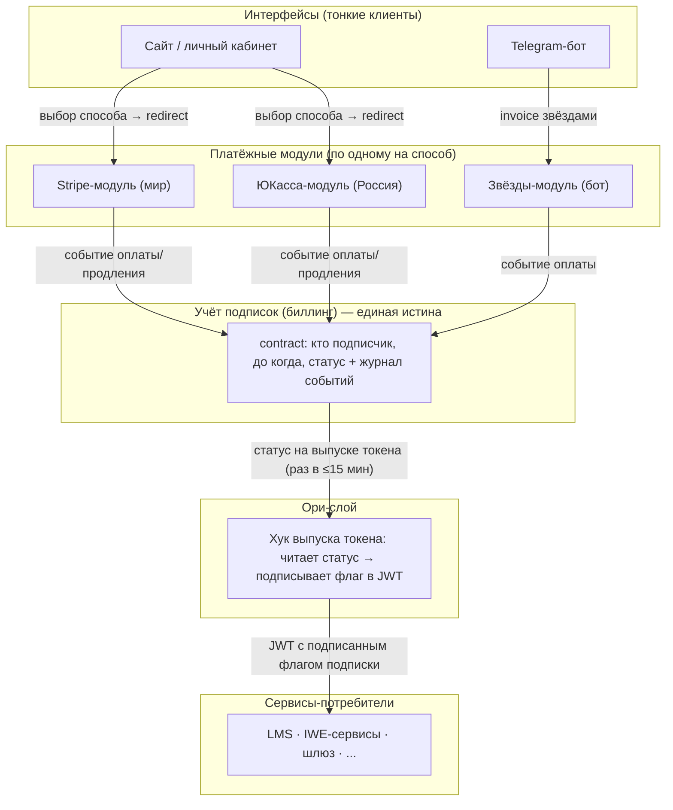

# Архитектура системы оплат и подписок: мир + Россия

> **Статус:** к обсуждению (черновик для встречи 07.07.2026)
> **РП:** WP-467 «Архитектура подписок через Ори» (Ф1 — архитектурный дизайн)
> **Источники:** ИТ-встреча 05.07.2026 (транскрипт) · аудит фактического состояния LMS/бота/Neon 07.07.2026 · peer-сессия Claude+Kimi 2026-07-07-07
> **Аудитория:** Церен, Ильшат, Дима, Андрей
> **Связанные РП:** WP-246 (архитектура прямых платежей, blocked), WP-424 (подписка Stripe, pending), WP-415 (разделение Россия/мир), WP-410 (шлюз без shared-secrets, done)

---

## 1. Зачем этот документ

Сегодня оплата и подписки живут внутри монолита LMS: он принимает вебхуки провайдеров, ведёт автосписания, хранит «кто подписчик» и сам решает, кому дать доступ. Каждый новый потребитель (бот, сайт, IWE-сервисы) вынужден либо ходить в LMS за статусом, либо заводить собственный учёт — уже сейчас прав доступа три параллельных бухгалтерии.

Этот документ фиксирует: (§2) принципы целевой архитектуры, согласованные на встрече 05.07; (§3) целевую схему; (§4) что из неё уже построено; (§5) состав сервисов отдельно для мира и для России; (§6) развилки, требующие решения команды; (§7) единый план реализации; (§8) что сознательно вне охвата.

**Рамка от владельца (Церен, 07.07):** мир и Россия должны быть полностью разделены между собой. Общими могут быть идеи, концепции и схемы — реализации могут отличаться. Stripe на Россию не работает и уходит миру. Paybox и Ecwid мертвы и в целевую архитектуру не входят. Бот остаётся на Россию.

---

## 2. Основные принципы (встреча 05.07)

**П1. Сервисы платежей — отдельные заменяемые модули.** На каждый способ оплаты — свой модуль: Stripe (мир), ЮКасса (Россия), звёзды Telegram. У каждого свой процесс получения денег, свои вебхуки, свои секреты. Модуль можно добавить или заменить, не трогая остальную систему.

**П2. Сервис учёта подписок (биллинг) — единственная истина «кто подписчик».** Все платёжные модули сообщают сюда факт оплаты («пользователь X теперь подписчик до даты Y»). Учёт не знает и не хочет знать, чем заплатили — деньгами, звёздами или вручную через админа. Модель учёта — контракт (contract): период действия + статус + журнал событий.

**П3. Ори не хранит и не считает подписки.** При выпуске JWT-токена (не чаще раза в ~15 минут) Ори-слой берёт готовый статус из учёта подписок и включает его в токен как подписанный флаг. Сервисы-потребители проверяют флаг в уже провалидированном токене — и не ходят в биллинг на каждый запрос. Экономия: одна проверка на токен вместо проверки на каждый вызов.

**П4. Интерфейсы не пишут в учёт напрямую.** Бот и сайт — тонкие клиенты: показывают форму выбора способа оплаты и перенаправляют в нужный платёжный модуль. Факт оплаты в учёт сообщает платёжный модуль, а не интерфейс. (Пример: бот получил оплату звёздами → модуль звёзд передаёт в учёт событие «оплачено звёздами», сам бот в таблицы подписок не пишет.)

**П5. Мир и Россия: один сервис как код, два изолированных развёртывания.** Схема данных, событийный контракт и код учёта — общие (одна кодовая база, миграции применяются к обоим развёртываниям). Развёртывания полностью раздельные: `billing-world` и `billing-ru` — свои базы данных, свои юрлица (Aisystant Corp / ИП), свои учётки провайдеров, свои секреты, свои домены. Запрещён «дрейф схем»: различия контуров живут в платёжных модулях-адаптерах, а не в ядре учёта.

**П6. Инвариант заменяемости платёжного модуля.** Любой платёжный модуль обязан уметь:
- (а) проецировать все события подписочного жизненного цикла в contract;
- (б) отдать список активных подписчиков для сверки (reconciliation);
- (в) деградировать в ручное продление без потери contract-истории;
- (г) при смене модуля активная подписка не теряет оплаченный период: перепривязка способа оплаты происходит на следующем платёжном цикле или по инициативе пользователя, contract-история непрерывна.

---

## 3. Целевая архитектура (схема)

**Три потока:**

1. **Оплата.** Пользователь в интерфейсе выбирает способ → redirect в платёжный модуль → модуль проводит оплату у провайдера → получает вебхук → публикует событие «оплачено» → учёт создаёт/продлевает contract.
2. **Продление.** Россия: планировщик биллинга сам инициирует списание по сохранённому способу оплаты (ЮКасса payment_method_id). Мир: продление ведёт Stripe (managed recurring), мы слушаем его события и обновляем contract. В обоих случаях учёт узнаёт о продлении событием — механика различается, истина одна.
3. **Проверка доступа.** Сервис получает запрос с JWT → проверяет подпись токена и флаг подписки → даёт/не даёт платный функционал. В биллинг не ходит. Свежесть флага ограничена временем жизни токена (целевое ≤15 минут — настройка эмитента).

Раздельность контуров: схема выше инстанцируется **дважды** — мировой и российский экземпляры не разделяют ни баз, ни секретов, ни учёток провайдеров. Общее между ними — код, схема данных, формат событий и формат флага в токене.

---

## 4. Что уже существует (аудит 07.07.2026)

<b>Фундамент уже частично построен — краткая сводка фактов</b>

**Работает в проде:**
- **Флаг подписки в JWT уже реализован** (это и есть П3): хук выпуска токена читает таблицу contract + уровень пользователя (tier) и подписывает их в токен. Истина = tier (T2+ — подписчик); отдельный булев флаг признан устаревшим.
- **Таблица contract живёт** и наполняется синхронизацией из LMS (последняя запись — 06.07). Проверка доступа у бота и шлюза уже читает contract.

**Собрано, но холодное (0 боевых событий с апреля):**
- Приёмник вебхуков (Cloudflare Worker, реализована только ЮКасса-ветка), шина событий, проекционные правила «событие → contract». Сквозная проверка пройдена 28.04 — с тех пор боевой трафик так и не переключён: живые деньги идут через LMS.

**Живые деньги сегодня:**
- **Россия:** ~714 плательщиков/год через ЮКассу в LMS; **330 активных подписок с автосписанием**; карты (payment_method_id) привязаны к учётке ЮКассы LMS — смена учётки сжигает все привязки (проверено экспериментом: учётка бота — другая, чужие платежи ей не видны). Автосписания — планировщик внутри LMS (10:00 и 21:00).
- **Мир:** 17 активных Stripe-подписок, **ни одной с автосписанием** (продления ручные). Канал сломан: с 25.05 ни одной попытки платежа (~$230-300/мес потери). Юрлицо для Stripe решено — Aisystant Corp (Delaware; внутреннее решение Р-14-9 от 21 мая). На фронте найдено ~6 живых прямых платёжных ссылок Stripe (Payment Links) в обход LMS — недокументированный поток.
- **Мертво:** Paybox (последний платёж 01.2023), Ecwid/Tilda (11.2022), звёзды Telegram (1 тестовый платёж).

**Вывод:** строить конвейер с нуля не нужно — нужно достроить платёжные модули и переключить трафик. Основная сложность не код, а координация переключения живых денег (вебхуки, учётки, планировщик LMS).

---

## 5. Состав сервисов по контурам

### 5.1 Мир (юрлицо Aisystant Corp, домен aisystant.com)

| Модуль | Роль | Решение |
|---|---|---|
| **Stripe-модуль** | приём оплат и продления | Stripe Checkout + **Stripe Billing (managed recurring)**: Stripe сам ведёт повторные списания, налоги, инвойсы, портал клиента (смена карты/отмена). Мы слушаем вебхуки подписочного цикла и проецируем в contract |
| **billing-world** | учёт подписок мира | развёртывание общего биллинга: своя БД, contract + журнал событий |
| **Эмитент токенов мира** | флаг в JWT | читает billing-world на выпуске токена (см. развилку Д1) |
| **Интерфейс** | выбор тарифа, redirect | сайт aisystant.com; мировой бот — позже, при спросе (см. Д3) |

Почему Stripe Billing, а не свой движок продлений: у мира ноль унаследованных автосписаний (17 подписок, все ручные) и ноль команды на поддержку собственного движка; повторные попытки списания, налоги, инвойсы и PCI-периметр Stripe даёт из коробки. Истина доступа при этом остаётся в contract (П2, П6) — Stripe владеет только механикой списаний.

### 5.2 Россия (юрлицо ИП, домен system-school.ru)

| Модуль | Роль | Решение |
|---|---|---|
| **ЮКасса-модуль** | приём оплат | выделяется из LMS; **наследует учётку ЮКассы LMS (тот же shopId)** — тогда 330 сохранённых карт переносятся 1-к-1 (payment_method_id — самодостаточный JSON, прямой доступ к БД LMS есть) |
| **Движок автосписаний** | продления | свой планировщик (порт логики LMS: инициация списания по payment_method_id, повторная попытка, письма) — вынужденное решение из-за наследия карт |
| **Звёзды-модуль** | оплата в боте | уже в боте (событийный путь построен); вопрос юрлица-получателя выплат — развилка Д2 |
| **billing-ru** | учёт подписок России | развёртывание общего биллинга: своя БД; переходно наполняется и синком из LMS, и событиями |
| **Эмитент токенов России** | флаг в JWT | сегодняшний работающий хук (читает contract) — см. развилку Д1 |
| **Интерфейс** | выбор тарифа, redirect | текущий сайт + текущий бот |

Почему свой движок, а не делегирование провайдеру: 330 живых автосписаний уже работают по модели «мы храним payment_method_id и сами инициируем списание» — это наследие, которое дёшево портируется и дорого мигрируется на другую модель.

### 5.3 Общее между контурами (идеи и код, не данные)

- Кодовая база биллинга и схема contract/событий (П5).
- Формат события «оплачено/продлено/отменено» и формат флага в токене.
- API «интерфейс → платёжный модуль» (одинаковый контракт, чтобы любой интерфейс работал с любым контуром).
- Инвариант заменяемости П6 и требования сверки/наблюдаемости (§7).

---

## 6. Развилки на решение команды (сегодня)

**Д1. Сколько эмитентов токенов?**
- Вариант А: один Ори/Hydra на всё, контуры разделяются OAuth-клиентами и политиками токенов.
- Вариант Б: у каждого контура свой эмитент (Россия — текущий на system-school.ru; мир — auth-слой aisystant.com, который переписывает Андрей).
- **Рекомендация: Б**, но честно — это выбор, продиктованный владением инфраструктурой и юрисдикцией (auth-сервер РФ на РФ-инфраструктуре, мировой у Corp), а не архитектурной необходимостью: технически хватило бы и одного. Цена Б: две ротации ключей, два управления сессиями; пользователь в обоих контурах = две identity (принимаем как цену юрисдикционного разрыва — та же доктрина, что с GitHub-организациями).

**Д2. Звёзды Telegram: чьи выплаты?** Звёзды — способ оплаты, а не юрисдикция: контур определяется юрлицом, получающим выплаты от Telegram. Сейчас получатель, судя по всему, физлицо (ни ИП, ни Corp) — нужно решение: оформить на ИП (тогда звёзды — чисто российский модуль) или иначе.

**Д3. Один бот на все или два?** Рекомендация: **два** (российский остаётся, мировой — когда появится спрос). Аргументы: один бот на оба контура = смешение денежных потоков разных юрлиц (commingling) + бот по архитектуре тонкий интерфейс (П4), дублировать его дёшево, а вот расцеплять общий — дорого.

**Д4. Совмещённый или раздельный деплой «платежи+подписки»?** (открытый вопрос со встречи 05.07). Предложение: **роли раздельные, старт совмещённый** — один разворачиваемый юнит биллинга с двумя изолированными контекстами внутри (приём платежей / учёт), граница между ними событийная; физический раскол — шаг после стабилизации, без переписывания. Исключение: приёмники вебхуков провайдеров выносятся отдельно сразу (другой периметр безопасности: внешние секреты, входящий трафик провайдеров).

**Д5. Судьба прямых платёжных ссылок Stripe (Payment Links).** ~6 живых ссылок на фронте в обход LMS. Предложение: пересоздать в каталоге нового Stripe-модуля при запуске мира; до того — учитывать в сверке.

---

## 7. План реализации (мир и Россия вместе)

> Сквозные требования каждого этапа: **сверка** (reconciliation: список активных подписчиков у провайдера ↔ contract), **откат** (kill-switch на каждый переключатель трафика), **наблюдаемость** (доставка вебхуков, лаг проекции событий, сверка выручки), **коммуникация** (уведомления затронутым подписчикам), **compliance** (чеклист этапа 0 действует на всех этапах).

### Этап 0 — Фундамент (без внешних зависимостей, ~1-2 нед)

- Согласовать этот документ (встреча сегодня) → зафиксировать решения Д1-Д5.
- Реанимировать холодный конвейер: починить/перенацелить мёртвую синхронизацию платёжного журнала (стоит с 13.04), включить журнал событий контрактов (сейчас пуст — статусы меняются без истории).
- Compliance-чеклист: 152-ФЗ (данные РФ-подписчиков), OFAC/налоги Corp, инвентаризация секретов.

### Этап 1 — Мир (с чистого листа, не зависит от Димы, ~2-3 нед)

1. Stripe-аккаунт Corp: подтвердить владельца/доступ к дашборду (открытый вопрос Q2 из WP-246), каталог тарифов, вебхук на новый Stripe-модуль.
2. Stripe-модуль: Checkout + Billing, вебхуки подписочного цикла → события → contract (billing-world).
3. Флаг в токене мира — по решению Д1.
4. Миграция: 17 подписчиков получают письмо с новой ссылкой оплаты (автосписаний нет — перепривязка не нужна, П6-г соблюдён автоматически); Payment Links пересоздаются (Д5).
5. Сверка: Stripe-подписки ↔ contract; первый боевой платёж = приёмка этапа.
- **Бонус:** канал, сломанный с 25.05, снова приносит деньги.

### Этап 2 — Россия, приём платежей (требует Диму: вебхук; 2-4 календарные недели)

1. Получить у Димы shopId/секреты учётки ЮКассы LMS (в git их нет) + подтвердить у ЮКассы возможность второго URL вебхука (Q1 из WP-246).
2. Дописать ЮКасса-модуль на готовом приёмнике; двойной приём (LMS продолжает работать — strangler, стадия 1: приёмник форвардит исходный вебхук в LMS).
3. billing-ru наполняется событиями параллельно с синком из LMS; сверка двух источников — критерий готовности к этапу 3.

### Этап 3 — Россия, автосписания (самый рискованный, требует Диму, ~3-4 нед)

1. Портировать движок продлений (инициация списаний по payment_method_id, повторные попытки, письма) в новый сервис **под той же учёткой ЮКассы**.
2. Перенос 330 payment_method_id из БД LMS (прямой доступ есть). Fallback, если перенос не сработает: управляемая перепривязка карт на следующем цикле (П6-г), не рубильник.
3. Cutover в окно между планировщиками LMS (21:00 → 10:00): kill-switch крону LMS, включение нашего. **Два планировщика одновременно = двойное списание** — главный риск всего плана, только совместно с Димой.
4. Неделя параллельной сверки списаний день-в-день.

### Этап 4 — Демонтаж (после стабилизации)

- LMS перестаёт быть платёжной системой: перевод проверки доступа LMS на contract/флаг, выключение синка LMS→contract (остаётся один писатель — события), архив мёртвых каналов (Paybox/Ecwid), консолидация учёток ЮКассы: LMS-подписки + бот + стажировки (стажировки — по §8, звёзды — по решению Д2).

**Критический путь:** этапы 2-3 упираются в координацию с Димой (эта же координация блокирует WP-246 с 28.04). Этапы 0-1 полностью в наших руках — начинать с них.

---

## 8. Известные потоки вне охвата (не забыты, вынесены сознательно)

| Поток | Объём | Почему вне охвата | Куда |
|---|---|---|---|
| Стажировки | ~1.9M RUB/квартал ручных инвойсов + отдельная учётка ЮКассы | своя механика (потоки, рассрочка 3×35%, CRM) | отдельный РП после этапа 3 |
| Донаты-подписки, балансы | малый | легаси-механика LMS | ревизия на этапе 4 |
| Баллы/бонусы | — | отдельная система (обсуждена 05.07 как смежная) | свой РП, интеграция через те же события |
| Гостевые пропуска/рефералы | — | ждут подтверждения спроса (PMF-гейт, WP-266) | там же |
| Legacy-таблица прав (subscription_grants) | 1 живой писатель | deprecated, заменена contract | зачистка на этапе 4 |

---

## 9. Открытые вопросы к команде

1. Д1-Д5 (§6) — решения сегодня.
2. **Дима:** shopId учёток ЮКассы; возможность второго вебхук-URL (Q1); кто держит доступ к Stripe-дашборду (Q2); готовность к окну cutover автосписаний.
3. **Ильшат:** подтверждение архитектуры для российской части; кто оператор billing-ru.
4. **Андрей:** судьба auth-слоя aisystant.com (вход для Д1); почему Stripe-канал молчит с 25.05 (сломан фронт? прокси? аккаунт?).
5. Один человек в обоих контурах (identity, двойная подписка) — правило разруливания.

---

*Составлено по итогам аудита кода/БД 07.07.2026 и peer-сессии (стенограмма: DS-my-strategy/sessions/2026-07/2026-07-07-07-payments-subscriptions-architecture/). Детальные факты аудита с точными ссылками на код — по запросу.*
