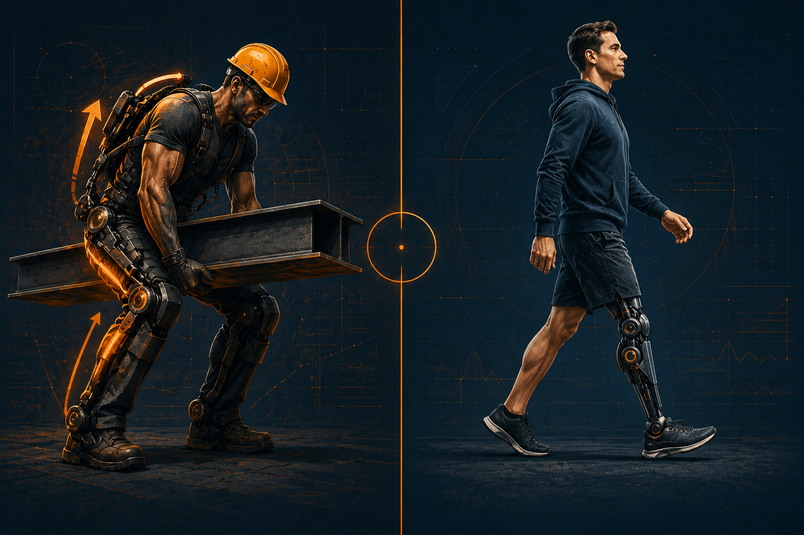

<!-- _class: title -->
<!-- _paginate: false -->
<!-- _header: "" -->
<!-- _footer: "" -->

# Ваша экспертность устареет. Как вырастить новую — не&nbsp;за&nbsp;10&nbsp;лет

## Диагностика связки человек&nbsp;—&nbsp;ИИ

Церен Церенов · сооснователь МИМ

31 мая 2026 · бесплатный онлайн-семинар

---

<!-- _class: hook -->

Вы провели десятки или сотни часов с&nbsp;ИИ за прошлый год. 
Помогали себе. Закрывали задачи. Получали ответы.  
А теперь честный вопрос: 
что произошло за это время не с задачами, а с&nbsp;вами?

---

<!-- _class: center -->

# Сильнее — или быстрее?

Напишите в чат одним словом.

Без объяснений. Просто реакция.

---

<!-- _class: with-eyebrow center -->

Главная линия семинара

Как работать с&nbsp;ИИ так, чтобы задачи закрывались, а ваша способность росла

Не «экспертность устареет». Не «ИИ заберёт работу». А внутренний вопрос: что после сотни выполненных задач остаётся <strong>со мной</strong> — навыки, знания, решения, рабочие продукты — или только результаты для других?

---

<!-- _class: with-eyebrow -->

Анна, 24 · 40 секунд
<h3 style="color:#94a3b8">Лестница входа сломалась</h3>

Юрист на старте. 80 откликов — ни одного оффера.

Junior-задачи делает ИИ.

Олег, 42 · 3 минуты · главный персонаж
<h3>Опора идентичности сломалась</h3>

Юрист с 18-летним опытом. GPT за 10 минут сделал договор, который Олег делал бы 4 часа.

Впервые не понимает: его опыт — опора или вчерашний актив?

<strong style="color:#f97316">Семинар — в первую очередь про Олега.</strong>

О человеке с опытом, который не понимает: его опыт — это опора или вчерашний актив.

---

<!-- _class: with-eyebrow -->

1951 · Айзек Азимов · цикл «Я, робот»

# Тони-робот

> Робот приходит в дом к Клэр.
> Умеет всё: готовить, убирать, помогать.
> Любую просьбу — мгновенно.
>
> Идеальный помощник.
> Клэр счастлива.

---

<!-- _class: with-eyebrow split -->

Блок 2 · Через год

### Через год

✓&nbsp;Задачи решены
✓&nbsp;Жизнь удобнее
✓&nbsp;Клэр довольна

✗&nbsp;Клэр не изменилась 
✗&nbsp;Без робота — не справляется 
✗&nbsp;Это и есть зависимость

---

<!-- _class: with-eyebrow -->

Связка — не человек с инструментом. Это третья система.

---

<!-- _class: center -->

Решить задачу

≠

Развить человека

Часто это противоположное.

---

<!-- _class: with-eyebrow center -->

Блок 3 · Куда смотрят

  
«ChatGPT пишет тексты лучше меня!»

  
«ИИ заберёт мою работу.»

  
«Это просто автодополнение.»

Все смотрят на одно и то же. И все промахиваются.

---

<!-- _class: with-eyebrow -->

Блок 3 · Три объекта внимания

# Смотреть нужно не на один объект — на&nbsp;три

| Объект | Что это | Вопрос к нему |
|---|---|---|
| ИИ | Инструмент | Что он умеет? |
| Человек | Пилот | Как не отстать? |
| **Связка** | **Новая система** | **Кем я становлюсь?** |

Третья строка — самая важная.

---

<!-- _class: center -->

«Что умеет ИИ?»

Кем я становлюсь, когда работаю с&nbsp;ним?

---

<!-- _class: with-eyebrow -->

Экзоскелет усиливает то, что есть.

Снял — навык остался.

Протез заменяет то, чего нет.

Снял — функция исчезла.

<strong style="color:#f97316">ИИ может быть любым.</strong> Зависит от того, <em style="color:#fbbf24;font-style:normal">как вы с ним работаете</em>.

---

<!-- _class: with-eyebrow -->

Блок 3 · Что говорят люди, ещё не видящие связки

# Три типичные реакции

Реакция 1
<h3 style="color:#94a3b8">«ИИ всё умеет — мне поздно учиться»</h3>

Не видит, что учиться нужно <strong style="color:#f97316">не конкурировать</strong> с ИИ, а собирать связку.

Реакция 2
<h3 style="color:#94a3b8">«Я уже эксперт — меня это не касается»</h3>

Не видит, что эксперт без связки <strong style="color:#f97316">= протез-эксперт</strong>.

Реакция 3
<h3 style="color:#94a3b8">«Подожду, пока станет ясно»</h3>

Не видит, что ясность приходит <strong style="color:#f97316">из заполненной карточки</strong>, а не из новостной ленты.

Каждая реакция оставляет в старой модели экспертности.

---

<!-- _class: hook -->

Если завтра ИИ исчезнет — 
что останется от вашей работы за последний месяц?

Напишите в чат — одним словом или фразой.

---

<!-- _class: with-eyebrow -->

Карточка связки · Точка 1 из 3 · Черновик пункта 2

# Что осталось <em style="color:#f97316;font-style:normal">моим</em>?

1. Что ИИ делал за меня за последний месяц:

_____________________________________________

<strong style="color:#f97316">2. Что после этого осталось моим:</strong> ← <em style="color:#fbbf24;font-style:normal">пишем сейчас в чат</em>

_____________________________________________

3. Где я стал быстрее, но не сильнее:

_____________________________________________

4. Какую следующую задачу сделаю с приростом:

_____________________________________________

Черновик. Уточним позже. Пишите в чат коротко — одной строкой.

---

<!-- _class: with-eyebrow -->

Блок 4 · Три позиции

# Куда попал ваш ответ?

Позиция 1
<h3 style="color:#94a3b8">Мастерская</h3>

**Что осталось:**
выполненные задачи, документы, тексты.

ИИ — как токарный станок. 
Точнее. Но не учит быть&nbsp;токарем.

Позиция 2
<h3 style="color:#fbbf24">Зависимость</h3>

**Что осталось:**
ощущение, что без ИИ уже сложнее.

ИИ не усилил навыки. 
Заместил их.

Позиция 3
<h3 style="color:#f97316">Связка</h3>

**Что осталось:**
что-то стало яснее. Изменились решения. Появились привычки.

ИИ менял вас, а не только работал.

---

<!-- _class: with-eyebrow -->

# За последний месяц ИИ помог мне&nbsp;получить:

Пункт 1
<h3 style="font-size:1em;margin-bottom:0.2em">Результаты</h3>

Готовые тексты, отчёты, код. Закрытые задачи.

Пункт 2
<h3 style="font-size:1em;margin-bottom:0.2em">Новые знания</h3>

Чего раньше не знал. Что теперь понимаю по-другому.

Пункт 3
<h3 style="font-size:1em;margin-bottom:0.2em">Новые способы работы</h3>

Методы, которыми буду пользоваться сам.

Пункт 4
<h3 style="font-size:1em;margin-bottom:0.2em">Рабочие продукты</h3>

Шаблоны, документы — можно использовать дальше.

Если есть только <strong style="color:#f97316">Пункт 1</strong> — это сигнал.

---

<!-- _class: with-eyebrow -->

Карточка связки · Точка 2 из 3 · Пункты 1 и 3

# Что ИИ делал и где я не&nbsp;стал&nbsp;сильнее

<strong style="color:#f97316">1. Что ИИ делал за меня за последний месяц:</strong> ← <em style="color:#fbbf24;font-style:normal">в чат</em>

_____________________________________________

2. Что после этого осталось моим: <em style="color:#94a3b8;font-style:normal">(черновик уже есть)</em>

_____________________________________________

<strong style="color:#f97316">3. Где я стал быстрее, но не сильнее:</strong> ← <em style="color:#fbbf24;font-style:normal">в чат</em>

_____________________________________________

4. Какую следующую задачу сделаю с приростом: <em style="color:#94a3b8;font-style:normal">(в финале)</em>

_____________________________________________

Карточка собирается по ходу семинара. К финалу — готовая, заполнена вашими руками.

---

<!-- _class: center -->

Мастерская —

диагноз, не приговор.

Пять природ. Вы на первой. Есть четыре следующих.

---

<!-- _class: with-eyebrow -->

Блок 5 · Карта пути

# Пять природ — куда двигаться

<svg class="diagram" viewBox="0 0 1100 320" xmlns="http://www.w3.org/2000/svg">
  <!-- Connecting line -->
  <line x1="100" y1="180" x2="1000" y2="180" stroke="#475569" stroke-width="2" stroke-dasharray="6 6"/>

  <!-- Node 1 -->
  <g transform="translate(110,180)">
    <circle cx="0" cy="0" r="40" fill="#94a3b8" opacity="0.3" stroke="#94a3b8" stroke-width="2"/>
    <text x="0" y="6" text-anchor="middle" fill="#f1f5f9" font-family="Inter" font-size="20" font-weight="800">1</text>
    <text x="0" y="-65" text-anchor="middle" fill="#94a3b8" font-family="Inter" font-size="15" font-weight="700">Мастерская</text>
    <text x="0" y="65" text-anchor="middle" fill="#94a3b8" font-family="Inter" font-size="12">ИИ помогает</text>
    <text x="0" y="80" text-anchor="middle" fill="#94a3b8" font-family="Inter" font-size="12">делать</text>
  </g>

  <!-- Node 2 -->
  <g transform="translate(310,180)">
    <circle cx="0" cy="0" r="40" fill="#7c2d12" stroke="#f97316" stroke-width="3"/>
    <text x="0" y="6" text-anchor="middle" fill="#fbbf24" font-family="Inter" font-size="20" font-weight="800">2</text>
    <text x="0" y="-65" text-anchor="middle" fill="#f97316" font-family="Inter" font-size="15" font-weight="700">Железный человек</text>
    <text x="0" y="65" text-anchor="middle" fill="#94a3b8" font-family="Inter" font-size="12">ИИ усиливает</text>
    <text x="0" y="80" text-anchor="middle" fill="#94a3b8" font-family="Inter" font-size="12">меня</text>
  </g>

  <!-- Node 3 -->
  <g transform="translate(550,180)">
    <circle cx="0" cy="0" r="40" fill="#1e293b" stroke="#94a3b8" stroke-width="2"/>
    <text x="0" y="6" text-anchor="middle" fill="#f1f5f9" font-family="Inter" font-size="20" font-weight="800">3</text>
    <text x="0" y="-65" text-anchor="middle" fill="#f1f5f9" font-family="Inter" font-size="15" font-weight="700">Аватар</text>
    <text x="0" y="65" text-anchor="middle" fill="#94a3b8" font-family="Inter" font-size="12">общая среда</text>
    <text x="0" y="80" text-anchor="middle" fill="#94a3b8" font-family="Inter" font-size="12">даёт общий язык</text>
  </g>

  <!-- Node 4 -->
  <g transform="translate(790,180)">
    <circle cx="0" cy="0" r="40" fill="#1e293b" stroke="#94a3b8" stroke-width="2"/>
    <text x="0" y="6" text-anchor="middle" fill="#f1f5f9" font-family="Inter" font-size="20" font-weight="800">4</text>
    <text x="0" y="-65" text-anchor="middle" fill="#f1f5f9" font-family="Inter" font-size="15" font-weight="700">Тамагочи</text>
    <text x="0" y="65" text-anchor="middle" fill="#94a3b8" font-family="Inter" font-size="12">среда растёт</text>
    <text x="0" y="80" text-anchor="middle" fill="#94a3b8" font-family="Inter" font-size="12">от заботы</text>
  </g>

  <!-- Node 5 -->
  <g transform="translate(990,180)">
    <circle cx="0" cy="0" r="40" fill="#1e293b" stroke="#94a3b8" stroke-width="2"/>
    <text x="0" y="6" text-anchor="middle" fill="#f1f5f9" font-family="Inter" font-size="20" font-weight="800">5</text>
    <text x="0" y="-65" text-anchor="middle" fill="#f1f5f9" font-family="Inter" font-size="15" font-weight="700">Букварь</text>
    <text x="0" y="65" text-anchor="middle" fill="#94a3b8" font-family="Inter" font-size="12">среда ведёт</text>
    <text x="0" y="80" text-anchor="middle" fill="#94a3b8" font-family="Inter" font-size="12">по траектории</text>
  </g>
</svg>

Не пять инструментов. Пять способов устроить рост человека в связке с&nbsp;ИИ. 
Природа 2 — это и есть Тони Старк, которого мы только что видели.

---

<!-- _class: with-eyebrow -->

Природа 4 · «Как тамагочи»

IWE нельзя купить.

Его можно только вырастить.

Как тамагочи. Каждый день. Не рывками.

---

<!-- _class: with-eyebrow center -->

Блок 5.5 · За счёт чего

# Чтобы экзоскелет стал нормой — работают четыре рычага

<svg class="diagram" viewBox="0 0 900 360" xmlns="http://www.w3.org/2000/svg" style="margin-top:20px">
  <!-- Quadrant -->
  <g transform="translate(80,40)">
    <!-- 1 -->
    <rect x="0" y="0" width="350" height="130" rx="12" fill="#1e293b" stroke="#f97316" stroke-width="2"/>
    <text x="20" y="40" fill="#f97316" font-family="Inter" font-size="14" font-weight="800" letter-spacing="2">01 · МИРОВОЗЗРЕНИЕ</text>
    <text x="20" y="75" fill="#f1f5f9" font-family="Inter" font-size="18" font-weight="700">Видеть проблему</text>
    <text x="20" y="100" fill="#f1f5f9" font-family="Inter" font-size="18" font-weight="700">там, где был хаос.</text>
    <!-- 2 -->
    <rect x="380" y="0" width="350" height="130" rx="12" fill="#1e293b" stroke="#f97316" stroke-width="2"/>
    <text x="400" y="40" fill="#f97316" font-family="Inter" font-size="14" font-weight="800" letter-spacing="2">02 · КОСТЮМ — ДВЕ РОЛИ</text>
    <text x="400" y="75" fill="#f1f5f9" font-family="Inter" font-size="18" font-weight="700">Пользователь &amp; Создатель</text>
    <text x="400" y="100" fill="#94a3b8" font-family="Inter" font-size="15">Не просто носить — проектировать.</text>
    <!-- 3 -->
    <rect x="0" y="155" width="350" height="130" rx="12" fill="#1e293b" stroke="#f97316" stroke-width="2"/>
    <text x="20" y="195" fill="#f97316" font-family="Inter" font-size="14" font-weight="800" letter-spacing="2">03 · СИСТЕМНОЕ МЫШЛЕНИЕ</text>
    <text x="20" y="230" fill="#f1f5f9" font-family="Inter" font-size="18" font-weight="700">Конвертирует проблему</text>
    <text x="20" y="255" fill="#f1f5f9" font-family="Inter" font-size="18" font-weight="700">в задачу.</text>
    <!-- 4 -->
    <rect x="380" y="155" width="350" height="130" rx="12" fill="#1e293b" stroke="#f97316" stroke-width="2"/>
    <text x="400" y="195" fill="#f97316" font-family="Inter" font-size="14" font-weight="800" letter-spacing="2">04 · СООБЩЕСТВО</text>
    <text x="400" y="230" fill="#f1f5f9" font-family="Inter" font-size="18" font-weight="700">Среда сопроизводителей</text>
    <text x="400" y="255" fill="#94a3b8" font-family="Inter" font-size="15">держит темп и норму.</text>
  </g>
</svg>

---

<!-- _class: with-eyebrow -->

<h3 style="color:#94a3b8;font-size:0.85em;margin-bottom:10px">Рычаг 01 · Мировоззрение, культура работы, стиль жизни</h3>

Было

Хаос

Ступор

«Непонятно»

Стало

<strong>Проблема</strong> — есть объект для мысли

<strong>Задача</strong> — есть метод

«Понятно, что делать»

Меняется не только работа. Меняется стиль жизни.

---

<!-- _class: with-eyebrow -->

<h3 style="color:#94a3b8;font-size:0.85em;margin-bottom:10px">Рычаг 02 · Костюм Железного человека — в двух ролях</h3>

<h3 style="margin-bottom:0.4em">Пользователь костюма</h3>

Больше за то же время.

Сложность, которая раньше была не по силам.

<h3 style="margin-bottom:0.4em">Создатель костюма</h3>

Проектирует. Настраивает.

Развивает костюм под свои задачи и проекты.

Оба нужны. Но потолок — у тех, кто строит.

---

<!-- _class: with-eyebrow center -->

Рычаг 03 · Системное мышление

<svg class="diagram" viewBox="0 0 600 280" xmlns="http://www.w3.org/2000/svg">
  <!-- Layer 1 -->
  <rect x="100" y="20" width="400" height="50" rx="8" fill="#1e293b" stroke="#94a3b8" stroke-width="1.5"/>
  <text x="300" y="52" text-anchor="middle" fill="#94a3b8" font-family="Inter" font-size="18" font-weight="600">Хаос · неопределённость</text>
  <!-- Arrow -->
  <path d="M 300 80 L 300 105 M 290 95 L 300 105 L 310 95" stroke="#f97316" stroke-width="2.5" fill="none"/>
  <!-- Layer 2 -->
  <rect x="100" y="110" width="400" height="60" rx="8" fill="#7c2d12" stroke="#f97316" stroke-width="2.5"/>
  <text x="300" y="146" text-anchor="middle" fill="#fbbf24" font-family="Inter" font-size="18" font-weight="800" letter-spacing="2">СИСТЕМНОЕ МЫШЛЕНИЕ</text>
  <!-- Arrow -->
  <path d="M 300 180 L 300 205 M 290 195 L 300 205 L 310 195" stroke="#f97316" stroke-width="2.5" fill="none"/>
  <!-- Layer 3 -->
  <rect x="100" y="210" width="400" height="50" rx="8" fill="#1e293b" stroke="#f97316" stroke-width="1.5"/>
  <text x="300" y="242" text-anchor="middle" fill="#f1f5f9" font-family="Inter" font-size="17" font-weight="700">Проблема → Задача → Метод</text>
</svg>

ИИ не делает этот шаг за вас. Этот шаг и есть ваша роль.

---

<!-- _class: with-eyebrow -->

<h3 style="color:#94a3b8;font-size:0.85em;margin-bottom:10px">Рычаг 04 · Сообщество и среда сопроизводителей</h3>

В одиночку

Темп падает

Норма размывается

Откат к старому стилю

В среде

Темп держится

Норма видна

Рост вместе с другими

Среда — не клуб по интересам. <strong style="color:#f97316">Это рычаг, которого нет в волевом усилии.</strong>

---

<!-- _class: center -->

Меняется человек —

потому что собираются четыре рычага.

Не курс. Не подписка. Среда, в которой это&nbsp;становится&nbsp;нормой.

---

<!-- _class: with-eyebrow -->

# Что разделяет Мастерскую и&nbsp;Железного&nbsp;человека?

Не сложность инструмента. Не деньги.

<h3 style="color:#94a3b8;margin-bottom:0.4em">Сейчас</h3>

ChatGPT не знает, кто вы.

Каждый разговор с нуля.

ИИ — незнакомец.

<h3 style="margin-bottom:0.4em">После сегодня</h3>

ИИ знает три вещи о вас.

Каждый разговор начинается с контекста.

ИИ — коллега.

---

<!-- _class: with-eyebrow -->

Блок 6 · Три предложения для вашего ИИ

# Напишите ИИ три предложения о&nbsp;себе

Вставите их в начало следующего разговора с&nbsp;ChatGPT или Claude — и&nbsp;ИИ начнёт его не с&nbsp;нуля, а&nbsp;с&nbsp;понимания, кто вы и что делаете.

Карточка 1
<h3>Кто вы</h3>
Роль + специализация.

<em>«Финансовый директор в&nbsp;строительной компании, веду три проекта»</em>

Карточка 2
<h3>Что сейчас важно</h3>
Текущая задача или контекст.

<em>«Готовлю отчёт для совета директоров к&nbsp;пятнице»</em>

Карточка 3
<h3>Как вы работаете</h3>
Предпочтения и ограничения.

<em>«Краткие ответы, примеры из&nbsp;практики»</em>

---

<!-- _class: center -->

Три предложения —

это не настройка.

Это начало связки.

---

<!-- _class: with-eyebrow -->

Блок 7 · Что прошли

# Карта семинара

<svg class="diagram" viewBox="0 0 1000 260" xmlns="http://www.w3.org/2000/svg">
  <g font-family="Inter" font-size="15" fill="#f1f5f9">
    <!-- Step 1 -->
    <circle cx="80" cy="50" r="14" fill="#34d399"/>
    <text x="50" y="55" fill="#34d399" font-weight="800">✓</text>
    <text x="110" y="55">Сотня часов с ИИ — что произошло с вами?</text>
    <!-- Step 2 -->
    <circle cx="80" cy="90" r="14" fill="#34d399"/>
    <text x="50" y="95" fill="#34d399" font-weight="800">✓</text>
    <text x="110" y="95">Тони-робот vs Железный человек — два сценария связки</text>
    <!-- Step 3 -->
    <circle cx="80" cy="130" r="14" fill="#34d399"/>
    <text x="50" y="135" fill="#34d399" font-weight="800">✓</text>
    <text x="110" y="135">Смотреть на связку — не на инструмент</text>
    <!-- Step 4 -->
    <circle cx="80" cy="170" r="14" fill="#34d399"/>
    <text x="50" y="175" fill="#34d399" font-weight="800">✓</text>
    <text x="110" y="175">Диагноз: большинство — Мастерская. Это не приговор</text>
    <!-- Step 5 -->
    <circle cx="80" cy="210" r="14" fill="#34d399"/>
    <text x="50" y="215" fill="#34d399" font-weight="800">✓</text>
    <text x="110" y="215">Четыре рычага: мировоззрение, костюм, мышление, сообщество</text>
    <!-- Step 6 -->
    <circle cx="80" cy="250" r="14" fill="#f97316"/>
    <text x="50" y="255" fill="#f97316" font-weight="800">→</text>
    <text x="110" y="255" fill="#f97316" font-weight="700">Первый шаг сделан — три предложения для вашего ИИ</text>
  </g>
</svg>

---

<!-- _class: hook -->

Опасность не в том, что ИИ выполнит вашу задачу.  
Опасность в том, что через год интенсивной работы с&nbsp;ИИ 
вы окажетесь там же, где сейчас.

Это и есть итоговая боль, которую решает диагностика связки.

---

<!-- _class: with-eyebrow -->

# Какую следующую задачу сделаю с&nbsp;приростом?

1. Что ИИ делал за меня за последний месяц <em style="color:#34d399;font-style:normal">✓</em>

2. Что после этого осталось моим <em style="color:#34d399;font-style:normal">✓</em>

3. Где я стал быстрее, но не сильнее <em style="color:#34d399;font-style:normal">✓</em>

<strong style="color:#f97316">4. Какую следующую задачу сделаю так, чтобы после неё остались знания, решение или продукт?</strong>

<strong style="color:#fbbf24">Одна строка в чат.</strong> Это ваш коммитмент.

---

<!-- _class: with-eyebrow split -->

CTA · Один шаг

## Марафон 4 июня

Бесплатно. Онлайн. Старт через 4 дня.

«Аудит экспертности» — что ИИ делает за вас сейчас и куда двигаться.

Доступен и формат с символической&nbsp;платой&nbsp;и&nbsp;созвонами.

QR

Сканируйте — попадёте на регистрацию

---

<!-- _class: center -->

# Второй мост — мягкий

7 июня — <strong>практическая сборка IWE 2.0</strong>

для тех, кто после диагностики понял, что хочет собрать среду.

Не сегодня. После Марафона.

---

<!-- _class: with-eyebrow center -->

Антиреклама IWE

Не быстрее делать.

Становиться быстрее.

Среда работает только там, где человек сам участвует в&nbsp;росте связки. 
Без вашего участия это просто ещё одна подписка.

---

<!-- _class: center -->

# Поделитесь результатом

Если в течение недели попробуете что-то с&nbsp;карточкой —

напишите один абзац в комментарий к&nbsp;посту-анонсу.

Это и будет ваш первый след в новой норме работы.

---

<!-- _class: center -->

# Ваши вопросы

Пишите в чат

---

<!-- _class: title -->
<!-- _paginate: false -->

# Спасибо

<h2>Связка — это&nbsp;вы&nbsp;и&nbsp;ваш&nbsp;ИИ. Растите её.</h2>

Церен Церенов · сооснователь МИМ

31 мая 2026 · v3.2.3

