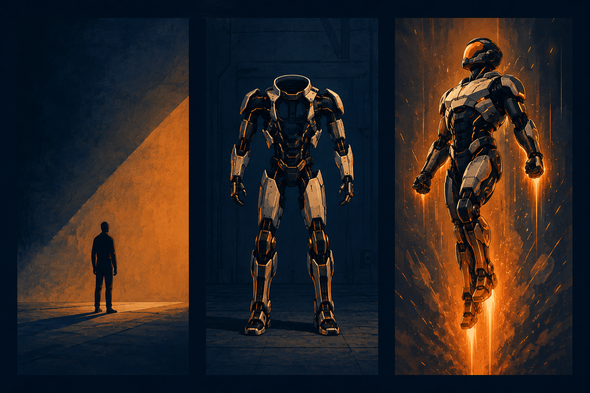
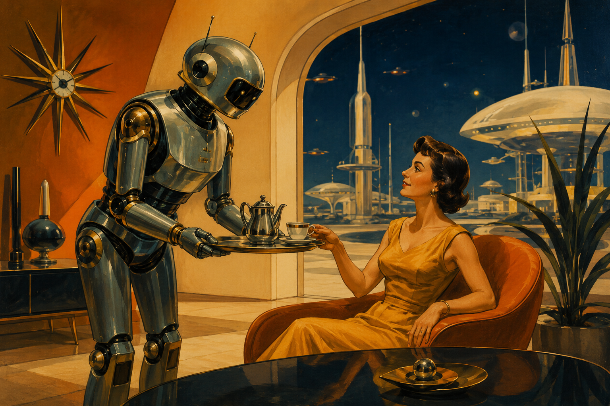
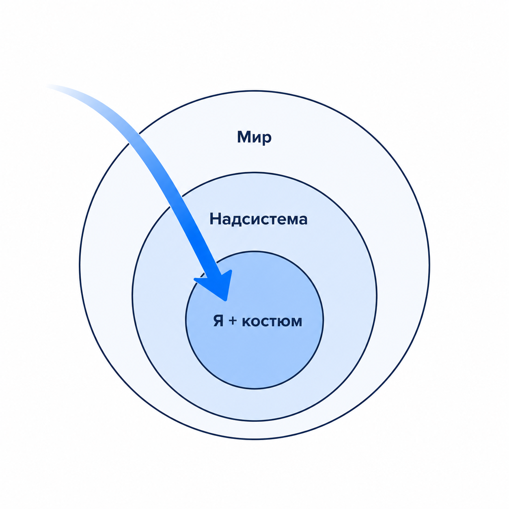
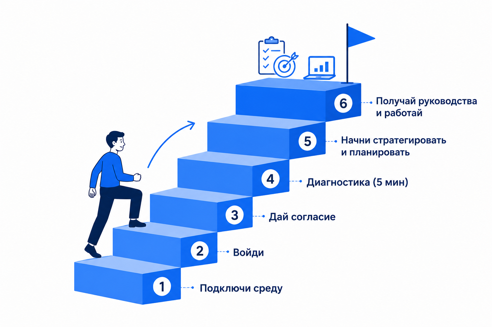
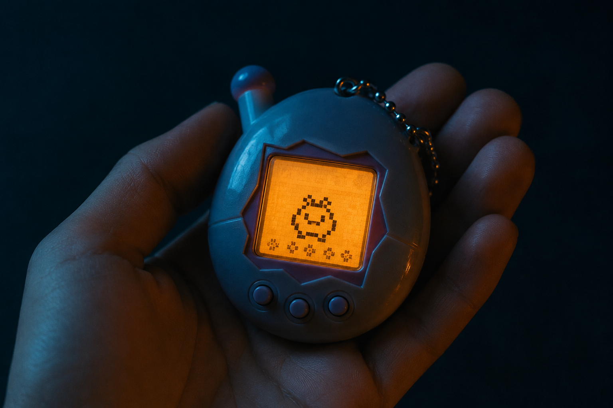
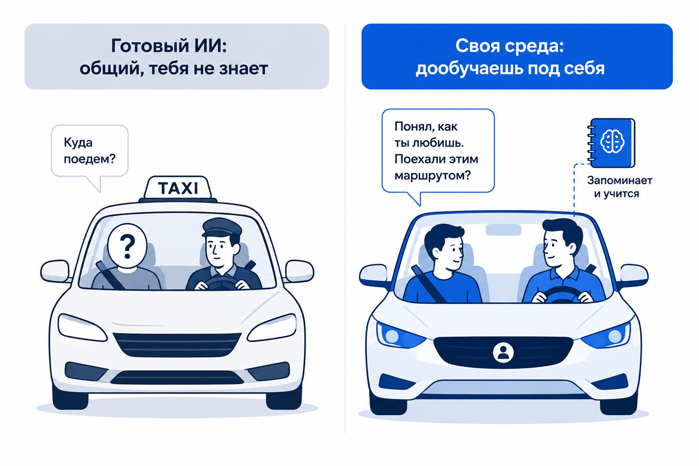
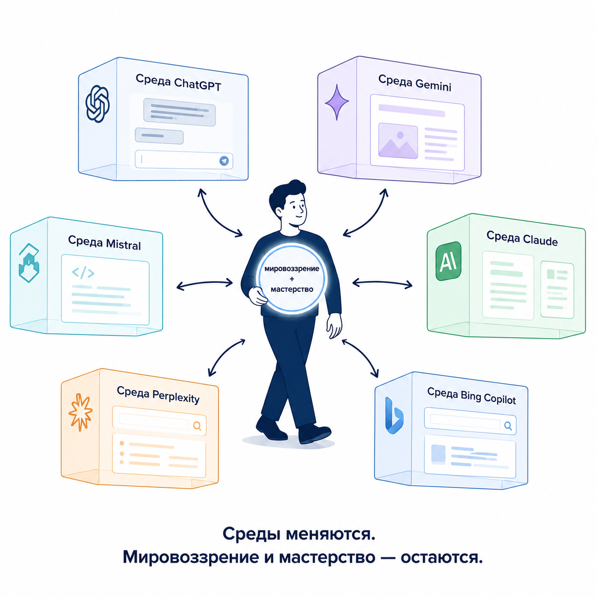
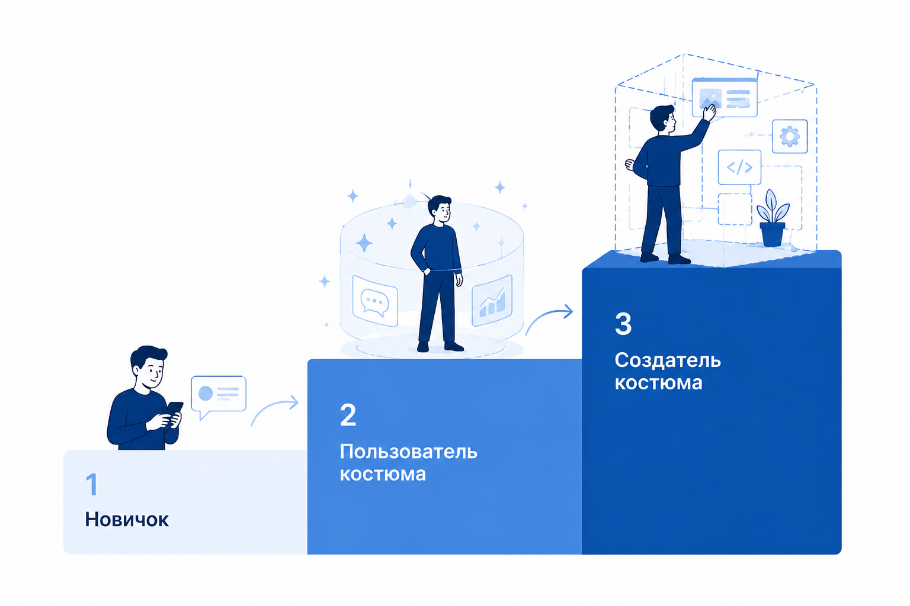

<!-- _class: title -->
<!-- _paginate: false -->
<!-- _header: "" -->
<!-- _footer: "" -->

# Железный человек

## Новая культура работы, жизни и саморазвития в эпоху ИИ

Церен Церенов · Мастерская инженеров и менеджеров

7 июня 2026 · семинар IWE 2.0

<!-- Визуал: фон — человек в контуре экзоскелета. -->

---

# Структура семинара

1. **Зачем и что такое ИИ-среда (помощник, ассистент и тп)** — проблемы, мировоззрение, опыт
2. **Как системно осваивать ИИ** — лестница сценариев на живом экране
3. **Демонстрация IWE** — мой опыт работы, жизни и саморазвития

*Первый блок — для всех. Дальше первое применение. Сложное — в конце, для продвинутых.*

Развиваешь — себя как "железного человека" (ты + костюм). Костюм (Инструмент) — ИИ-среда (сменная).

<!-- A2: формула продукта. Системное мышление и мастерство — характеристики этого железного человека, не сам продукт (D.173). Повтор на финале. -->

---

<!-- _class: center -->
<!-- _paginate: false -->
<!-- _header: "" -->
<!-- _footer: "" -->

# Часть 1

Зачем и что такое ИИ-среда, а также почему важны ваши проблемы, мировоззрение, опыт

---

# Узнаёте себя?

*(голосуем — отметьте несколько)*

1. ИИ упрощает задачи до неузнаваемости
2. ИИ не дал кратного рычага
3. Теряю конкурентное преимущество
4. Нет среды, которая помнит меня
5. Хочу развиваться, но не могу найти время
6. Главная проблема — доступ из России
7. Не хватает проводника в мир ИИ

К каждой поднятой руке — пример. К концу дня у каждой боли будет ответ.

---

# Рано — это сейчас

Всё только зарождается. Входить можно с любого уровня — диплом, ИТ-навыки и стек не главное.

Что действительно нужно:

- **агентность и собранность** — владение своим вниманием
- **видение** — что хочешь сделать
- **опыт** — из любой профессии и жизни
- **системное мышление** — ставим в программах МИМ

> Кто начнёт строить среду несовершенно сегодня — обгонит тех, кто ждёт готовности.

---

# Как смотреть на ИИ-среду (ИИ-помощника)

<h3>Ты и агенты</h3>

<strong>Ты</strong> — пилот и оператор. Агенты</strong> — Claude (Anthropic), Kimi, Hermes и др.

<h3>Платформа</h3>

Например, Aisystant — доставляет знания, память, контекст и тп

<h3>Хранилище знаний</h3>

Твои база знаний — живет у тебя, не теряется при смене агента

<h3>Интерфейсы</h3>

Telegram · Браузер · VS Code — точки входа

> **IWE — моя реализация этой схемы.** Вендоры создадут свои. Схема — общая.

<!-- Демо-разминка: показать экран, каждый блок вживую. 2 мин. -->

---

# Мой IWE — не панацея

Это **один из вариантов**. Со своей изюминкой (экзоскелет). 

Большие ИИ-компании сделают свои персональные среды. И это хорошо.

> Мы здесь учимся не «моему инструменту», а тому, что переносится на любой и как развивать себя. 

**Подключиться к Aisystant MCP:** `https://mcp.aisystant.com/mcp`

---

<!-- _class: split-l -->

# Понятия задают объекты внимания

Нет понятия — не замечаешь. Специалист видит детали — новичок пропускает целиком.

Меняем понятия → меняем, что замечаешь → меняем поведение → меняем мышление.

**Вот три понятия, через которые дальше смотрим на всё.**

---

<!-- _class: split-l -->

# Три объекта внимания

**Человек · Костюм · Железный человек**

Голый Тони Старк — умный мужик с проблемами. Голый костюм — груда металла. Вместе — новая система, которой обычному человеку не быть.

---

<!-- _class: split-l -->

# Костюм — часть твоей ИИ-среды

Внешняя память и помощник. Продолжение тебя. 

**Экзоскелет для мышления** — усиливает, а не заменяет. ИИ предлагает, ты решаешь.

> Снимешь экзоскелет — работаешь сам, просто медленнее. Это не протез.

---

# Четыре мастерства: нужны все!

|  | Пилот| КОСТЮМ |
|--|------|--------|
| **Управлять** | Собирать себя, держать ритм | Работать в среде каждый день |
| **Развивать** | Растить своё мастерство | Растить и достраивать среду |

**И всё вместе — создавать "железного человека":** свои роли, методы, агенты (горизонт мастера).

---

<!-- _class: split-l -->

# Думать о себе ≠ Думать как железный человек

«Думать про себя или о себе» — это как мне, человеку, стать лучше.

**«Думать как железный человек»** — как "нам с костюмом" действовать, к чему стра=емиться и расти единым целым.

> Ты развиваешь не себя — ты строишь бо́льшую систему, в которой ты не единственная часть.

<!-- Канон DP.IWE.007 §3.2 — сдвиг рамки саморазвития. -->

---

# Карта основных понятий семинара

Три объекта, четыре мастерства и система "железный человек" — основа, на которой строится всё остальное.

Часть 2 разложит мастерства в конкретные шаги. 

Часть 3 покажет верхнее — создание костюма.

---

# Четыре этапа освоения IWE

→ Этап 1 · <b>Войти</b> — первый результат уже сегодня

Этап 2 · Работать и развиваться — среда помогает делать работу

Этап 3 · Расти в калибре — среда надёжна и можно прыгать выше головы

Этап 4 · Создавать — строишь свой уникальный костюм

Сейчас разбираем мировоззрение и устройство. К этапам вернёмся в Части 2 — с живым экраном.

---

# Пять уровней подключения: Т0 → Т4

*Это другая ось, чем этапы освоения: там — мастерство, здесь — что подключено.*

| Уровень | Что даёт | Как войти |
|---|---|---|
| **Т0 · Старт** | Попробовать без регистрации: диагностика, первый марафон, поиск знаний | в боте |
| **Т1 · Аккаунт** | Память между ботом, вебом и клубом | почта |
| **Т2 · Изучение** | Все руководства и программы, полный профиль | подписка |
| **Т3 · Персонализация** | ИИ знает тебя и отвечает под тебя | заполнить профиль, 20 мин |
| **Т4 · Созидание** | Свой костюм: личная среда с агентами, вход из любого ИИ | подключить GitHub |

> **Т0-Т1 — бесплатно навсегда. Т2-Т4 — одна подписка на всё.**

<!-- Канон: DP.ARCH.002 (service tiers). Ось оснащения ⊥ ось мастерства (DP.D.130 две оси онбординга). -->

---

# 14 элементов культуры работы в IWE

1. **ОРЗ сессии, дня, недели, месяца** — открытие · работа · закрытие
2. **Каскад планирования** — стратегия → неделя → день
3. **Учёт времени на РП** — что куда идёт
4. **Структура знаний** — Pack, база, понятия
5. **ВДВ** — вход · действие · выход
6. **Захват знания** — фиксация на рубеже
7. **АрхГейт** — оценка решения до реализации

8. **Стоп-краны** — блокирующие правила
9. **Мультитаскинг** → **мультипликатор**
10. **Экзоскелетный режим** — усиление, не замена
11. **Техобслуживание среды** — периодическая ревизия
12. **Стоп-лист** — что не делать
13. **Мультиагентность и верификация**
14. **Эволюция системы** — среда растёт вместе с тобой

---

# Сначала — мировоззрение

Дело не в инструментах. Дело в том, **как ты мыслишь**.

Без смены мировоззрения любой ИИ даёт результат «так себе» и не особо меняет жизнь!

Подход МИМ в этом уникальный, в том числе за счет системной методологии. 

> «Нет смысла осваивать очередной инструмент без личного непрерывного развития.»

---

# Системное мышление — из МИМ

Методология МИМ — база мышления, которая работает с любой средой.

- Видеть **системы**: целевая система и надсистема.
- Главный навык эпохи ИИ — **превращать Проблемы в Задачи**: увидеть, что неопределённо → сформулировать, что конкретно сделать.

> Этого ИИ за тебя не сделает. МИМ — не курс про инструменты. Это то, что остаётся с тобой при любой смене среды.

---

<!-- _class: split-l -->

# Создатель меняет мир — и меняется сам

Системное мышление: **сначала вовне, потом вовнутрь**.

Сначала — что я создаю в мире и кому нужно. Потом — я и мой костюм.

> Рост себя и изменение своей жизни — это результат изменения мира, а не самоцель.

---

# Развилка: глобально или никак

«Мне многого не нужно», «космос мне не нужен» — и **именно поэтому** бег по кругу.

Встал на рельсы развития — по умолчанию идёшь к большому.

Масштаб скорректирует жизнь. Направление выбираешь ты.

---

# Тупик: ИИ как аналог компьютера-печатная машинка

Можно взять ИИ и просто быстрее получить текст. Те же задачи, тот же ты — только текст идёт скорее.

**Это и есть бег по кругу.** Инструмент мощный, а ты не растёшь и среда не растёт.

> Потреблять готовый ИИ ≠ строить свой костюм и железного человека.

<!-- A6 risk-слайд (обязательный, DP.ROLE.060 §6). Антитеза основной линии. -->

---

# Как смотреть на ИИ

Не «волшебная коробка».

**Среда из частей, которой ты управляешь.** Видеть устройство — чтобы управлять.

---

# Из чего состоит костюм

**Память · персона · база знаний · роли через скиллы · скрипты · MCP · агенты с LLM**

> Это устройство — у **любой** среды, не только моей.

---

# Что делает каждая часть

- **Память** — помнит тебя
- **Персона** — знает, кто ты
- **База знаний** — твоя библиотека
- **Роли через скиллы** — специализации под задачи
- **Скрипты и MCP** — связь с внешним миром
- **Агенты** — действуют сами

---

# Одно ядро — много входов

Заходишь с телефона, из браузера или из редактора кода — отвечает одно и то же ядро.

<h3>Входы — сменные</h3>

телефон (бот) · браузер (claude.ai, ChatGPT) · редактор (VS Code)

<h3>Ядро — одно</h3>

понимание тебя · знания · память · ориентация

> Один вопрос через любой вход — один по сути ответ. Память живёт в ядре, не в кнопке.

<!-- Канон: «Суть ≠ Интерфейс» (WP-392). -->

---

# Облачная платформа и личный IWE

<h3>Облачная платформа</h3>

Общая розетка знаний и памяти. Подключаешься из любого ИИ-клиента — она доставляет твои знания, память и контекст.

<h3>Личный IWE</h3>

Твоя мастерская в редакторе. Здесь работаешь с агентами, создаёшь артефакты, здесь живут твои хранилища.

> Платформа **доставляет**. Личный IWE — где ты **строишь**. Два слоя одного костюма.

<!-- Канон: Cloud Gateway DP.IWE.003 (Aisystant MCP) ≠ Local Gateway DP.IWE.005 (рабочее пространство в VS Code). -->

---

# LLM и агенты — как электричество

Скоро подключиться к мощной модели и готовым агентам будет как воткнуть вилку в розетку.

- **Модель сменная** — Claude, GPT, локальная — через переходник.
- **Подключаешься к вендору** и платишь по счётчику.
- Само «электричество» — общий товар, дешевеет.

<b>Вкладываться в саму розетку бессмысленно</b> — её даёт вендор.

<!-- Канон: DP.D.086 (bundle ≠ coupling; ближе к JVM+POSIX), LLM-ядро платное/сменное. -->

---

# Что уникально — и стоит развивать

Розетка общая. Уникально то, что **ты в неё включаешь и чем создаёшь**:

- **память и персона** — платформа помнит тебя (цифровой двойник)
- **базы знаний** — твои понятия и методы
- **роли, скрипты, агенты** — твой костюм
- **проекты и контексты** — то, что ты создаёшь
- **мировоззрение и мастерство** — это не копируется

> Это твоя киберличность. Вкладывайся сюда — она растёт, остаётся, не обесценивается.

<!-- Канон: DP.IWE.007, DP.D.043 (рынок компиляции растёт), киберличность PD.FORM.131. Мост в Часть 2. -->

---

# Четыре этапа освоения IWE

✓ Этап 1 · Войти — первый результат уже сегодня

→ Этап 2 · <b>Работать и развиваться</b> — среда помогает делать работу

Этап 3 · Расти в калибре — среда надёжна и можно прыгать выше головы

Этап 4 · Создавать — строишь свой уникальный костюм

Устройство костюма понятно. В Части 2 — конкретные шаги от первого входа до рабочего продукта.

---

<!-- _class: center -->
<!-- _paginate: false -->
<!-- _header: "" -->
<!-- _footer: "" -->

# Перерыв

---

<!-- _class: center -->
<!-- _paginate: false -->
<!-- _header: "" -->
<!-- _footer: "" -->

# Часть 2

Как осваивать IWE по порядку

Каждое демо закрою формулой: что изменилось в работе.

---

<!-- _class: split-l -->

# Как стартовать

Подключи среду → Войди → Дай согласие → **Диагностика (5 мин)** → Стратегирование и планирование → Развивайся и работай.

---

# Бесплатно и платно

**Бесплатно** — универсальные руководства и диагностика.

**Подписка** — за персонализацию под тебя, за культуру и стиль работы/жизни/саморазвития, встроенные в IWE.

---

# Четыре этапа освоения IWE

✓ Этап 1 · Войти — первый результат уже сегодня

✓ Этап 2 · Работать и развиваться — среда помогает делать работу

→ Этап 3 · <b>Расти в калибре</b> — среда надёжна и можно прыгать выше головы

Этап 4 · Создавать — строишь свой уникальный костюм

Демо покажут этапы 1 и 2. Этап 3 — когда среда стала надёжной и начинаешь прыгать выше головы.

---

# Карта освоения IWE

Начинай работать — и осваивай по порядку. ▶ покажем вживую.

<b>Этап 1 · Войти</b> — первый результат уже сегодня 
1 Учёт времени на РП · 2 ▶ ОРЗ · 3 Каскад планирования · 4 Организация досуга · 5 ▶ Захват знания

<b>Этап 2 · Работать и развиваться</b> — среда помогает делать работу 
6 ▶ Стратегирование · 7 ▶ Рабочие продукты · 8 Чтение → письмо → проговаривание · 9 Структура знаний · 10 ВДВ

<b>Этап 3 · Расти в калибре</b> — среда надёжна и можно прыгать выше головы 
11 Стоп-краны · 12 АрхГейт · 13 Мультиагентность и верификация · 14 Экзоскелетный режим · 15 ТО среды · Стоп-лист · Эволюция системы · Аттестация, баллы и бонусы

<b>Этап 4 · Создавать</b> — строишь свой уникальный костюм 
16 Формирование окружения · 17 ▶ Создание своих баз знаний и костюма · Память об ошибках агента · Граф понятий

> Та же карта, что в Части 1, только в виде «что конкретно начать делать».

<!-- 17 сценариев = 14 элементов культуры (DP.M.008) + методы саморазвития (PD.METHOD.001-009). Команды: 1 /setup-wakatime · 2 /day-open,/day-close · 3 /week-close · 5 /ke,/apply-captures · 6 /strategy-session,/month-close · 7 /wp-new,/decompose · 8 /fpf,/peer-conversation · 12 /archgate · 13 /verify · 15 /iwe-rules-review · 16 /org-dev · 17 /pack-new,/pack-creator,/extend. -->

---

# Скиллы платформы: первые 10 — и далее

<code>/day-open</code> · <code>/day-close</code> — открыть и закрыть день

<code>/ke</code> · <code>/apply-captures</code> — захватить знание в базу

<code>/wp-new</code> — завести рабочий продукт

<code>/strategy-session</code> — стратегическая сессия

<code>/week-close</code> · <code>/month-close</code> — закрыть неделю и месяц

<code>/diagnose-iwe</code> — диагностика ступени мастерства

<code>/archgate</code> — оценить решение до реализации

<code>/verify</code> — проверить артефакт по эталону

<code>/peer-conversation</code> — пир-сессия с напарником

<code>/pack-new</code> — создать свою базу знаний · <b>…и ещё около 30</b>

> Полный список собирается автоматически из самого шаблона:
> [скиллы (docs/skills-catalog.md)](https://github.com/TserenTserenov/FMT-exocortex-template/blob/main/docs/skills-catalog.md) · [скрипты (docs/scripts-catalog.md)](https://github.com/TserenTserenov/FMT-exocortex-template/blob/main/docs/scripts-catalog.md)

<!-- Каталоги генерируются scripts/generate-catalogs.py из .claude/skills + scripts. Пользователь запускает у себя → видит свой список. -->

---

# Роли платформы и IWE

В среде живут не «безымянные ассистенты», а роли с зоной ответственности. К роли обращаешься словом:

<b>Навигатор</b> — ведёт по программе развития · <b>Диагност</b> — определяет ступень

<b>Стратег</b> — план дня и недели · <b>Архитектор</b> — оценка решений

<b>Верификатор</b> · <b>Аудитор</b> — проверяют результат и согласованность

<b>Создатель паков</b> — помогает собрать базу знаний · <b>Менеджер оргразвития</b> — первый шаг по оргизменению

<b>…около 30 ролей в IWE</b>, плюс полные паспорта платформенных ролей в базе знаний

> Полный список собирается автоматически: [роли (docs/roles-catalog.md)](https://github.com/TserenTserenov/FMT-exocortex-template/blob/main/docs/roles-catalog.md)
>
> Пример: напиши «Навигатор, с чего мне начать?» — и ответит роль Навигатора.

<!-- Каталог ролей: scripts/generate-catalogs.py из memory/roles.md. Платформенные DP.ROLE.* — в PACK-digital-platform. -->

---

<!-- _class: split-l -->

# Как в «Матрице»: загрузил роль — и умеешь

Тринити не умеет водить вертолёт. За секунды «загружает» программу пилота — и взлетает.

Так и агент: подгружает описание роли (Навигатор, Архитектор, Верификатор) и сразу действует по ней.

> Роль — это сменная программа, а не характер агента. Один агент берёт разные роли под задачу: сменил роль — сменил метод.

[▶ Момент из «Матрицы» (youtube)](http://youtube.com/watch?v=SoAk7zBTrvo)

<!-- Метафора загрузки роли: агент читает SKILL.md / role-prefix и исполняет. Канон: «Агент ≠ Роль» (роль переносима, агент сменный). -->

---

# Показываю вживую

Сейчас реальный экран. Беру четыре сценария с лестницы — по одному с нижних ступеней.

После каждого — **что изменилось в работе**.

---

# Демо 1 · ОРЗ дня (ступень 1)

Открыл день, поработал, закрыл. /day-open → /day-close

*(живой показ)*

<b>Что изменилось:</b> день не растекается — виден план и факт, результат не теряется.

---

# Демо 2 · Захват знания (ступень 1)

Заметил инсайт → записал на лету → среда сама занесла в твою базу знаний. /ke → /apply-captures

*(живой показ)*

<b>Что изменилось:</b> знания не теряются в чатах — растёт твоя библиотека.

---

# Демо 3 · Стратегирование (ступень 2)

Что меня не устраивает и куда двигаюсь. /strategy-session · /week-close

*(живой показ)*

<b>Что изменилось:</b> было «тушу пожары, не расту» — теперь виден вектор, и учусь, делая.

---

# Демо 4 · Рабочий продукт от и до (ступень 2)

Задача → артефакт с критериями готовности → открыл, сделал, закрыл. /wp-new → работа → закрытие

*(живой показ)*

<b>Что изменилось:</b> работа держит контекст, результат — конкретный артефакт, а не «поговорили».

---

# Пир-сессия: Claude + Kimi (+ Hermes за кулисами)

<h3>Формальные роли — фиксированы</h3>

<b>Писатель</b> — создаёт артефакт, держит контекст, пишет в файл 
<b>Критик</b> — оспаривает, задаёт вопросы, при разногласии — эскалирует к пилоту

<h3>Содержательные роли — меняются динамически</h3>

Архитектор · Аудитор · Постановщик · Стратег · Верификатор — любой агент занимает нужную роль по ходу задачи

**Hermes** — координатор за кулисами: маршрутизирует задачи между агентами, следит за статусами, не занимает содержательную позицию сам.

> Формальная роль даёт полномочия. Содержательная роль — что делаешь прямо сейчас. Одно не меняется, другое — постоянно.

---

<!-- _class: split-l -->

# Почему костюм умнеет с каждым днём

Сценарии замыкаются в контур:

**заметка → база знаний → стратегирование → рабочий продукт → знание обратно в базу**

Каждый день этот круг прокручивается. Ежедневность — это дообучение твоего водителя.

---

# Лестница владения

**управлять** (сегодня) → **развивать** (со временем) → **создавать** (мастерство)

> И это про **любую** среду — навык переносим.

---

<!-- _class: split-l -->

# Таксист или персональный водитель?

**Готовый ИИ — таксист:** отвезёт куда-то, но он общий, тебя не знает.

**Своя среда — водитель,** которого ты **дообучаешь**: знает тебя, твой стиль. Со временем — лучше.

---

# Всё это вместе — культура работы

Семнадцать сценариев — не россыпь приёмов. Это **14 элементов одной культуры**:

ОРЗ · каскад планирования · учёт времени · структура знаний · ВДВ · захват знания · АрхГейт · стоп-краны · мультитаскинг · мультиагентность · экзоскелетный режим · ТО · стоп-лист · эволюция системы

> Не свод правил. **Способ жить и работать.** То, что превращает **любые** инструменты в новую культуру.

<!-- Канон DP.M.008 (14 элементов культуры работы IWE). -->

---

<!-- _class: center -->
<!-- _paginate: false -->
<!-- _header: "" -->
<!-- _footer: "" -->

# Перерыв

---

# Четыре этапа освоения IWE

✓ Этап 1 · Войти — первый результат уже сегодня

✓ Этап 2 · Работать и развиваться — среда помогает делать работу

✓ Этап 3 · Расти в калибре — среда надёжна и можно прыгать выше головы

→ Этап 4 · <b>Создавать</b> — строишь свой уникальный костюм

Верхняя ступень лестницы — для тех, кто готов строить. Сейчас покажу как это выглядит изнутри.

---

<!-- _class: center -->
<!-- _paginate: false -->
<!-- _header: "" -->
<!-- _footer: "" -->

# Демонстрация

Мой опыт за рамками · для продвинутых

---

# Демо 5 · Создание костюма (ступень 4)

Верхняя ступень лестницы. Как сам шью **роли, скрипты**, подключаю **MCP**, собираю **агентов**.

/pack-new · /pack-creator · /extend — живые примеры из настоящего IWE.

> Это «развивать и создавать костюм» в действии — и переносится на вендорские среды.

---

# Демо 6 · Память об ошибках агента (косяки)

Агент забывает свои промахи между сессиями и повторяет их. Память косяков даёт ему перечитать свои ошибки перед работой — как пилот чек-лист перед взлётом.

<b>Контур:</b> заметил промах → записал в заметку → свёл в память агента → перед сессией агент сам напомнил себе топ-3 → раз в неделю разбор

**Как запустить у себя (шаблон IWE):**

bash scripts/agent_fault_remind.sh open — показать топ-3 косяка
python3 scripts/sync_feedback_to_memory.py — пересобрать память из заметок

<b>Что изменилось:</b> агент не наступает на одни грабли — меньше правок «ты опять забыл».

> Полный процесс и список: [docs/AGENT-FAULT-PROCESS.md](https://github.com/TserenTserenov/FMT-exocortex-template/blob/main/docs/AGENT-FAULT-PROCESS.md)

---

# Будущее ИИ-сред: парламент, а не президент

<h3>Президент — так делают сейчас</h3>

Один агент видит всё: здоровье, финансы, работу, семью. Удобно — но один взлом, и утекает сразу всё.

<h3>Парламент — так правильно</h3>

Здоровье, финансы, семья, работа, развитие — у каждой области свой агент. Финансовый не видит здоровье. Ещё один направляет вопросы между ними, но данные не хранит. И отдельный проверяющий — только смотрит, менять не может.

> Правила, кто к чему имеет доступ, задаёшь ты. А держит их само устройство среды, а не обещание агента — лишнего платформа просто не отдаст.

<!-- Канон: distinctions.md «Парламент ≠ Президент», DP.KR.030 (триада Учёт/Доступ/Аудит), WP-214. Источник: systemsworld.club, 9 апр 2026. -->

---

# Свободные демо по запросам

«Покажи, как ты делаешь X» — продвинутые ведут.

---

# Что останется, когда среда сменится

Не кнопки конкретного инструмента, а:

- твоё **мышление и мировоззрение**
- твоё **мастерство** управлять и развивать среду и себя
- твои **идеи, знания, проекты**

**Тест:** различаешь агента и систему · роль и агента · характеристику и состояние · знание и мировоззрение?

> Если да — среда умнеет. Если нет — копишь шум.

---

<!-- _class: split-l -->

# Траектория роста

**новичок** (держит ритм) → **пользователь костюма** → **создатель костюма**

> Среда — сменная. Мастерство и мировоззрение — твои.

---

<!-- _class: title -->
<!-- _paginate: false -->
<!-- _header: "" -->
<!-- _footer: "" -->

# Спасибо

Развиваешь — себя как железного человека. Среду строишь и меняешь ты.

Вопросы?

Семинар IWE 2.0 · 7 июня 2026

