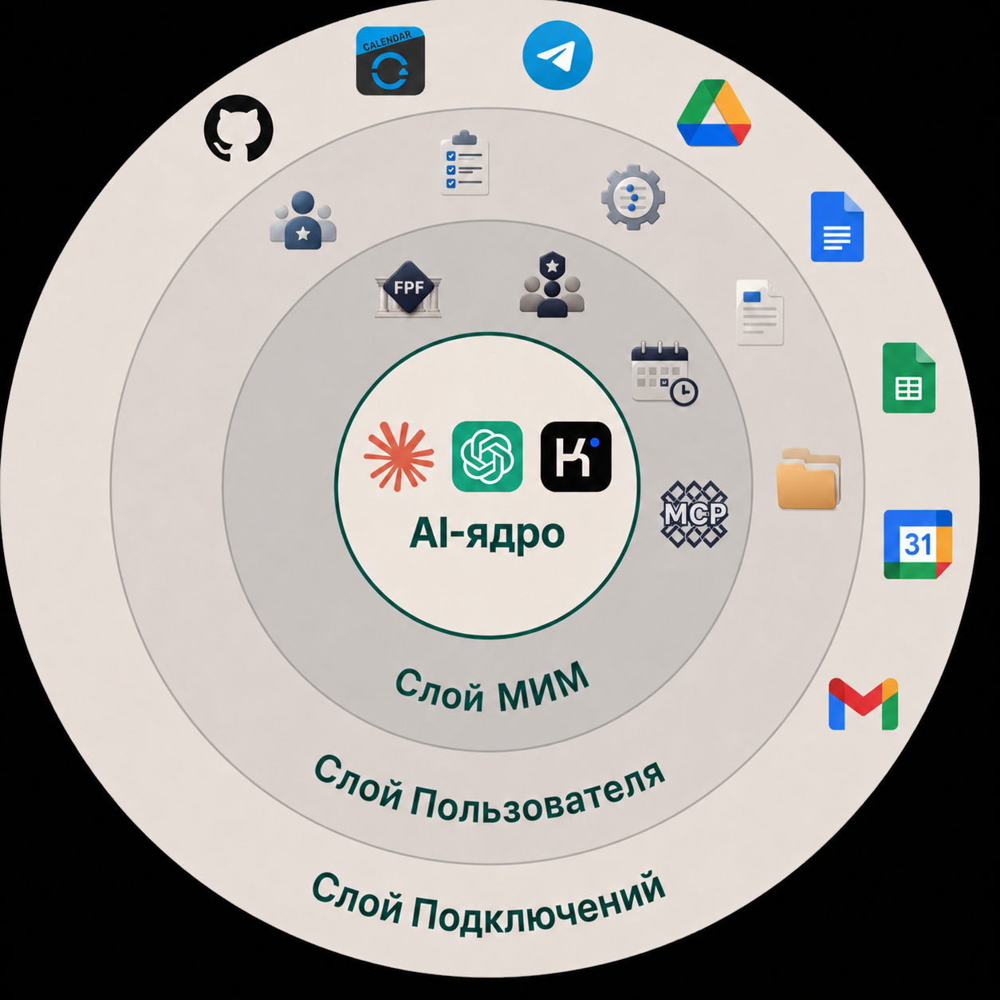
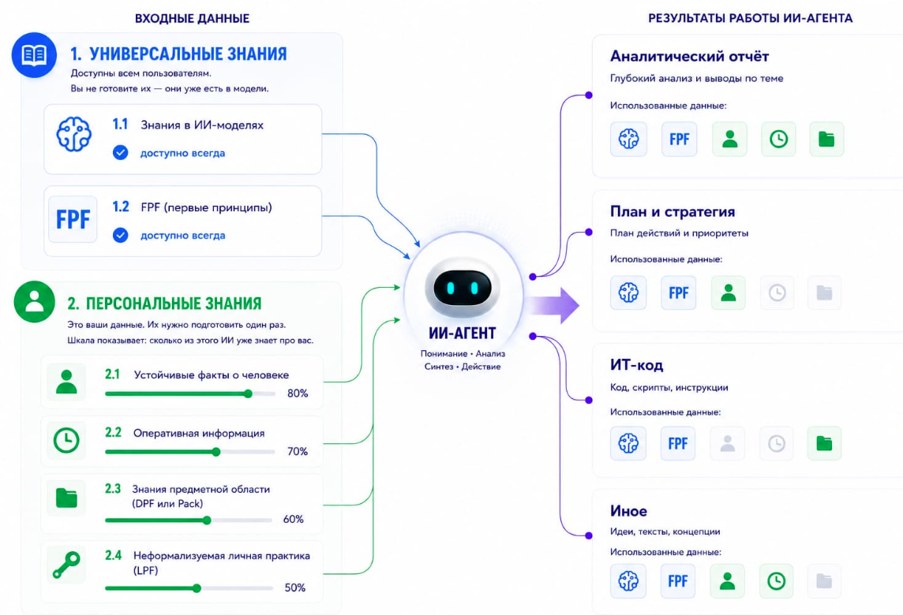
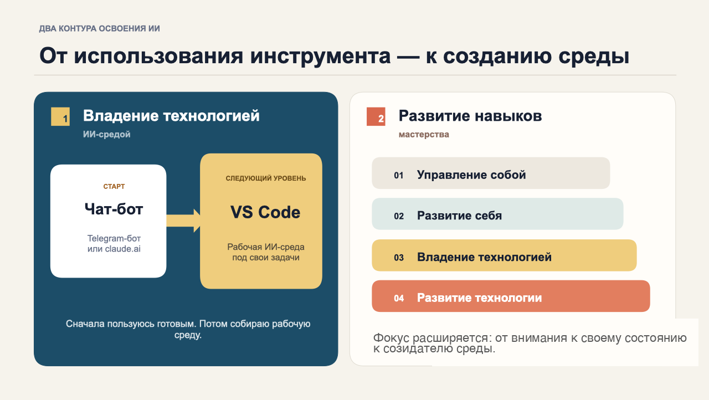

<!-- _class: title -->
<!-- _paginate: false -->
<!-- _header: "" -->
<!-- _footer: "" -->

# Первый запуск личной ИИ-среды

## Интеллектуальная рабочая среда для тех, у кого есть дело

Церен Церенов · Мастерская инженеров и менеджеров

23 августа 2026 · практикум IWE

---

<!-- A3: диагностика — узнаёте себя? -->

# Узнаёте себя?

1. Каждый диалог с ИИ начинается с нуля — вчерашний контекст потерян
2. Чувствуете, что коллеги и знакомые уже впереди в работе с ИИ
3. Хочется системно, но непонятно, с чего начать
4. Инструмент есть — но настроить под себя ни разу не пробовали

К концу практикума у каждого пункта будет ответ — вы увидите его вживую, не в теории.

---

<!-- Как сейчас обычно работают с ИИ — путь к ИИ-среде -->

# Как сейчас обычно работают с ИИ

1. **Чат-бот** — каждый диалог с нуля, контекст теряется
2. **Проекты в интерфейсе вендора** — память и файлы появляются, но живут у поставщика модели
3. **Подключение агентов и мультиагентный режим** — пока нет общей памяти или бесшовной работы со всеми проектами и данными, или вы не в контуре среды
4. **ИИ-среда** — ваше место, ваши данные, вы сами — часть системы

---

<!-- A2: слайд "ИИ-среда" — ценность сверху, инструмент снизу -->

# ИИ-среда — система, которая всегда с вами

Чат-бот забывает после каждого диалога. Личная среда — накапливает и возвращает.

**IWE — одна из возможных реализаций ИИ-среды, которая в той или иной степени будет у каждого.**

Сегодня — не про то, чтобы стать техническим специалистом. Про то, чтобы завести своё место, которое работает на вас каждый день.

---

<!-- Кому подходит IWE — целевая аудитория -->

# Кому подходит IWE

Опыт и ИТ-навыки разные. Общая задача — не терять контекст сложной работы.

<h3>🧠 Методолог и создатель образовательных продуктов</h3>

Опыт: превращает сложные идеи в программы и тексты

ИТ-навыки: без программирования

В IWE: стратегия, знания, развитие продуктов

новое и непонятное → спокойное освоение

<h3>🏠 Специалист по интерьерному дизайну</h3>

Опыт: ведёт проект от брифа до реализации

ИТ-навыки: профильные программы, без программирования

В IWE: бриф, версии, правки, материалы и договорённости

хаос правок → целостная картина проекта

<h3>📊 Продуктовый руководитель / ИТ-директор</h3>

Опыт: отвечает за продукт, команду и изменения

ИТ-навыки: высокий уровень

В IWE: аудит, стратегия и найм

тупик и неопределённость → уверенность в решении

<h3>📁 Руководитель портфеля проектов</h3>

Опыт: ведёт несколько сложных проектов

ИТ-навыки: разработческая подготовка

В IWE: помощник, администратор проектов, аналитик и внешняя память

перегрузка → ощущение личной команды

IWE нужна не определённой профессии. Она нужна там, где работа продолжается дольше одного чата.

---

<!-- Устройство IWE — 4 слоя (слайд Дмитрия Смирнова) -->

# Что такое IWE

1. **AI-ядро** — «двигатель» всей среды. Актуальная ИИ-модель: чем сильнее — тем выше эффект
2. **Слой МИМ** — методология и руководства, правила и методы, данные и другая информация, чтобы ИИ был системным и безопасным для личного мышления
3. **Слой Пользователя** — правила и методы, проекты и данные
4. **Слой Подключений** — внешние сервисы и модели, к которым среда дотягивается наружу

Слайд Дмитрия Смирнова

---

<!-- 4 типа персональной информации — входные данные и результаты работы ИИ-агента -->

<!-- _header: "" -->
<!-- _footer: "Подробнее в посте: [«Всезнающий ИИ есть у всех, а полезный — только у тех, кто его самостоятельно развивает»](https://systemsworld.club/t/vseznayushhij-ii-est-u-vseh-a-poleznyj-tolko-u-teh-kto-ego-samostoyatelno-razvivaet/40020)" -->

# Универсальная и персональная информация

- **Тип 1.1:** знания в ИИ-моделях
- **Тип 1.2:** первые принципы (FPF)
- **Тип 2.1:** устойчивые факты о вас
- **Тип 2.2:** оперативная информация
- **Тип 2.3:** формализованное личное знание
- **Тип 2.4:** неформализуемая личная практика

---

<!-- A5, опора 3: 4 вида навыков (мастерства) -->

# 4 вида навыков (мастерства)

| | Управление (держать норму) | Развитие (поднять норму) |
|---|---|---|
| **Я** | Собранный человек | Непрерывно развивающийся человек |
| **Инструмент (IWE)** | **Оператор костюма** | Мастер-создатель костюма |

Сегодня — первое подключение костюма. 30 августа — как спроектировать костюм под себя.

---

<!-- Как мыслить ИИ-среду — три роли человека в работе с ИИ -->

# Как мыслить ИИ-среду

ИИ-среда — не просто инструмент рядом с вами, а система, с которой вы взаимодействуете в ролях:

1. **Пользователь**, а IWE как инструмент
2. **Исполнитель рабочих ролей**, а IWE как мастерская, в которой есть другие агенты
3. **Созидатель**, а IWE как целевая система (продукт)

---

<!-- Два контура освоения ИИ-среды -->

<!-- _header: "" -->

# Два контура освоения ИИ-среды

---

<!-- Полезные ссылки -->

# Полезные ссылки

- **Aisystant MCP:** https://mcp.aisystant.com/mcp
- **Шаблон IWE:** https://github.com/TserenTserenov/FMT-exocortex-template
- **Бот в Телеграм:** @aist_me_bot
- **Подписка МИМ:** https://system-school.ru/open-endedness
- **Канал Церена в Телеграм:** https://t.me/systemsthinkinglife
- **Альбом освоения IWE:** https://claude.ai/code/artifact/b93116c4-e2c9-413a-b86c-b78e561e4b30

---

<!-- Спасибо и приглашение -->

<!-- _header: "" -->
<!-- _class: center -->

# Спасибо за внимание!

Приглашение на платный семинар 30 августа

Там разберём, как работать в своей ИИ-среде.

