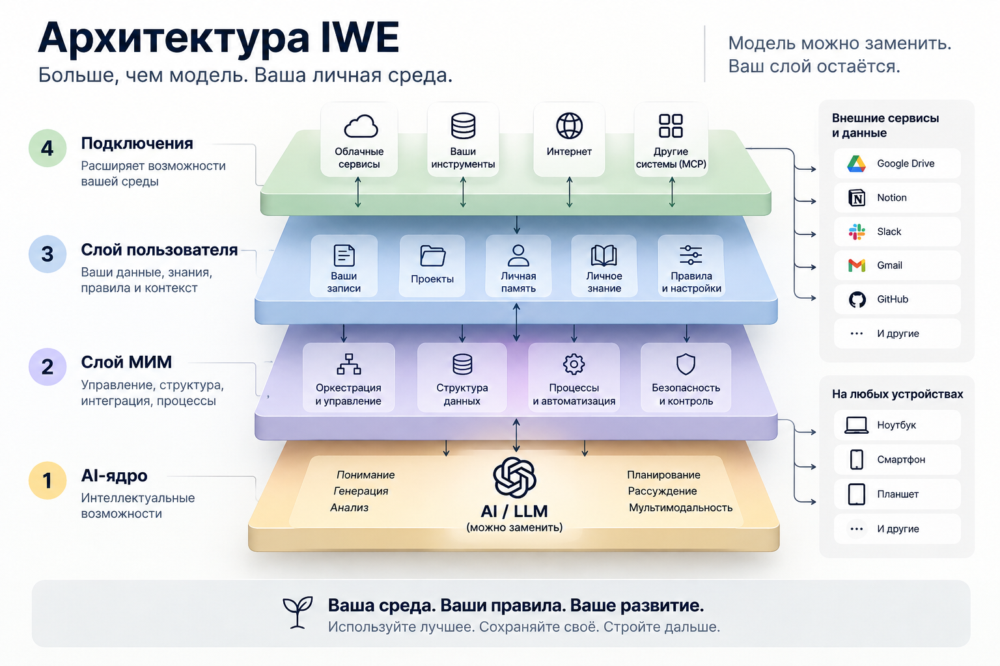
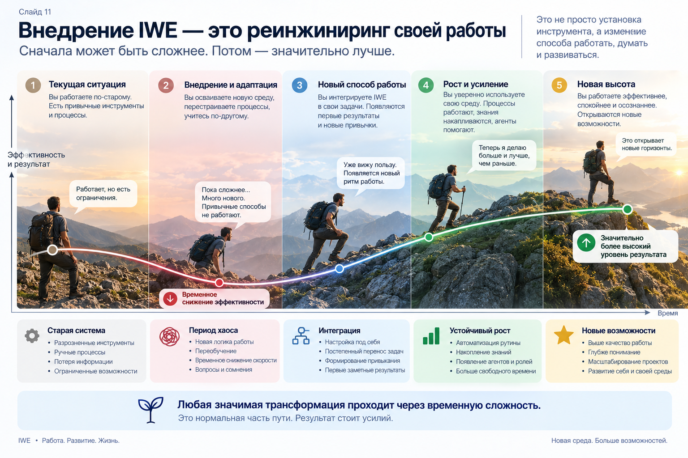
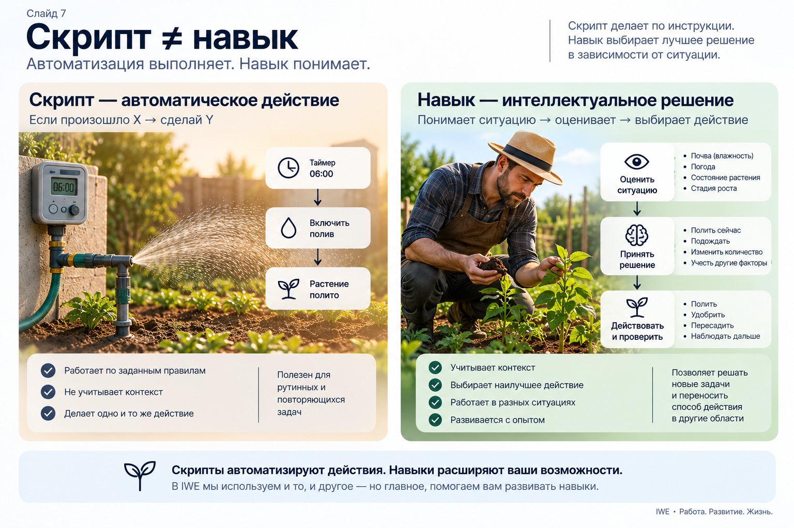
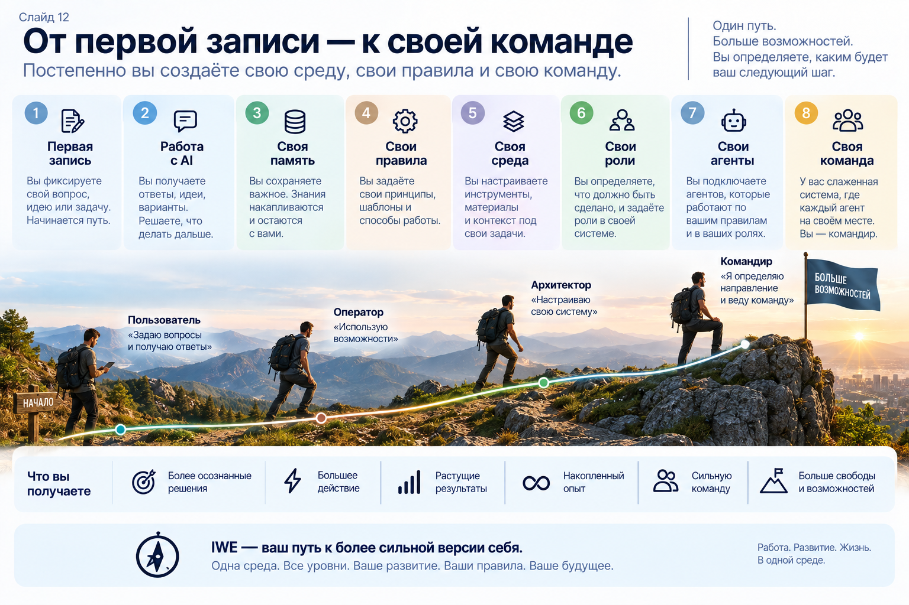

<!-- _class: title -->
<!-- _paginate: false -->
<!-- _header: "" -->
<!-- _footer: "" -->

# IWE в развитии

## От первой записи до своей команды агентов

Церен Церенов · Мастерская инженеров и менеджеров

6 сентября 2026 · блок 1 «от первой записи» + блок 2 «своя команда агентов»

---

<!-- Слайд-крюк открытия — вопрос (ответ на следующем слайде, пауза для зала) -->

# Что изменилось?

Извозчик, 1900-е. Кучер знает улицы, погоду, характер лошади — работа: везти из точки А в точку Б.

Водитель такси. Знает приложения, маршрутизацию, рейтинги — работа всё та же (А → Б), а методы, навыки, среда — другие.

Что здесь главное изменение?

---

<!-- Слайд-крюк — ответ -->

# Не лошадь поменялась

Не просто авто заменил лошадь. Смотри шире!

Кучер не стал водителем, просто сев за руль. Изменились навыки, привычки, весь контекст работы. <b>Изменилась среда</b> - асфальт вместо брусчатки, заправки и автосервисы, разметка и правила движения, навигатор, диспетчер заказов, страховка, права и техосмотр.

С ИИ то же самое: не новая «лошадь» - меняются методы, привычки, стиль жизни. И меняется среда вокруг: где лежит ваш контекст, кто помнит вчерашнее, по каким правилам идёт работа.

---

<!-- Слайд узнавания (переписан 06.09 по поручению пилота): не «когда объясняли», а «как часто повторяете» плюс вопрос про осознанность накопления. Пять признаков ведущий проговаривает голосом — см. 03-host-card.md. -->

# Как часто вы повторяете ИИ, кто вы?

Кто вы, чем занимаетесь, что хотите получить, какие у вас проекты - и что вы делали в прошлый раз. Каждый разговор заново?

И второй вопрос, потяжелее: видите ли вы осознанно, что добавляется к вашей среде каждый день?

---

<!-- Не Практика: чистая оргинформация, демонстрации здесь нет. 06.09: слайд перенесён в открытие вместо «Маршрута дня» (решение пилота). -->

# Оргчасть

- **Первые 2 часа** — для новичков, можно прийти без запущенной среды
- **Вторые 2 часа** — для тех, у кого среда уже развивается
- **Каждый блок — две части по часу**, между ними короткий перерыв
- **После блока 1** у вас есть: личное пространство, один личный след, понятная структура среды
- **После блока 2** у вас есть: установленный автоматический помощник, разобранный живой пример извлечения знания, спроектированная своя первая роль

---

# Чек-лист на весь день

Сегодня мы проверим:

1. Зачем IWE именно вам — в вашей работе, в жизни, в саморазвитии
2. Что такое IWE и из каких частей он состоит
3. Как с ним жить каждый день и как расти вам обоим

В конце дня вернёмся к этим трём вопросам — и каждый ответит на них своими словами.

---

<!-- Эпиграф встречи. 06.09 (поручение пилота): слайд отдан под готовую схему «Одна сессия — три результата», текст эпиграфа ушёл на следующий слайд, ничего не потеряно. -->

<!-- _header: "" -->
<!-- _class: center -->

---

<!-- Эпиграф встречи — словами, сразу за схемой -->

# Одна работа — три результата

1. **Продвинулся проект** — за счёт созданного рабочего продукта
2. **Вырос сам человек** — получен опыт, новый навык, знание
3. **Обновилась его личная среда** — появились новые записи, правила, навыки среды

Проверочный вопрос дня: сможет ли связка человек+среда повторить способ действия на изменённой задаче?

Рабочий продукт — конкретный результат с названием и критерием готовности, который можно предъявить. Не «задача», а вещь.

---

<!-- Блок 1, Шаг 0 — теория: самоопределение -->

<!-- _header: "Блок 1 «от первой записи»" -->

# Насколько вы срослись с ИИ?

Настолько ли явно и органично он встроен в вашу работу и жизнь, что вы прямо сейчас могли бы сказать — где именно и как?

К концу сегодняшнего дня у каждого будет конкретный, показанный на практике ответ — не ощущение, а точка на пути от первой записи до своей команды помощников.

---

<!-- _header: "" -->

Практика

# Живой вход

1. **claude.ai** — регистрация. Это ядро, которое умеет думать
2. **Аккаунт МИМ** (system-school.ru) — нужен для подключения разъёма, дальше среда сама попросит войти
3. **Разъём к знаниям МИМ** — `mcp.aisystant.com/mcp`, работает как USB: стандартное подключение к методологии и навыкам мастерской
4. **GitHub** — облачная папка, где будет лежать ваше личное пространство. Это ваше хранилище
5. **«Создай мне личное пространство»** — среда сама разворачивает руководство и место для данных, без ручной настройки. Так появляются ваши правила

Без claude.ai (в первую очередь Россия) — тот же путь через iwe.system-school.ru. Это полноценный вход, а не запасной: сквозной прогон по нему прошли вчера, работает.

---

<!-- Практика-контраст, шаг 1 (добавлено 06.09 по поручению пилота): вопрос в пустом чате ДО записи о себе. Второй шаг — после «Первой записи о себе». Полные тексты — 04-demo-prompts.md §1. -->

Практика

# Спросите среду прямо сейчас

В чистом чате, ничего о себе не рассказывая:

Как мне лучше организовать свою работу на этой неделе?

Ответ будет вежливым и пустым: расставьте приоритеты, попробуйте матрицу Эйзенхауэра.

Запомните этот ответ.

---

<!-- Т1.5 — теория: почему ИИ обгоняет на олимпиаде, но не справляется с работой (добавлено 05.09, пост «Такси или личный водитель», по поручению пилота) -->

# Такси или личный водитель

Та же модель, что обгоняет человека на математической олимпиаде и сдаёт экзамен на адвоката, решает только 47% реальных ИТ-задач в независимом бенчмарке (Artificial Analysis + IBM, май 2026).

Дело не в уме модели, а в том, что дали ей на вход и насколько её способы работы отвечают вашему контексту.

Такси знает маршрут, не знает вас: каждая поездка с нуля. Личный водитель знает расписание семьи, привычки, что оставить в багажнике. Утренний «водитель» из маршрута дня — это как раз такси по вызову; сегодня мы делаем из него вашего личного.

---

<!-- Продолжение метафоры такси/водитель -->

# Без вашего контекста — средний ответ

1. Кто вы и чем занимаетесь
2. Какие у вас правила, договорённости, приоритеты
3. Что уже обсуждалось и решено

Без этого даже лучшая модель отвечает усреднённо — как таксист, который в первый раз едет по вашему маршруту.

Личный водитель не ждёт вопроса — сам звонит: «Дождь начался, забрать раньше?» Обычный чат-бот только отвечает.

---

<!-- П1.5 — практика: первая запись о себе (добавлено 05.09, по поручению пилота) -->

Практика

# Первая запись о себе

Прямо сейчас, коротко и своими словами — в среду:

1. Кто вы и чем занимаетесь
2. С какими инструментами и технологиями уже работаете
3. Что для вас важно в работе — правила, приоритеты, стиль

Пример, который можно повторить целиком
Запиши обо мне в мою среду: я дизайнер-архитектор интерьеров, проектирую
квартиры, черчу в Автокаде. Трое детей, на работу и на новое есть 10-15 часов
в неделю. Что для меня важно: сначала сценарии жизни семьи, потом планировка;
без пафосных текстов для заказчиков. Скажи, куда именно ты это записал.

Это и есть пакет онбординга личного водителя вместо такси — первый шаг приучения говорить с IWE обычным языком.

---

<!-- Практика-контраст, шаг 2: тот же вопрос, что был до записи. Здесь и происходит момент узнавания. -->

Практика

# Тот же вопрос - теперь со средой

Теперь, зная обо мне, ответь ещё раз: как мне лучше организовать свою
работу на этой неделе? Учти мои 10-15 часов и то, что я работаю в Автокаде.

Сравните с тем ответом, что был до записи. Разницу даёт не новая модель, а одна ваша запись.

Ключевой была последняя строка первого запроса: среда назвала файл, и запись видно своими глазами в вашем хранилище. Чат «помнит на время», среда — записывает.

---

<!-- Т1 — теория: четыре объекта внимания (пост №217) -->

# Четыре объекта внимания

1. **ИИ-модель (LLM) как сменное ядро** — интеллектуальная мощность, но ещё не персональная среда
2. **Правила пользователя** — контекст, инструкции, стиль, приоритеты, рабочие процедуры
3. **Пользовательское хранилище** — принадлежит вам, сохраняется при смене модели или компании-поставщика
4. **Общие правила и навыки человека и ИИ** — единая понятийная рамка, ИИ как экзоскелет мышления

Обычный чат-бот — это только первый объект. Среда начинается со второго.

Вы это уже прошли руками полчаса назад: регистрация — ядро, разъём МИМ — общие правила и навыки, GitHub — ваше хранилище, «создай личное пространство» — ваши правила. Второй объект — ИИ как выпускник вуза: компетентен, но не знает лично вас; ваши правила — его пакет онбординга.

---

<!-- Практика зала (добавлено 06.09): каждый спрашивает про себя. Ещё три персоны — преподаватель, инженер, предприниматель — в 04-demo-prompts.md §2. -->

Практика

# Зачем IWE именно мне

Подставьте свою профессию и спросите среду о себе:

Я дизайнер-архитектор интерьеров: квартиры под ключ, Автокад, трое детей,
10-15 часов в неделю на развитие. Объясни без общих слов, зачем лично мне личная
ИИ-среда и чем она отличается от обычного чат-бота, которым я уже пользуюсь.
Приведи три примера моих реальных задач, где разница будет видна в первую же
неделю, и скажи, с чего начать в понедельник.

Я руковожу отделом из девяти человек: планёрки, отчёты, найм, куча переписки
и никакой памяти между неделями. Объясни, зачем мне личная ИИ-среда и что она
даст такого, чего не даёт таск-трекер. Три примера моих задач и первый шаг.

Это первый вопрос дневного чек-листа, отвеченный не мной со сцены, а вашей же средой про вас.

---

<!-- Т2b — теория: круговой слайд Дмитрия (переиспользован из 23.08) -->

# Что такое IWE

1. **AI-ядро** — «двигатель» всей среды
2. **Слой МИМ** (Мастерская инженеров и менеджеров) — методология и правила, чтобы ИИ был системным
3. **Слой Пользователя** — ваши правила, проекты и данные
4. **Слой Подключений** — внешние сервисы и модели

Те же четыре объекта, нарисованные слоями: ядро — объект 1, слой Пользователя — объекты 2 и 3, слой МИМ — объект 4, подключения — разъём ко всему остальному. Схема Дмитрия Смирнова.

---

<!-- Крупный план архитектуры (добавлен 06.09 по поручению пилота): та же схема слоёв, но подробно — видно, что лежит в каждом слое и к чему среда подключается. -->

<!-- _header: "" -->
<!-- _class: center -->

---

<!-- Т2c — теория: 4 типа персональной информации (переиспользован из 23.08) -->

<!-- _header: "" -->

# Что лежит в слое Пользователя

### Универсальное (не про вас)

- **1.1** знания в ИИ-моделях
- **1.2** первые принципы — общая рамка мышления, одна на всех

### Персональное (про вас)

- **2.1** устойчивые факты о вас
- **2.2** оперативная информация
- **2.3** формализованное личное знание
- **2.4** неформализуемая личная практика

Персональные типы — это и есть ваш слой. Их нет ни в одной модели.

---

<!-- Т2а — теория: принцип ВДВ (переставлено 05.09 рядом с практикой — доказательство сразу за принципом, по замечанию ревью Fable). Физический порядок слайдов здесь: Т2b → Т2c → Т2а, метка сохранена по сценарию 01-scenario.md. -->

# Принцип Вход-Действие-Выход

Универсальный жизненный принцип, не частность IWE — так устроено вообще всё в жизни: у любого процесса есть вход, действие и выход.

Выход работы в IWE — тройной: продукт, рост человека, обновление среды. Те самые три результата из эпиграфа.

---

Практика

# Живой полный цикл на своей работе

Участник называет свою повторяющуюся работу, и прямо в браузере мы разбираем её по принципу Вход-Действие-Выход:

«Разложи по принципу ВДВ, как я готовлю и отправляю коммерческое предложение клиенту. Найди стадию, где нет явного результата, и сохрани разбор в мою среду.»

<b>Продукт</b> — на экране стадии процесса с результатом на каждой <b>Рост человека</b> — вслух названа стадия, где результат не определён <b>Обновление среды</b> — разбор сохранён, к нему можно вернуться завтра

Работает и в браузере, и в редакторе: приём разбора по ВДВ проверен живым запуском 4 сентября. Процесс подставляем любой из зала — приём заявки, найм, подготовка занятия.

---

<!-- Т3а — теория: понятие ИИ-среда, две параллельные метафоры -->

# ИИ-среда — два образа

<h3>Дом со штатом помощников</h3>
Личный водитель, повар, управляющий — каждый мастер своего дела. Полномочия помощников растут постепенно, как лимиты по карте.

<h3>Мастерская, доставшаяся от отца</h3>
Станок с программным управлением — чат-бот. Сотрудник, которому можно поручить задачу — ИИ-агент. Готовая мастерская по наследству, которую сам достраиваешь: покупаешь станки, обучаешь сотрудников, перестраиваешь офис.

Обе — об одном: дом — что вас уже обслуживают; мастерская — что вы сами её достраиваете.

---

<!-- Т3b — теория: IWE vs платформа Aisystant, аналогия iPhone/Apple -->

<!-- _header: "" -->

# IWE — это не платформа Aisystant

IWE — как iPhone: у вас, вы управляете, работает и без подключения к платформе. Aisystant (сервисы МИМ) — как App Store: делают телефон мощнее, но не обязательны.

IWE (ваши файлы в git, редактор VS Code на компьютере) подключается к сервисам Aisystant — методология, база знаний, расчёт ступени (уровня вашего мастерства) — через тот же разъём MCP. Становится мощнее, но не обязана.

---

<!-- Слайд про данные (добавлен 06.09, пир-сессия с Kimi). Стоит ПЕРЕД первым следом намеренно: человек спрашивает «а безопасно?» до того, как отдал первую запись, а не после. -->

# Чьи это данные

Данные лежат в вашем хранилище — в вашем репозитории, под вашим аккаунтом.

Скажете стереть — сотрём полностью: процедура есть и она работает. Доступ к чужим данным закрывается на уровне самой базы — там, где хранится согласие и профиль, это уже сделано, остальное закрываем сейчас.

Говорю про то, что проверено на этой неделе, а не про планы: процедура удаления работает, запрет на чужие данные раскатывается по хранилищу — часть уже стоит на бою.

---

<!-- П3 — практика: первый личный след + диагностика -->

Практика

# Первый личный след

Участник фотографирует свой обед и произносит «запиши, что я поел» → среда сама решает, куда это положить.

Тут же — предложение пройти диагностику собранности (до 6 вопросов).

Вот дом уже вас обслужил — записал след, это уже сделано. А платформа поверх дома предлагает диагностику — необязательный шаг, добавляющий свою картину.

«Запиши, что я поел» → оперативная информация (тип 2.2). Результат диагностики → устойчивый факт о вас (тип 2.1).

---

<!-- Т4 — теория: суть ≠ интерфейс -->

# Суть ≠ интерфейс

Суть — память, правила, знание и ваш контекст. Интерфейс — окно, через которое вы с ней говорите.

Один ответ независимо от окна: Телеграм · Браузер (claude.ai и iwe.system-school.ru) · Терминал (VS Code)

---

<!-- Т4b — теория: что стоит за окнами, сборка сеанса -->

# Кто собирает сеанс

За каждым окном — агент. Он выбирает модель и подключается к вашей среде и к сервисам платформы.

<h3>Меняется</h3>
Агент — сегодня бот, завтра браузер, послезавтра терминал. Модель внутри агента — обновляется почти каждый месяц. Набор подключённых сервисов — вы включаете и выключаете их сами.

<h3>Остаётся</h3>
Ваша среда IWE — файлы, правила, история. Подключение к сервисам платформы Aisystant — методология, база знаний.

Смените модель, смените окно — среда и подключение к сервисам платформы останутся теми же.

---

<!-- Сервисы и сборка сеанса (добавлено 06.09 по вопросу пилота): показать, что IWE подключается к внешним сервисам и что сеанс каждый раз собирается заново из нескольких систем. -->

# Среда собирается заново каждый раз

В любом вашем разговоре одновременно работают четыре разные вещи — и ни одна из них не «программа IWE».

<h3>Кто отвечает</h3>
Модель — сегодняшняя, сменная. Агент — окно, через которое вы говорите.

<h3>Что он читает</h3>
Ваша среда — правила, записи, проекты. Сервисы МИМ — методология, база знаний, ступень. Ваши сервисы — почта, календарь, диск, репозитории.

Поэтому IWE не устанавливают один раз навсегда: каждый сеанс собирается заново из того, что вы подключили. Меняете одну часть — остальные работают по-прежнему.

---

<!-- Практика (добавлено 06.09): среда сама рассказывает, из чего собран сеанс и к чему её можно подключить. -->

Практика

# Пусть среда расскажет о себе сама

Объясни простыми словами, что именно сейчас участвует в нашем разговоре:
какая модель отвечает, что даёт подключение к МИМ, что из моего личного хранилища
ты читаешь и какие внешние сервисы подключены. Нарисуй словами схему: что меняется
от сеанса к сеансу, а что остаётся моим навсегда.

Покажи, к каким сервисам можно подключить мою среду: почта, календарь, диск,
репозитории, мессенджеры. По каждому скажи: что появится полезного лично для меня
и чем я рискую, если подключу. Начни с того, что даст больше всего пользы за неделю.

Предыдущий слайд, рассказанный самой средой про саму себя - и сразу список того, что вы можете подключить уже сегодня.

---

Практика

# Выдача по интерфейсам

Строка плана недели — «сегодня разобрать три входящих письма» — приходит в Telegram.

Та же строка — в VS Code и в браузере, и под ней открывается один и тот же текст руководства, без расхождений.

---

<!-- Т5 — теория: зачем стратегирование -->

# Зачем стратегирование

Без приоритетов среда не знает, что для вас важно. Одна сессия в неделю даёт 2-3 приоритета — среда потом держит их перед глазами: в плане, в руководстве, в напоминаниях.

За активные действия в среде начисляются баллы, их можно тратить в боте на семинары, подписку и курсы. Сегодня на сцене это не показываем — механика ещё донастраивается.

---

Практика

# Стратегирование на реальном приоритете

Участник называет одну свою рабочую путаницу — «не понимаю, за что хвататься на этой неделе».

Среда вместе с ним раскладывает её на 2-3 приоритета, и они сразу становятся видны в плане недели.

---

<!-- Закрытие блока 1 — теория -->

# Сила не в модели, а в среде

Модель — как электричество, среда — как дом. Модель меняется, среда остаётся.

Честный ответ на «а зачем строить, если завтра выйдет модель получше»

---

Практика

# Экскурсия и задание на неделю

На экране — структура папок личного пространства участника с подписями, что где лежит.

Задание на неделю: раз в день фиксировать один личный след.

Пространство — есть, первый след — есть, структуру — видите.

---

<!-- Саммари блока 1 (добавлен 06.09 по поручению пилота): что унести с первой половины дня -->

# Что унести из первой половины

1. **Сила не в модели, а в среде.** Модель — сменное ядро, среда остаётся вашей.
2. **Среда начинается с ваших правил и вашего хранилища**, а не с умного бота: бот — это только первый из четырёх объектов.
3. **Любая работа даёт три результата сразу:** продвинулся проект, вырос человек, обновилась среда.
4. **Данные ваши.** Лежат у вас, стираются по вашему слову, чужого доступа нет.
5. **Одна запись в день** — это и есть весь вход. Дальше среда растёт вместе с вами.

Утром вы вызывали такси. Сейчас у вас есть свой водитель — вы его сегодня наняли и представили.

---

<!-- Переход между блоками (без слайдов Практики — не Т/П-пара) -->

<!-- _header: "" -->

# 4 вида мастерства

| | Управление (держать норму) | Развитие (поднять норму) |
|---|---|---|
| **Я** | Собранный человек | Непрерывно развивающийся человек |
| **Инструмент (IWE)** | **Оператор костюма** | Мастер-создатель костюма |

Костюм — ваша IWE как экзоскелет. Сегодня вы дошли до «оператора», дальше — «мастер-создатель». Для тех, кто был 23.08, — знакомая таблица.

---

# Мастерская отца — заявка на действие

Станок с программным управлением — чат-бот. Сотрудник, которому можно поручить задачу, — ИИ-агент. Готовая мастерская по наследству, которую сам достраиваешь: покупаешь станки, обучаешь сотрудников, перестраиваешь офис.

В первом блоке вы собрали свою среду и научились ей управлять. Сейчас — набираем команду помощников.

Команда — это и есть сотрудники мастерской: агенты, которым можно поручать. Модель меняется, среда остаётся — вы это уже проверили в первом блоке.

---

# Честное ожидание блока 2

У большинства в этом зале уже есть свои рабочие привычки и правила, которые доказали эффективность.

Встраивание новой среды в уже выстроенную систему — это не гладкое добавление, а реальный реинжиниринг с временной просадкой некоторых процессов, пока новая система не устоялась.

Что на той стороне просадки — словами участника: Дмитрий: «инструмент однозначно сложный — но окупается: подешевело поддержание жизненного ритма, появилась единая точка входа во все мысли, идеи, проекты».

---

<!-- Кривая внедрения (добавлено 06.09): просадка эффективности и выход на новый уровень — картинка к «честному ожиданию», зал видит, что провал посередине это норма пути. -->

<!-- _header: "" -->
<!-- _class: center -->

---

<!-- Блок 2, Т6 — теория: зачем VS Code -->

<!-- _header: "Блок 2 «своя команда агентов»" -->

# Зачем VS Code, а не браузер

Разница не в приёмах среды — готовый приём полностью работает и в браузере.

Разница в другом: приёмы, которые запускают скрипты на вашем компьютере (установка Экстрактора, конвейер знания), требуют терминала — а он есть только в VS Code (редакторе на компьютере). Записи через платформу, как утром, работают и в браузере.

---

<!-- _header: "Блок 2 «своя команда агентов»" -->

Практика

# Живое подключение VS Code

На экране рядом два окна: редактор с файлами среды участника слева, переписка с ассистентом справа — ассистент правит файл, изменение видно в дереве файлов сразу.

**Remote Control:** то же самое со смартфона — список запущенных сессий, можно проверить и вмешаться, не садясь за компьютер.

Обязательная первая фраза: «прочитай CLAUDE.md и начни стратегическую сессию» — без неё агент работает в обычном режиме.

---

<!-- Т6.5 — теория: рабочий продукт vs задача -->

# Почему рабочий продукт, а не задача

Задача может быть расплывчатой и никогда явно не закрыться. Рабочий продукт — конкретный результат с названием-артефактом и критерием готовности.

Как формируется: неудовлетворённость/цель → название-артефакт → бюджет времени → критерий приёмки → фазы.

---

Практика

# Живой мета-пример

Показать саму карточку рабочего продукта, из которой прямо сейчас собирается этот семинар — та карточка, что обновилась утром, теперь целиком: название, бюджет, критерий, фазы.

Не постановочный, а настоящий текущий пример.

---

<!-- Т7 — теория: роль-автомат Экстрактор -->

# Роль-автомат Экстрактор

Наблюдает поток работы, находит кандидатов в заметки и знание. Знание приходит в среду и другим путём — активно: вы сами приносите статью или ссылку и просите разобраться.

<h3>Скрипт ≠ скилл</h3>Скрипт — автополив по таймеру, жёстко детерминирован. Скилл — садовник, сам решает когда полить. Экстрактор — автополив; решение о находке — садовник, то есть вы.

<h3>Система ≠ роль ≠ агент</h3>Один агент может исполнять разные роли. Одна роль может переходить между агентами.

---

<!-- Скрипт против навыка (добавлено 06.09): та же пара «автополив против садовника», что в карточке слайда Экстрактора, только развёрнуто. -->

<!-- _header: "" -->
<!-- _class: center -->

---

Практика

# Установка Экстрактора вживую

Автомат ставится на реальную рабочую переписку участника за последние дни и предлагает 1-2 кандидата в заметки. Что именно найдёт — заранее неизвестно, в этом и смысл живого показа.

**Второй пример (кормление среды):** участник даёт свежую статью и спрашивает «как это применить? насколько это соответствует уже накопленному знанию?»

---

<!-- Карта конвейера знаний (добавлено 06.09 по поручению пилота): образ целиком сразу за теорией об Экстракторе, дальше тот же путь разбирается словами по шагам. -->

<!-- _header: "" -->
<!-- _class: center -->

---

<!-- Т8а — теория: конвейер извлечения знания -->

# Конвейер извлечения знания

1. Экстрактор наблюдает поток работы и находит кандидата
2. Оформляет как предложение со статусом «ждёт решения»
3. Человек, не автомат, смотрит и решает: принять / отклонить / отложить
4. Принято — запись уходит в постоянную базу знаний, остаётся видимый след (сохранённая версия)

Главная мысль: автомат ищет и предлагает, человек решает и владеет решением.

---

Практика

# Живой разбор находки

Участник вживую решает — принять или отклонить то, что нашёл Экстрактор.

Заодно скажу вслух, кто ещё смотрел на эту находку до вас: у меня её проверял второй агент, другой модели. Он спорит с первым — и это не сбой, а рабочий приём: агенты проверяют друг друга.

---

<!-- Т8б — теория: ВДВ как инструмент проверки -->

# Принцип ВДВ как инструмент проверки

Та же рамка «вход-действие-выход», но теперь как инструмент: берём описание любого процесса → проверяем, есть ли явный вход, действие, выход → если нет, достраиваем.

Пример: конвейер поиска работы — 6 стадий от определения критериев до оформления на новом месте, каждая с рабочим продуктом на выходе.

---

Практика

# Живая демонстрация

На сцене — обычная человеческая фраза, без служебного синтаксиса:

«Я хочу найти новую работу. Помоги организовать процесс поиска по принципу ВДВ.»

Проверочный вопрос дня: тот же способ (ВДВ) — на новой задаче. Связка человек+среда сработала?

---

<!-- Т8в — теория: ритуал ОРЗ -->

# Ритуал Открытие-Работа-Закрытие

Тот же ритм, что уже был во всех живых шагах сегодня: явное начало (что делаю и зачем) → сама работа → явное завершение (что получилось, что узнал, что дальше).

Не отдельный инструмент, а рамка, в которой происходит вообще всё показанное сегодня.

---

Практика

# Живое открытие и закрытие эпизода

Сама демонстрация элементов культуры делается как один такой цикл: открыли (что показываем и зачем) → показали → закрыли (что участники увидели, что дальше).

---

<!-- Т8г — теория: карта 14 элементов культуры (реестр DP.M.008, простыми словами). Практики нет по сценарию (строка 88: "—") — слайда «Практика» здесь намеренно нет, не пара Т/П. -->

# Культура работы IWE — 14 элементов

<ol>
<li><b>✓ ОРЗ</b> — Открытие → Работа → Закрытие</li>
<li>Каскад планирования — стратегия → месяц → неделя → день</li>
<li>Учёт времени по трём координатам — продукт + роль + метод</li>
<li>Структура знаний — принципы → предметные → производные</li>
<li><b>✓ ВДВ</b> — Вход-Действие-Выход</li>
<li><b>✓ Захват знания</b> — конвейер извлечения знания</li>
<li>АрхГейт — оценка архитектурного решения до принятия</li>
</ol>

<ol start="8">
<li>Стоп-краны — обязательные проверки перед действием</li>
<li>Осторожный мультитаскинг — 2-4 фокусных дела в день</li>
<li>Мультиагентность — агенты проверяют друг друга</li>
<li>Экзоскелетный режим — ИИ усиливает мышление, не заменяет</li>
<li>Техобслуживание — держать среду в рабочем состоянии</li>
<li>Стоп-лист — когда остановить работу</li>
<li>Эволюция системы — ежедневная ретроспектива правил</li>
</ol>

Три отмеченных — показаны сегодня вживую. Остальные одиннадцать — это ваш маршрут на ближайшие месяцы, и чек-лист по нему уже готов: вы получите его сегодня, вместе с ролями, которые за каждым элементом стоят.

---

<!-- Мета-пример команды агентов (добавлен 06.09, пир-сессия с Kimi). Страховочная фраза обязательна — без неё зал слышит «у них всё есть, а у меня нет». -->

# Команда уже работает — на этой встрече

Эту презентацию собирали два разных ИИ: один писал, второй спорил и ловил слабые места. Третий читал готовое холодным взглядом и нашёл то, что пропустили оба.

Но это ещё не ваша команда: у меня за ней месяцы настройки, у вас — сегодня первая роль. Начинается она ровно с того опросника, который сейчас будет.

Тот же приём вчера нашёл два настоящих дефекта в моём коде, мимо которых я прошёл сам.

---

<!-- Слайд скорости изменений (добавлен 06.09). Смысл — не «наши достижения», а доказательство тезиса «среда достраивается»: ответ на возражение «зачем строить, если завтра выйдет модель получше». -->

# Среда достраивается: пример скорости

Мастерская отца — это не картинка. Вот что появилось в этой среде за одну последнюю неделю:

1. Вход без claude.ai — полноценный, проверен сквозным прогоном
2. Наставник в чате: среда узнаёт названные понятия по ходу разговора и подсказывает по ним — уже в пилотном боте, живую приёмку проходим сейчас
3. Полное удаление личных данных по запросу и закрытие доступа к чужим прямо в хранилище
4. Машинная проверка кода, которая ловит то, что пропустил человек

У вас будет происходить так же — только со своими вещами, в своём темпе.

---

<!-- Т9 — теория: своя команда ролей -->

# Своя команда ролей

Не копируется у Дмитрия или у кого-то ещё, а проектируется под ВАШУ повторяющуюся работу.

**Роль** — что делается регулярно и по каким правилам (должность в мастерской). **Агент** — кто её сейчас исполняет (сотрудник на этой должности).

Дмитрий Смирнов — участник, собравший свою команду из четырёх ролей: персональный ассистент, администратор проектов, аналитик, внешняя память. Это его конфигурация, не универсальный набор.

---

Практика

# Опросник «своя команда ролей»

8 вопросов, ~20 минут — каждый участник проектирует одну свою первую роль сам. Вопросы 3-6 — это тот же принцип ВДВ, применённый к роли.

Примеры Дмитрия — только иллюстрация, не меню.

---

<!-- Рабочий слайд опросника (материал практики П9; источник — 2026.08.30/03-roles-questionnaire.md) -->

# Опросник — одна повторяющаяся работа за раз

1. **Какая у вас повторяющаяся работа?** (что именно и как часто)
2. **Что в ней отнимает время механически, не творчески?** (черновик, сверка, поиск, напоминание)
3. **Вход.** Что роль получает, чтобы начать работу? (документ, сообщение, событие)
4. **Результат.** Что роль должна предъявить на выходе — конкретно, проверяемо?
5. **Границы полномочий.** Что делает сама, а что только предлагает вам на решение?
6. **Способ проверки.** Как вы узнаете, что роль сработала верно, а не просто дала ответ?
7. **Название роли** — своё, свободное
8. **Первый шаг настройки.** Какое правило или файл завести, чтобы роль заработала?

---

<!-- Т10 — теория (опция): мягкое/жёсткое правило -->

# Мягкое и жёсткое правило

Мягкое правило допускает интерпретацию модели и ошибку. Жёсткое — детерминированная процедура.

Жёсткость — свойство ОПЕРАЦИИ, не всего процесса.

---

Практика

# Найди признак сбоя

Помните утреннее «запиши, что я поел» — среда сама выбрала, куда положить запись. А если ошиблась? Как это заметить и как вернуть на место?

Короткое упражнение на одном примере: признак сбоя → путь восстановления.

---

<!-- Закрытие семинара — теория -->

# Главное — не технология

А то, насколько человек меняет свои привычки, методы и стиль работы и жизни.

«Я сам, как минимум, 4 месяца упирался — и потерял их. А потом создал IWE, перестроил процессы своей работы и команды: расходы упали примерно на 20%, скорость работы выросла.»

Ступень растёт не от анкеты, а от того, что вы реально делаете каждый день — среда учитывает ваши действия, а не только ответы. Тот самый извозчик и водитель — помните, с чего начали? Модель поменяется к следующему семинару, а ваша среда — уже не та, что была сегодня утром.

---

<!-- Саммари блока 2 (добавлен 06.09 по поручению пилота) -->

# Что унести из второй половины

1. **Роль — это не агент.** Роль — что делается регулярно и по каким правилам; агент — кто её сейчас исполняет. Агента меняете, роль остаётся.
2. **Рабочий продукт, а не задача.** Название, критерий готовности, фазы — иначе работа никогда явно не закончится.
3. **Автомат ищет, человек решает.** Экстрактор приносит кандидатов, но принимает знание всегда человек.
4. **Вход-Действие-Выход — рабочий инструмент, а не теория.** Берёте любой свой процесс и достраиваете недостающее.
5. **Открытие-Работа-Закрытие — рамка для всего.** Без явного закрытия результат теряется, даже если работа сделана.
6. **Своя команда собирается под вашу работу**, а не копируется с чужой.

---

<!-- Карта пути (добавлено 06.09): восемь ступеней от первой записи до своей команды — где зал сегодня и что дальше. Ставится перед самопроверкой и шагом недели. -->

<!-- _header: "" -->
<!-- _class: center -->

---

Практика

# Самопроверка — те же три вопроса

Утром спросили: где именно и как ИИ встроен в вашу жизнь. Теперь — ваш ответ своими словами:

1. **Зачем IWE именно вам** — в работе, в жизни, в саморазвитии?
2. **Что это такое и из чего состоит?**
3. **Как с ним жить каждый день и как расти вам обоим?**

Одной строкой: «IWE мне нужен для ______»

---

<!-- Обязательство на неделю (добавлен 06.09, пир-сессия с Kimi). На экране только три строки — процедура с поднятием рук у ведущего, см. 03-host-card.md. -->

Практика

# Один шаг на этой неделе

Выберите один — и скажите вслух, какой.

1. **Первый раз со средой** — одна запись о себе или о дне, каждый день
2. **Среда уже есть** — поставить Экстрактора и разобрать хотя бы одну его находку
3. **Хочется команду** — довести опросник до конца и завести первую роль

Один шаг, а не три. Тот, который точно сделаете.

---

# Полезные ссылки

- **Разъём к знаниям МИМ:** https://mcp.aisystant.com/mcp
- **Браузерный вход без claude.ai:** https://iwe.system-school.ru
- **Аккаунт МИМ:** https://aisystant.system-school.ru/lk
- **Подписка «Инженерия интеллекта»:** https://system-school.ru/open-endedness
- **Альбом освоения IWE (12 листов):** https://claude.ai/code/artifact/b93116c4-e2c9-413a-b86c-b78e561e4b30
- **Структура этой встречи:** https://claude.ai/code/artifact/4f2aa44f-9e3d-4146-9745-c8fae3ce8d17
- **Шаблон IWE в GitHub:** https://github.com/TserenTserenov/FMT-exocortex-template
- **Бот в Телеграм:** @aist_me_bot
- **Чат поддержки МИМ:** https://t.me/ssm_tg
- **Канал Церена в Телеграм:** https://t.me/systemsthinkinglife
- **Личное развитие с наставником:** https://system-school.ru/programs/intro

Куда писать, когда застрял: чат поддержки, одно сообщение по формуле «я на таком-то шаге, сделал то-то, вижу вот это» плюс снимок экрана.

---

<!-- _header: "" -->
<!-- _class: center -->

# Спасибо за внимание!

Приглашение на практикумы «Системное саморазвитие»

Сегодня — первая роль. На практикумах — вся команда и работа над собой вместе с IWE.

