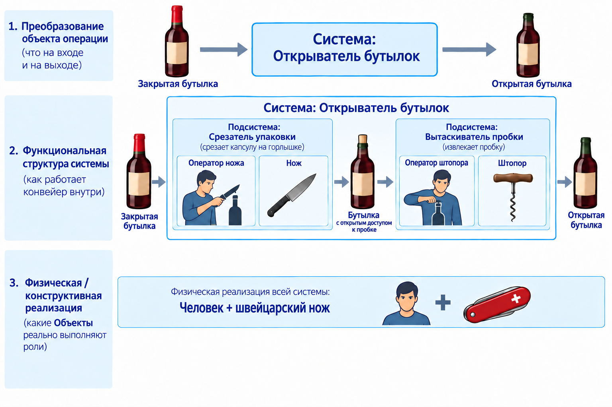

<!-- _class: title -->
<!-- _paginate: false -->
<!-- _header: "" -->
<!-- _footer: "" -->

<style scoped>
h1 { font-size: 2.1em; }
</style>

# Использование ИИ в работе

## От чат-бота к своей ИИ-среде: как думать о пилоте, чтобы он заработал

<div class="speaker">Церен Церенов · Мастерская инженеров и менеджеров</div>

<div class="meta">22 сентября 2026 · акселератор внедрения ИИ в бизнес</div>

---

<!-- План на 90 минут -->

<style scoped>
ol { font-size: 0.85em; line-height: 1.4; }
li { margin-bottom: 0.2em; }
</style>

# Что сегодня

1. **Чат-боты, агенты, мультиагенты - это прошлое.** Теперь ИИ-среда
2. **Одна сессия - три результата.** Меняется формат обучения
3. **Из чего состоит ИИ-среда**
4. **Системное мышление для века ИИ** - на примере открывателя бутылок
5. **Практика:** раскладываем ваш пилот - вход, действие ИИ, проверка, результат

<span class="ex">В конце - три двери, как попробовать сегодня: браузер, VS Code, сообщество.</span>

---

<!-- Блок 1 · Крюк - вопрос (пауза для зала) -->

<!-- _header: "Блок 1 · От ботов и агентов к ИИ-среде" -->

<style scoped>
p { font-size: 0.82em; }
.highlight-box { margin-top: 14px; }
</style>


# Что изменилось?

Извозчик, 1900-е. Кучер знает улицы, погоду, характер лошади - работа: везти из точки А в точку Б.

Водитель такси. Знает приложения, маршрутизацию, рейтинги - работа всё та же (А → Б), а методы, навыки, среда - другие.

<div class="highlight-box">
<p>Что здесь главное изменение?</p>
</div>

---

<!-- Крюк - ответ -->

<!-- _header: "Блок 1 · От ботов и агентов к ИИ-среде" -->

# Не лошадь поменялась

<div class="lead">Не просто авто заменил лошадь. Смотри шире!</div>

<div class="highlight-box">
<p>Кучер не стал водителем, просто сев за руль. Изменились навыки, привычки, весь контекст работы.<br><b>Изменилась среда</b> - асфальт вместо брусчатки, заправки и автосервисы, разметка и правила движения, навигатор, диспетчер заказов, страховка, права и техосмотр.</p>
</div>

<span class="ex">С ИИ то же самое: не новая «лошадь» - меняются методы, привычки, стиль работы. И меняется среда вокруг: где лежит ваш контекст, кто помнит вчерашнее, по каким правилам идёт работа.</span>

---

<!-- Четыре ступени работы с ИИ (23.08) -->

<!-- _header: "Блок 1 · От ботов и агентов к ИИ-среде" -->

# Как сейчас обычно работают с ИИ

1. **Чат-бот** - без своей памяти вообще, контекст вводите каждый раз заново
2. **Проекты в интерфейсе вендора** - память и файлы появляются, но живут у поставщика модели
3. **Агенты и мультиагентный режим** - пока нет общей памяти или бесшовной работы со всеми проектами и данными, или вы не в контуре среды
4. **ИИ-среда** - ваше место, ваши данные, вы сами - часть системы

<span class="ex">Первые три ступени - это прошлое, которое мы уже прошли. Главный навык сегодня - четвёртая.</span>

---

<!-- Три типа ИИ-помощников (D-034) -->

<!-- _header: "Блок 1 · От ботов и агентов к ИИ-среде" -->

<style scoped>
.cards-3 { gap: 18px; }
.card { padding: 16px 20px; font-size: 0.8em; }
</style>

# Три типа ИИ-помощников

<div class="cards-3">
<div class="card">
<h3>Автопилот</h3>
Выполняет задачу за вас. Быстро, но вы не становитесь способнее. Так работает большинство ботов и «помощников для кода».
</div>
<div class="card">
<h3>Экзоскелет</h3>
Усиливает ваше мышление: помогает увидеть различие, структуру, ошибку - и вы сами делаете лучше.
</div>
<div class="card accent">
<h3>Среда</h3>
Накапливает следы вашей деятельности - записи, решения, результаты - и превращает их в следующий рабочий продукт.
</div>
</div>

<div class="highlight-box"><p>Проверка: если после разговора с ИИ не осталось ни записи, ни решения, ни сделанного результата - это пока чат, а не среда.</p></div>

---

<!-- Сила не в модели, а в среде -->

<!-- _header: "Блок 1 · От ботов и агентов к ИИ-среде" -->

# Сила не в модели, а в среде

<div class="highlight-box"><p>Модель - как электричество, среда - как дом.<br>Модель меняется, среда остаётся.</p></div>

Вендоры - Anthropic, OpenAI, Google - поставщики вычислений. Они конкурируют за то, кто даст мощность дешевле и умнее. Это их работа, не ваша.

<span class="ex">Ваша работа - развивать свой дом: правила, память, знание, команду помощников. Главный навык эпохи ИИ - не «выбрать самую умную модель», а строить и развивать свою ИИ-среду.</span>

---

<!-- Что меняется и что остаётся (06.09 «Кто собирает сеанс») -->

<!-- _header: "Блок 1 · От ботов и агентов к ИИ-среде" -->

# Что меняется и что остаётся

<div class="cards-2">
<div class="card">
<h3>Меняется</h3>
Агент - сегодня бот, завтра браузер, послезавтра терминал.<br>Модель внутри агента - обновляется почти каждый месяц.<br>Набор подключённых сервисов - включаете и выключаете сами.
</div>
<div class="card accent">
<h3>Остаётся</h3>
Ваша среда - файлы, правила, история.<br>Ваша база знаний и методы работы.<br>Ваша команда ролей - кто бы их сейчас ни исполнял.
</div>
</div>

<span class="ex">Смените модель, смените окно - среда останется той же. Именно она и есть ваш актив.</span>

---

<!-- Блок 2 · Схема трёх результатов -->

<!-- _header: "" -->
<!-- _class: center -->


---

<!-- Блок 2 · Три результата словами -->

<!-- _header: "Блок 2 · Одна сессия - три результата" -->

# Одна работа - три результата

1. **Продвинулся проект** - за счёт созданного рабочего продукта
2. **Вырос сам человек** - получен опыт, новый навык, знание
3. **Обновилась его личная среда** - появились новые записи, правила, навыки среды

<div class="highlight-box">
<p>Проверочный вопрос: сможет ли связка человек+среда повторить способ действия на новой задаче?</p>
</div>

<span class="ex">Рабочий продукт - конкретный результат с названием и критерием готовности, который можно предъявить. Не «задача», а вещь.</span>

---

<!-- Блок 2 · Меняется формат обучения -->

<!-- _header: "Блок 2 · Одна сессия - три результата" -->

# Меняется формат обучения

<div class="lead">Вы не откладываете проект ради отдельного курса. Делаете реальный проект - среда подсказывает метод в момент, когда он нужен.</div>

<div class="highlight-box"><p>Пример: готовите концепцию и смешали проблему, требования и решение.<br>Обычный ИИ перепишет текст за вас. Среда помогает увидеть различие - и вы улучшаете настоящий документ сами.</p></div>

<span class="ex">Поэтому три результата, а не один ответ: проект продвинулся, вы стали способнее, среда сохранила решение и метод для следующей сессии.</span>

---

<!-- Блок 3 · Такси или личный водитель -->

<!-- _header: "Блок 3 · Из чего состоит ИИ-среда" -->

# Такси или личный водитель

<div class="lead">Та же модель, что обгоняет человека на олимпиаде по математике, без вашего контекста отвечает усреднённо - как таксист, который в первый раз едет по вашему маршруту.</div>

<div class="highlight-box"><p>Личный водитель знает расписание семьи, привычки, что оставить в багажнике. Личным его делает не магия модели, а накопленные вами следы: договорённости, проекты, записи, результаты.</p></div>

<span class="ex">Дело не в уме модели, а в том, что вы дали ей на вход и насколько её способы работы отвечают вашему контексту.</span>

---

<!-- Блок 3 · Четыре объекта внимания (пост №217) -->

<!-- _header: "Блок 3 · Из чего состоит ИИ-среда" -->

<style scoped>
ol { font-size: 0.82em; line-height: 1.3; }
li { margin-bottom: 0.2em; }
.highlight-box { margin: 12px 0; padding: 14px 28px; }
</style>

# Четыре объекта внимания

1. **ИИ-модель как сменное ядро** - интеллектуальная мощность, но ещё не персональная среда
2. **Правила пользователя** - контекст, инструкции, стиль, приоритеты, рабочие процедуры
3. **Пользовательское хранилище** - принадлежит вам, сохраняется при смене модели или поставщика
4. **Общие правила и навыки человека и ИИ** - единая понятийная рамка, ИИ как экзоскелет мышления

<div class="highlight-box"><p>Обычный чат-бот - это только первый объект. Среда начинается со второго.</p></div>

<span class="ex">Новая грамотность эпохи ИИ - умение работать со всеми четырьмя слоями сразу. Кто ограничится первым, останется пассажиром такси.</span>

---

<!-- Блок 3 · Четыре слоя IWE (схема Дмитрия Смирнова) -->

<!-- _header: "Блок 3 · Из чего состоит ИИ-среда" -->

<style scoped>
ol { font-size: 0.8em; line-height: 1.35; }
li { margin-bottom: 0.35em; }
</style>

# Что такое IWE


1. **ИИ-ядро** - «двигатель» всей среды
2. **Слой МИМ** (Мастерская инженеров и менеджеров) - методология и правила, чтобы ИИ был системным
3. **Слой Пользователя** - ваши правила, проекты и данные
4. **Слой Подключений** - внешние сервисы и модели

<span class="ex">Те же четыре объекта, нарисованные слоями. IWE - одна из возможных реализаций ИИ-среды, которая в той или иной степени будет у каждого.</span>

---

<!-- Блок 3 · Крупный план архитектуры -->

<!-- _header: "" -->
<!-- _class: center -->


---

<!-- Блок 3 · Суть ≠ интерфейс -->

<!-- _header: "Блок 3 · Из чего состоит ИИ-среда" -->

# Суть ≠ интерфейс

<div class="lead">Суть - память, правила, знание и ваш контекст. Интерфейс - окно, через которое вы с ней говорите.</div>

<div class="highlight-box"><p>Один ответ независимо от окна:<br>Телеграм · Браузер (claude.ai и iwe.system-school.ru) · Терминал (VS Code)</p></div>

<span class="ex">Как подключиться - покажу в конце: три двери на выбор.</span>

---

<!-- Блок 3 · Демо (по возможности): первая запись о себе -->

<!-- _header: "Блок 3 · Из чего состоит ИИ-среда" -->

<div class="p-tag">Демонстрация</div>

<style scoped>
.ask { font-size: 0.58em; }
</style>

# Первая запись о себе

В чистом чате: «Как мне лучше организовать работу на этой неделе?» - ответ вежливый и пустой.

<span class="ask">Запиши обо мне в мою среду: я руковожу отделом из девяти человек - планёрки,
отчёты, найм, много переписки. На новое есть 5-7 часов в неделю. Важно: сначала
приоритеты недели, потом всё остальное; без общих слов. Скажи, куда именно записал.</span>

<span class="ask">Теперь, зная обо мне, ответь ещё раз: как мне лучше организовать работу на этой неделе?</span>

<div class="highlight-box"><p>Разницу даёт не новая модель, а одна ваша запись. Чат «помнит на время», среда - записывает.</p></div>

---

<!-- Блок 4 · Формула и развилка -->

<!-- _header: "Блок 4 · Системное мышление для века ИИ" -->

# ИИ забирает навыки. У человека остаётся мышление

<div class="cards-2">
<div class="card muted">
<h3>Протез</h3>
ИИ думает за вас. Вы слабеете, а среда решает. Любой пилот - «дайте модели и посмотрим, что выйдет».
</div>
<div class="card accent">
<h3>Экзоскелет</h3>
ИИ усиливает ваше мышление. Вы остаётесь тем, кто ставит цель, выделяет систему и принимает решение.
</div>
</div>

<div class="highlight-box"><p>Экзоскелет требует одного навыка: явно выделять системы, объекты и действия. Этому ИИ за вас не научится.</p></div>

---

<!-- Блок 4 · Открыватель бутылок - схема во весь экран -->

<!-- _header: "" -->
<!-- _class: center -->



---

<!-- Блок 4 · Открыватель бутылок - три уровня словами -->

<!-- _header: "Блок 4 · Системное мышление для века ИИ" -->

<style scoped>
ol { font-size: 0.8em; line-height: 1.35; }
li { margin-bottom: 0.3em; }
</style>

# Одна система - три уровня описания

1. **Преобразование объекта операции.** Что на входе (закрытая бутылка), что на выходе (открытая). Система «Открыватель бутылок» - то, что делает этот переход
2. **Функциональная структура.** Как устроен конвейер внутри: подсистема «Срезатель упаковки» (оператор ножа + нож) → бутылка с доступом к пробке → подсистема «Вытаскиватель пробки» (оператор штопора + штопор)
3. **Физическая реализация.** Кто и что реально играет роли: человек + швейцарский нож

<div class="highlight-box"><p>Один физический объект - нож - играет две роли. Одну роль можно отдать разным объектам. Роль и её носитель - разные вещи.</p></div>

---

<!-- Блок 4 · Перенос на ИИ-пилот -->

<!-- _header: "Блок 4 · Системное мышление для века ИИ" -->

<style scoped>
table { font-size: 0.72em; }
td, th { padding: 10px 16px; }
tbody tr:last-child td { background: #1e293b; color: var(--color-text) !important; font-weight: 600; border-top: none; }
</style>

# Ваш пилот - такая же система

| Уровень | Открыватель бутылок | ИИ-пилот в вашем бизнесе |
|---|---|---|
| **1. Объект операции** | закрытая → открытая бутылка | заявка → отправленный ответ; сырой отчёт → сводка для решения |
| **2. Структура и роли** | срезатель упаковки, вытаскиватель пробки | роль ИИ-агента, роль человека-проверяющего, роль интеграции |
| **3. Реализация** | человек + швейцарский нож | модель + конструктор без кода + подключения к почте и CRM |

<div class="highlight-box"><p>Ошибка новичков - начинать с третьего уровня («какую модель взять») и пропускать первые два.</p></div>

---

<!-- Блок 4 · Система ≠ Роль ≠ Агент -->

<!-- _header: "Блок 4 · Системное мышление для века ИИ" -->

# Система ≠ Роль ≠ Агент

<div class="lead"><b>Роль</b> - что делается регулярно и по каким правилам. <b>Агент</b> - кто её сейчас исполняет.</div>

<div class="cards-2">
<div class="card">
<h3>Один агент - много ролей</h3>
Как нож-штопор: одна модель может быть и разборщиком заявок, и черновиком ответа, и проверяющим на втором проходе.
</div>
<div class="card">
<h3>Одна роль - разные агенты</h3>
Сегодня роль «Разборщик запроса» исполняет одна модель, завтра - другая, послезавтра - человек. Роль остаётся, меняется носитель.
</div>
</div>

<span class="ex">Меняете модель или вендора - роли и правила в вашей среде остаются. Это и есть «оркестрация», только своими словами.</span>

---

<!-- Блок 4 · Скрипт против навыка - схема -->

<!-- _header: "" -->
<!-- _class: center -->


---

<!-- Блок 4 · Скрипт ≠ Скилл словами -->

<!-- _header: "Блок 4 · Системное мышление для века ИИ" -->

# Скрипт ≠ Скилл

<div class="cards-2">
<div class="card">
<h3>Скрипт</h3>
Автополив по таймеру: жёстко, предсказуемо, одинаково каждый раз. Уберёте ИИ - продолжит работать.
</div>
<div class="card accent">
<h3>Скилл</h3>
Садовник: сам решает, когда и сколько полить. Требует суждения. Уберёте ИИ - сломается.
</div>
</div>

<div class="highlight-box"><p>В пилоте решите явно: где нужен автомат, где - суждение, и кто отвечает за результат. Автомат ищет и предлагает, человек решает и владеет решением.</p></div>

---

<!-- Блок 4 · Роль-автомат Экстрактор (06.09) -->

<!-- _header: "Блок 4 · Системное мышление для века ИИ" -->

# Роль-автомат Экстрактор

<div class="lead">Наблюдает поток вашей работы - переписку, записи, разговоры с ИИ - и находит кандидатов в знание: решения, различения, приёмы, которые стоит сохранить.</div>

<div class="cards-2">
<div class="card">
<h3>Экстрактор - автополив</h3>
Работает по расписанию, без вашего участия: каждые несколько часов смотрит на новые следы и откладывает находки во входящие.
</div>
<div class="card accent">
<h3>Решение - садовник</h3>
Принять, отклонить или отложить находку решаете вы. Знание становится вашим только после вашего решения.
</div>
</div>

<span class="ex">Знание приходит в среду и активно: вы сами приносите статью или ссылку и просите разобрать, что из этого применимо к вашему пилоту.</span>

---

<!-- Блок 4 · Схема конвейера извлечения знания -->

<!-- _header: "" -->
<!-- _class: center -->


---

<!-- Блок 4 · Конвейер словами -->

<!-- _header: "Блок 4 · Системное мышление для века ИИ" -->

# Конвейер извлечения знания

1. Экстрактор наблюдает поток работы и находит кандидата
2. Оформляет его как предложение со статусом «ждёт решения»
3. Человек, не автомат, смотрит и решает: принять / отклонить / отложить
4. Принято - запись уходит в постоянную базу знаний, остаётся видимый след

<div class="highlight-box"><p>Автомат ищет и предлагает. Человек решает и владеет решением.</p></div>

<span class="ex">Это и есть третий результат любой сессии - обновилась среда. Сам по себе он не случается: без конвейера знание остаётся в чате и теряется.</span>

---

<!-- Блок 4 · Практика: извлечь знание из разговора (работает в любом чат-боте) -->

<!-- _header: "Блок 4 · Системное мышление для века ИИ" -->

<div class="p-tag">Практика · 5 минут</div>

<style scoped>
.ask { font-size: 0.6em; }
</style>

# Извлеките знание из своего разговора

<div class="lead">Откройте любой свой недавний разговор с ИИ - про работу, про пилот, про что угодно - и допишите в конец:</div>

<span class="ask">Извлеки из нашего разговора три знания, которые стоит сохранить: решение, различение
или приём. По каждому скажи, куда его положить - в правила, в базу знаний по проекту
или в заметки - и почему.</span>

<div class="highlight-box"><p>Чат даст текст - и забудет его к следующему разговору. Среда положит записи туда, куда вы сказали, и вернёт их завтра. В этом вся разница между первым и четвёртым объектом внимания.</p></div>

---

<!-- Блок 4 · Принцип ВДВ -->

<!-- _header: "Блок 4 · Системное мышление для века ИИ" -->

# Принцип Вход-Действие-Выход

<div class="lead">Универсальный жизненный принцип, не частность ИИ: у любого процесса есть вход, действие и выход. Открыватель бутылок - это он же.</div>

<div class="highlight-box"><p>В ИИ-среде выход тройной: продукт, рост человека, обновление среды.<br>Те самые три результата.</p></div>

<span class="ex">Сейчас применим его к вашему пилоту - ровно по четырём полям, которые просил заказчик.</span>

---

<!-- Блок 5 · Шаблон четырёх полей -->

<!-- _header: "Блок 5 · Практика: разложи свой пилот" -->

<style scoped>
table { font-size: 0.66em; }
td, th { padding: 9px 14px; }
tbody tr:last-child td { background: rgba(249, 115, 22, 0.18); }
h1 { font-size: 1.5em; }
</style>

# Шаблон описания пилота

| Поле | Уровень системы | Вопрос себе |
|---|---|---|
| **Входные данные** | объект на входе | Что приходит и в каком состоянии: письмо, заявка, таблица, звонок? |
| **Действие ИИ** | структура и роли | Что делает ИИ-агент, что человек, что интеграция? Где автомат, где суждение? |
| **Проверка** | роль проверяющего | Как узнаём, что сработало верно, а не просто дало ответ? Что агент делает сам, а что только предлагает? |
| **Результат** | объект на выходе | В каком состоянии объект на выходе? Критерий готовности - вещь, которую можно предъявить |
| **Реализация** | физический уровень | Какая модель, какой конструктор без кода, какие подключения - решается последним |

---

<!-- Блок 5 · Пример разбора -->

<!-- _header: "Блок 5 · Практика: разложи свой пилот" -->

<style scoped>
ol { font-size: 0.74em; line-height: 1.35; }
li { margin-bottom: 0.2em; }
h1 { font-size: 1.5em; }
</style>

# Пример: ответ на входящий запрос клиента

1. **Вход** - письмо клиента с вопросом о цене и сроках
2. **Действие ИИ** - роль «Разборщик запроса»: извлечь параметры, найти позицию в прайсе, собрать черновик ответа. Роль «Проверяющий» - менеджер. Агент только предлагает, не отправляет
3. **Проверка** - параметры совпали с прайсом, нет обещаний вне правил. Признак сбоя: агент придумал позицию, которой нет
4. **Результат** - отправленный ответ и запись в CRM
5. **Реализация** - модель + почтовый ящик + конструктор автоматизаций без кода

<div class="highlight-box"><p>Заметьте порядок: реализация - последней. Сначала вход, роли и проверка.</p></div>

---

<!-- Блок 5 · Опросник (30.08) как расширенный шаблон -->

<!-- _header: "Блок 5 · Практика: разложи свой пилот" -->

<style scoped>
ol { font-size: 0.72em; line-height: 1.35; }
li { margin-bottom: 0.15em; }
h1 { font-size: 1.4em; }
</style>

# Расширенный шаблон - одна повторяющаяся работа за раз

1. **Какая у вас повторяющаяся работа?** (что именно и как часто)
2. **Что в ней отнимает время механически, не творчески?** (черновик, сверка, поиск, напоминание)
3. **Вход.** Что роль получает, чтобы начать работу? (документ, сообщение, событие)
4. **Результат.** Что роль должна предъявить на выходе - конкретно, проверяемо?
5. **Границы полномочий.** Что делает сама, а что только предлагает вам на решение?
6. **Способ проверки.** Как вы узнаете, что роль сработала верно, а не просто дала ответ?
7. **Название роли** - своё, свободное
8. **Первый шаг настройки.** Какое правило или файл завести, чтобы роль заработала?

<span class="ex">Вопросы 3-6 - те же четыре поля брифа. Это шаблон, с которым можно уйти сегодня.</span>

---

<!-- Блок 5 · Практика зала -->

<!-- _header: "Блок 5 · Практика: разложи свой пилот" -->

<div class="p-tag">Практика · 10 минут</div>

# Разложите свой пилот

<div class="lead">В чат - четыре строки, по одной на поле:</div>

<span class="ask">Вход: …
Действие ИИ (роли - кто что делает, где автомат, где суждение): …
Проверка (как узнаем, что верно; признак сбоя): …
Результат (вещь, которую можно предъявить): …</span>

<div class="highlight-box"><p>Два-три пилота разберём вслух: где спутаны роли и реализация, где нет проверки, где результат - «задача», а не вещь.</p></div>

---

<!-- Закрытие · 14 элементов культуры (06.09) -->

<!-- _header: "Закрытие" -->

<style scoped>
.cards-2 { gap: 20px; }
.card { padding: 14px 20px; }
ol { font-size: 0.6em; line-height: 1.3; margin: 0; }
li { margin-bottom: 0.1em; }
h1 { font-size: 1.4em; }
</style>

# Культура работы в ИИ-среде - 14 элементов

<div class="cards-2">
<div class="card">
<ol>
<li>ОРЗ - Открытие → Работа → Закрытие</li>
<li>Каскад планирования - стратегия → месяц → неделя → день</li>
<li>Учёт времени по трём координатам - продукт + роль + метод</li>
<li>Структура знаний - принципы → предметные → производные</li>
<li><b>✓ ВДВ</b> - Вход-Действие-Выход</li>
<li><b>✓ Захват знания</b> - конвейер извлечения знания</li>
<li>АрхГейт - оценка архитектурного решения до принятия</li>
</ol>
</div>
<div class="card">
<ol start="8">
<li>Стоп-краны - обязательные проверки перед действием</li>
<li>Осторожный мультитаскинг - 2-4 фокусных дела в день</li>
<li><b>✓ Мультиагентность</b> - роли и агенты, агенты проверяют друг друга</li>
<li><b>✓ Экзоскелетный режим</b> - ИИ усиливает мышление, не заменяет</li>
<li>Техобслуживание - держать среду в рабочем состоянии</li>
<li>Стоп-лист - когда остановить работу</li>
<li>Эволюция системы - регулярная ретроспектива правил</li>
</ol>
</div>
</div>

<span class="ex">Четыре отмеченных прошли сегодня вживую. Остальные десять - маршрут на ближайшие месяцы; среда подсказывает их в момент, когда они нужны.</span>

---

<!-- Закрытие · Четыре рычага и тупик «печатная машинка» (31.05, 07.06) -->

<!-- _header: "Закрытие" -->

<style scoped>
.cards-2 { gap: 14px; }
.card { padding: 12px 18px; font-size: 0.74em; line-height: 1.35; }
.card h3 { font-size: 0.95em; margin-bottom: 4px; }
h1 { font-size: 1.4em; }
.highlight-box { margin-top: 12px; padding: 12px 24px; }
.highlight-box p { font-size: 0.9em; }
</style>

# Четыре рычага - без них среда превращается в папку с файлами

<div class="cards-2">
<div class="card"><h3>1. Мировоззрение и стиль работы</h3>ИИ меняет не инструмент, а привычки, методы и стиль жизни. Кто это принял - растёт, кто нет - бегает по кругу.</div>
<div class="card"><h3>2. Костюм в двух ролях</h3>Пользователь костюма - больше за то же время. Создатель костюма - среда развивается вместе с вами.</div>
<div class="card"><h3>3. Системное мышление</h3>Хаос и неопределённость → явно выделенные системы, роли, действия → решение. Открыватель бутылок и ваш пилот.</div>
<div class="card accent"><h3>4. Сообщество и среда сопроизводителей</h3>В одиночку темп падает, норма размывается, откат к старому стилю. Среда - не клуб по интересам, а рычаг, которого нет в волевом усилии.</div>
</div>

<div class="highlight-box"><p>Тупик «печатная машинка»: взять ИИ и просто быстрее получать текст. Те же задачи, тот же вы - инструмент мощный, а вы не растёте и среда не растёт.</p></div>

---

<!-- Закрытие · Что унести -->

<!-- _header: "Закрытие" -->

<style scoped>
ol { font-size: 0.82em; line-height: 1.35; }
li { margin-bottom: 0.25em; }
</style>

# Что унести

1. **Сила не в модели, а в среде.** Модель - сменное ядро, вендоры - поставщики вычислений
2. **Среда начинается с ваших правил и хранилища**, а не с умного бота
3. **Одна работа - три результата:** продвинулся проект, вырос человек, обновилась среда
4. **Любой пилот - система:** вход, роли, проверка, выход - и только потом реализация
5. **Роль остаётся, агент меняется.** Скрипт - автомат, скилл - суждение; за результат отвечает человек

<div class="highlight-box"><p>Главное - не технология, а то, насколько вы меняете свои методы и привычки работы.</p></div>

---

<!-- Закрытие · Три двери -->

<!-- _header: "Закрытие" -->

# Куда дальше - три двери

<div class="cards-3">
<div class="card">
<h3>1. Браузер</h3>
Две минуты, ничего не устанавливать. Разъём к знаниям и своё хранилище прямо в claude.ai.
</div>
<div class="card">
<h3>2. VS Code</h3>
Полная среда на вашем компьютере: автоматы, скрипты, команда ролей. Шаблон открытый, в GitHub.
</div>
<div class="card">
<h3>3. Сообщество</h3>
Четвёртый рычаг: бот, чат поддержки, практикумы. Чтобы не строить среду в одиночку.
</div>
</div>

<span class="ex">Первая дверь - для всех сегодня. Вторая - для тех, кому нужны автоматы на своём компьютере.</span>

---

<!-- Подключение · Браузер -->

<!-- _header: "Подключение" -->

<style scoped>
ol { font-size: 0.8em; line-height: 1.35; }
li { margin-bottom: 0.25em; }
</style>

# Подключение из браузера за 2 минуты

1. **claude.ai** - регистрация (это ядро, которое умеет думать)
2. **Настройки → Коннекторы → добавить** `https://mcp.aisystant.com/mcp` - разъём к знаниям и методам, как USB-C
3. **Войти через аккаунт МИМ** (system-school.ru) - среда сама попросит
4. **GitHub** - подключить, когда чат попросит: это ваше хранилище
5. **Написать:** «Хочу настроить свою личную ИИ-среду по IWE» - дальше среда ведёт сама

<div class="highlight-box"><p>Без claude.ai (в первую очередь Россия) - тот же путь через <b>iwe.system-school.ru</b>. Тот же разъём подключается в Cursor и ChatGPT.</p></div>

---

<!-- Подключение · VS Code и шаблон в GitHub -->

<!-- _header: "Подключение" -->

<style scoped>
pre { font-size: 0.62em; margin: 8px 0; }
p { font-size: 0.85em; }
</style>

# Полная среда в VS Code

**Нужно:** VS Code, Claude Code (или другой агент, который видит файлы), аккаунт GitHub. Программировать не нужно.

**Шаблон IWE в GitHub** (открытый код, MIT): https://github.com/TserenTserenov/FMT-exocortex-template

```bash
mkdir -p ~/IWE && cd ~/IWE
gh repo fork TserenTserenov/FMT-exocortex-template --clone
cd FMT-exocortex-template && bash setup.sh
cd ~/IWE && claude
```

Первая фраза агенту: **«Проведём первую стратегическую сессию»** - он проведёт через цели, первый план и настройку среды.

<span class="ex">Зачем VS Code, а не браузер: терминал даёт автоматы и скрипты на вашем компьютере - готовые приёмы работают и в браузере.</span>

---

<!-- Полезные ссылки -->

<!-- _header: "" -->

<style scoped>
ul { font-size: 0.74em; line-height: 1.35; }
li { margin-bottom: 0.12em; }
h1 { font-size: 1.4em; }
</style>

# Полезные ссылки

- **Разъём к знаниям МИМ:** https://mcp.aisystant.com/mcp
- **Браузерный вход без claude.ai:** https://iwe.system-school.ru
- **Аккаунт МИМ:** https://aisystant.system-school.ru/lk
- **Шаблон IWE в GitHub:** https://github.com/TserenTserenov/FMT-exocortex-template
- **Гайд для новичков и быстрый старт:** в README шаблона - `docs/onboarding/onboarding-guide.md`, `docs/QUICK-START.md`
- **Альбом освоения IWE (12 листов):** https://claude.ai/code/artifact/b93116c4-e2c9-413a-b86c-b78e561e4b30
- **Бот в Телеграм:** @aist_me_bot
- **Чат поддержки МИМ:** https://t.me/ssm_tg
- **Канал Церена в Телеграм:** https://t.me/systemsthinkinglife
- **Подписка «Инженерия интеллекта»:** https://system-school.ru/open-endedness

<span class="ex">Куда писать, когда застрял: чат поддержки, одно сообщение по формуле «я на таком-то шаге, сделал то-то, вижу вот это» плюс снимок экрана.</span>

---

<!-- _header: "" -->
<!-- _class: center -->

# Спасибо за внимание!

<div class="lead">Вопросы</div>

<div class="sub">Сила не в модели, а в среде. Начните со своей первой записи сегодня.</div>
