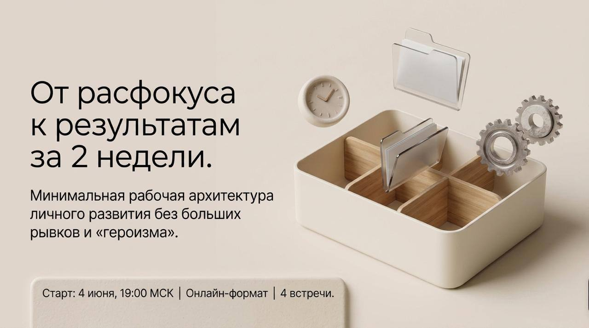
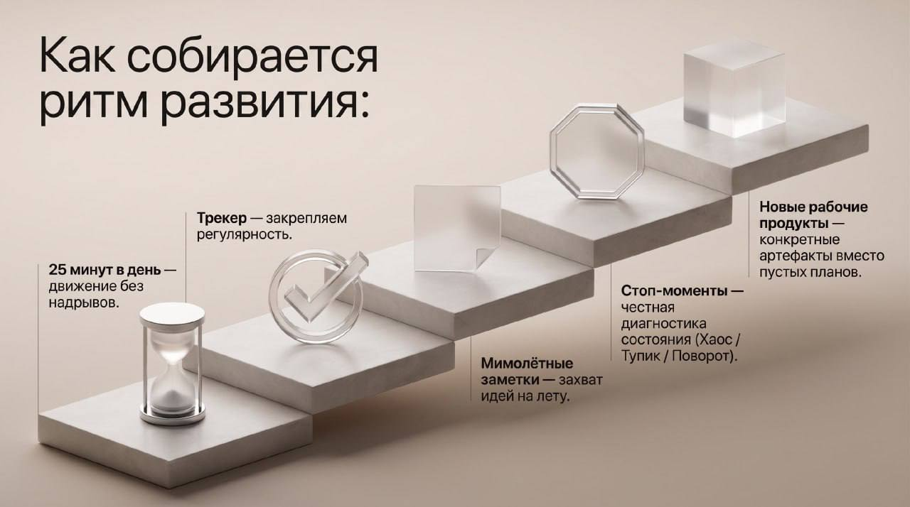

<!-- _class: title -->

        

---

# Сегодня

- Познакомимся с командой
- Разберём, зачем всё это
- Расскажем, как работаем
- Поговорим о главном — внимании
- Ответим на вопросы

---

# Команда

**Кто рядом на весь марафон**

- Подгаевский Александр
- Заводчикова Марфа
- Чайковская Юлия
- Чайковская Алена
- Церен Церенов

*Мы здесь не лекторы — мы те, кто прошёл похожий путь.*

---

# Цель марафона

**Систематичность, а не сразу качество**

Ошибка новичка: ждать, пока будет «правильно» и «достаточно глубоко».

Цель марафона — другая:

> Удерживать внимание на своём развитии каждый день.

Время, глубина, результат — вторично.
**Регулярность — главное.**

---

<!-- _class: imgonly -->

---

# Как ты обычно?

**Выбери варианты, которые ближе всего:**

1. 🔄 Стартую с энтузиазмом — и бросаю через неделю-две
2. 🧱 Застреваю: начал, что-то непонятно, дальше не двигаюсь
3. 🌀 Хаос: не понимаю с чего начать, всё кажется важным
4. 🔒 Держусь за убеждения: «это не для меня», «у меня по-другому»
5. ⏰ Делаю в последний момент: накануне, на авось
6. 📱 Нет времени: всегда что-то срочное вытесняет саморазвитие

*Голосование в чате — результаты разбираем вместе*

---

# Как работаем

**Два инструмента**

**Бот @aist_me_bot**
- Ежедневные материалы и напоминания
- Фиксация факта «я сегодня занялся»

**Рабочая тетрадь**
- https://t.me/c/3640190564/34
- Для тех, кто любит читать там

*Не нужно выбирать «правильный» инструмент. Главное — открыл.*

---

# О состояниях системы

**Ты — система. У системы есть состояния.**

Прямо сейчас у тебя есть привычный стиль жизни — набор автоматических состояний:

- Как ты реагируешь на усталость
- Что делаешь в свободные 15 минут
- Когда «в ресурсе», а когда нет

Марафон меняет одно состояние: **как ты распоряжаешься своим вниманием**.

---

<!-- _class: imgonly -->

---

<!-- _class: imgonly -->

---

# Три привычки участника

1. **Удерживай ежедневный слот.**
   Время и сложность — вторично, главное — регулярность.
   Читай в боте @aist_me_bot или рабочей тетради.

2. **Пиши заметки.**
   Если хочешь — добавь рефлексию: что удивило, что зацепило.

3. **Будь активен.**
   Начни с вопросов в чате, делись текстами, приходи на встречи с наставниками.

---

<!-- _class: title -->

# Вопросы и ответы

*Что непонятно? Что беспокоит?*

---

<!-- _class: title -->

# Удачи. Мы рядом.
