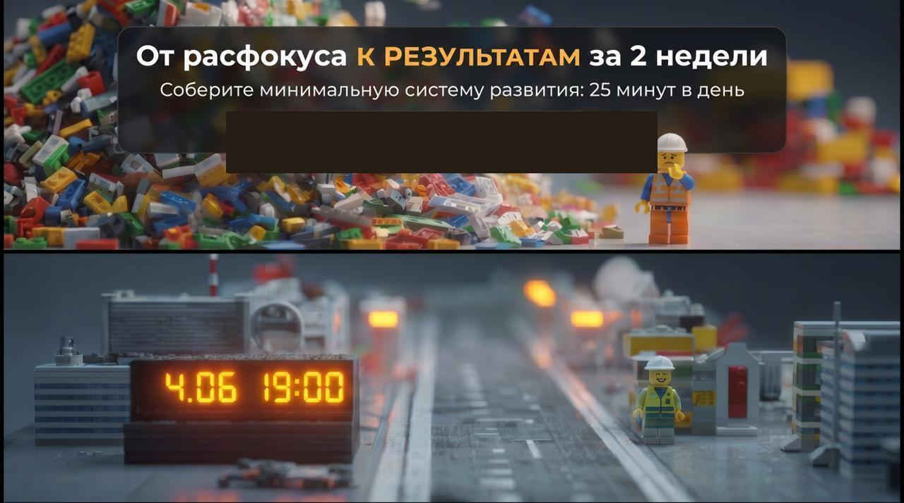
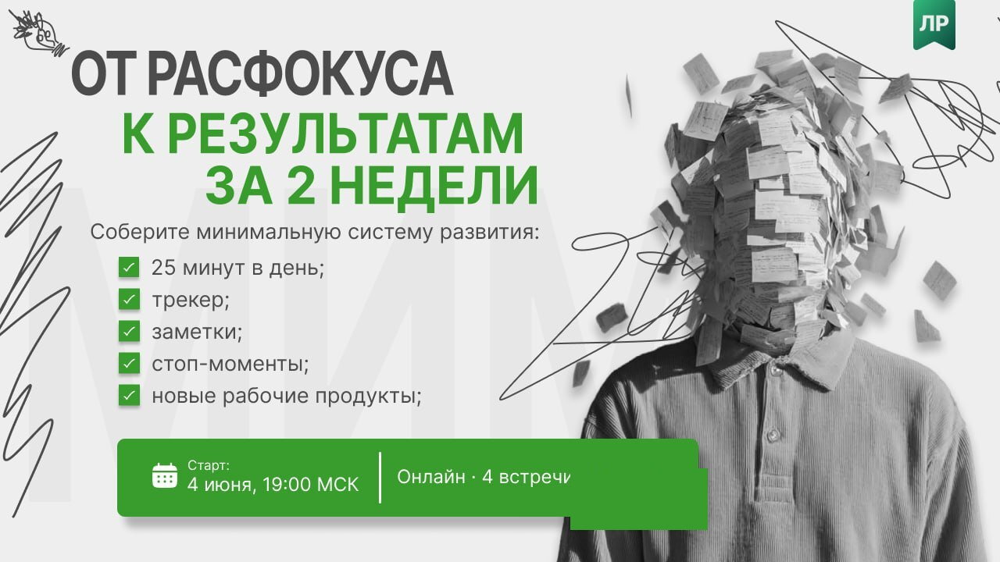

<!-- _class: title -->

        

---

# Сегодня

- Познакомимся с командой
- Разберём, зачем всё это
- Расскажем, как работаем — в этот раз в двух форматах
- Поговорим о главном — внимании
- Ответим на вопросы

---

# Команда

**Кто рядом на волну**

- Подгаевский Александр
- Заводчикова Марфа
- Чайковская Юлия
- Чайковская Алена
- Церен Церенов

*Мы здесь не лекторы — мы те, кто прошёл похожий путь.*

В этот раз без персональных наставников — команда держит себя сама через протокол.

---

# Цель волны

**Систематичность, а не сразу качество**

Ошибка новичка: ждать, пока будет «правильно» и «достаточно глубоко».

Цель — та же, что в волне-1:

> Удерживать внимание на своём развитии каждый день.

Время, глубина, результат — вторично.
**Регулярность — главное.**

Мы также проверяем: работает ли команда лучше, чем в одиночку — это часть эксперимента.

---

<!-- _class: imgonly -->

---

# Как ты обычно?

**Выбери варианты, которые ближе всего:**

1. 🔄 Стартую с энтузиазмом — и бросаю через неделю-две
2. 🧱 Застреваю: начал, что-то непонятно, дальше не двигаюсь
3. 🌀 Хаос: не понимаю с чего начать, всё кажется важным
4. 🔒 Держусь за убеждения: «это не для меня», «у меня по-другому»
5. ⏰ Делаю в последний момент: накануне, на авось
6. 📱 Нет времени: всегда что-то срочное вытесняет саморазвитие

*Голосование в чате — результаты разбираем вместе*

---

# Как работаем: два трека

**Ты идёшь одним из двух путей — выбор сегодня**

**Командный под (6-8 человек)**
- Еженедельный протокол: 4 вопроса, 45-60 минут
- «Якорь» — таймкипер из выпускников волны-1, держит ритм встречи
- Общий результат — одно совместное различение к концу волны

**Соло-трек (контрольная группа)**
- Тот же путь: онбординг + бот + рабочая тетрадь + персональное руководство
- Без командных встреч — как в волне-1

*Оба трека получают персональное руководство и доступ к боту @aist_me_bot.*

---

# Честно про эксперимент

**Это пилотная волна — говорим прямо**

- Волна платная (цена основателя — ниже, чем будет дальше)
- Не сложится ритм у команды (меньше половины встреч или заметный отток) — переключаемся на соло-формат
- Без отката назад и без возврата денег — рычаг один: продлеваем срок обучения
- Ваша обратная связь — часть результата волны, не формальность

---

<!-- _class: imgonly -->

---

# О состояниях системы

**Ты — система. У системы есть состояния.**

Прямо сейчас у тебя есть привычный стиль жизни — набор автоматических состояний:

- Как ты реагируешь на усталость
- Что делаешь в свободные 15 минут
- Когда «в ресурсе», а когда нет

Волна меняет одно состояние: **как ты распоряжаешься своим вниманием**.

---

# Откуда берётся внимание

**У каждого уже сложились привычки потребления информации**

Мы получаем информацию из десятков каналов - лента, мессенджеры, короткие ролики. Совсем не потреблять информацию мы не можем, так устроен мозг. Но мы неосознанно тянемся к простому и привычному - там не нужно прикладывать усилие.

Чтобы что-то изменить, нужно отвоевать внимание у этих каналов. И начать не с самого сложного, а с простого действия - чтобы почувствовать сам слом привычного поведения.

> Стакан воды перед едой - осознанно, не на автомате. Три вдоха перед тем, как взять телефон. Один приём пищи без экрана.

Та же мышца, что понадобится для ежедневного слота.

---

<!-- _class: imgonly -->

---

# Правила участника

**Общие для обоих треков:**

1. **Удерживай ежедневный слот.**
   Время и сложность — вторично, главное — регулярность.
   Читай в боте @aist_me_bot или рабочей тетради.

2. **Пиши заметки.**
   Если хочешь — добавь рефлексию: что удивило, что зацепило.

3. **Будь активен.**
   Начни с вопросов в чате, делись текстами.

**Если в командном поде — добавляется:**

4. **Приходи на еженедельный синк.** 45-60 минут, 4 вопроса протокола.

---

<!-- _class: title -->

# Вопросы и ответы

*Что непонятно? Что беспокоит?*

---

<!-- _class: title -->

# Удачи. Мы рядом.
