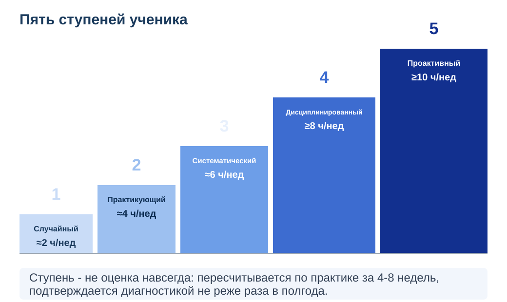
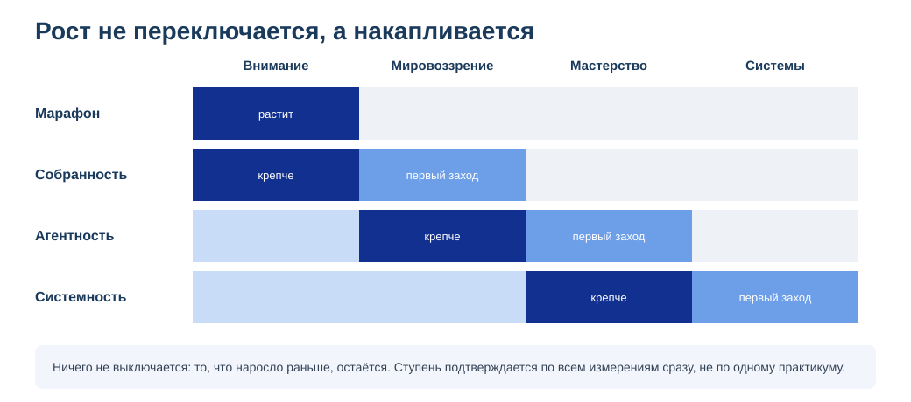
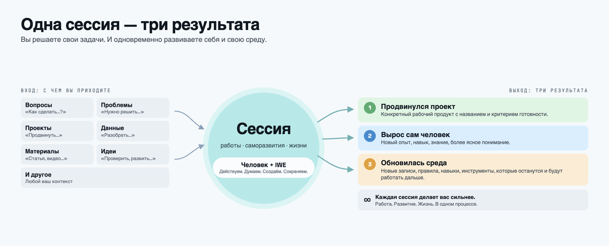
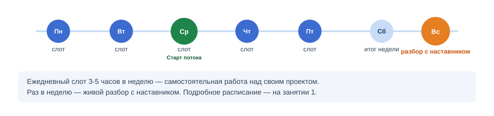

<!-- _class: title -->

# Практикум S1 «Собранность»

**Программа «Личное развитие» Мастерской инженеров-менеджеров**

Церен Церенов · 13 сентября 2026

---

## Сегодня

- Покажем, что изменилось в устройстве программы «Личное развитие»
- Расскажем, что делаем в практикуме S1 «Собранность»
- Разберём, как выбрать свой проект
- Разбор ваших кейсов

---

## Свой проект вместо общего маршрута

> «Свой проект вместо общего учебного маршрута. Нужные методы и знания подключаются тогда, когда они требуются именно вашему следующему шагу.»

Сначала ставим способ работы на своём проекте подходящего масштаба — дальше переносите его на более сложные.

**Руководство и практикум — теперь разные вещи:**

---

## Вся программа теперь стоит на ИИ-среде

- **Практикум / самостоятельный режим** — два способа пройти программу «Личное развитие»
- **ИИ-среда** — технологическая основа обоих способов: без неё непонятно, какие именно куски руководства нужны вам и в чём ваш проект
- **Мастерская IWE** — поддерживающее сообщество вокруг развития и использования ИИ-среды; не заменяет наставника и не является обязательным способом прохождения

> «Раньше не приходили без компьютера — вся работа строилась на культуре его использования. Сейчас так же с ИИ-средой. IWE — наша реализация; у другого человека ИИ-среда может быть устроена иначе, но совсем без неё — нельзя.»

---

## Гайды и практикумы: разные имена, разные роли

**Руководства (библиотека метода, не меняются):**
«Системное саморазвитие» · «Методы саморазвития» · «IWE: работа и развитие» · «Введение в системное мышление»

| Поток | Название | Переход |
|---|---|---|
| S0 | Марафон «От расфокуса к результатам за 2 недели» | ст.1 → ст.2 |
| S1 | Практикум «Собранность» ← вы здесь | ст.1-2 → ст.3 |
| S2 | Практикум «Агентность» | ст.3 → ст.4 |
| S3 | Практикум «Системность» | ст.4 → ст.5 |

**Мы не переименовываем и не отменяем руководства** — практикум берёт нужные куски из нескольких руководств под вашу задачу.

---

## Лестница пяти ступеней ученика

---

<!-- _class: question -->

## Где на этой лестнице начинается S1

Практикум «Собранность» закрепляет ритм ступеней 1-2 и ведёт к ступени 3.

**В чат:** какая ступень сейчас кажется вам ближайшей?

*Не нужен точный ответ — это ориентир для вас самих.*

---

## Что растим на каждом шаге

---

## Работа на своём проекте, не на абстрактных упражнениях

- Раньше: общий учебный маршрут для всех, одинаковые задания
- Теперь: берёте задачу, которую хотите продвинуть прямо сейчас, и на ней осваиваете методы
- Не абстрактное упражнение «для программы» — ваша реальная работа

---

## Вторая линия роста: мастерство работы с IWE

Пилот тренируется, машина строится — вместе сильнее. Мастерская IWE теперь автоматически включена в практикум.

---

## Персональное руководство пересобирается из вашей активности

Три источника: **ступень и узкое место** (диагностика) · **ваша реальная жизнь** (действия, планы, результаты) · **ваш запрос**. Пересобирается по ходу движения — не выдаётся один раз.

---

## Один сеанс — три результата

---

## Как выбрать свой проект: три критерия

1. Первый результат виден за реальный срок
2. Результат зависит от ваших действий, не от внешних людей
3. Первый шаг обратим, без высокой цены ошибки

Дорастать до формата не нужно — вход открыт с любой ступени.

---

## «Новичок» — не одна шкала, а пять разных

| Шкала | Что показывает |
|---|---|
| Культура сообщества | Насколько знакомы термины и ритуалы МИМ |
| Профессиональный опыт | Опыт именно в теме вашего проекта |
| Собранность | Регулярность и самостоятельность практики |
| Системность | Насколько привычно системное мышление |
| ИТ-навыки | Уверенность в инструментах и технике |

Формат подстраивается под то, где именно у вас пробел.

---

## Примеры точек входа

Три личных примера — на них сегодня ставим сам способ работы.

| Проект | Первый шаг |
|---|---|
| **Похудение** | Начать вести дневник питания одну неделю |
| **«Мой день»** | Просто фиксировать, что происходит, без анализа |
| **Карьерный рост** | Разобраться, чего вы хотите от следующей роли |

**Дальше масштаб — рабочий проект.** Тот же способ работы дальше переносится на рабочую задачу, которая тормозит. Это не сегодняшнее упражнение — следующий шаг.

---

<!-- _class: question -->

## Живое упражнение: от того, что не устраивает, к делу на неделю

**Заранее:** пишут в чат все, вслух разберём 2-3 примера

1. Что сейчас не устраивает или хочется сдвинуть
2. Зачем это менять
3. Рабочий продукт недели — конкретная вещь, которую покажете через неделю
4. Как поймёте, что получилось

---

<!-- _class: divider -->

# 10 минут

**Пишите в свою заметку, в чат — только рабочий продукт недели**

Вслух разберём 2-3 примера

---

## Разбор через формулу «один сеанс — три результата»

Берём 2-3 прозвучавших рабочих продукта и разбираем вслух:

- откуда взялась неудовлетворённость
- какой отсюда рабочий продукт недели
- где здесь движение проекта, где рост мастерства, где усиление среды

---

## Как устроен практикум

---

## Для тех, кто уже начинал

Если раньше заходили в практикум и остановились — **напишите нам, подберём, с чего продолжить**.

Не нужно ждать идеальной готовности — ракету перестраивают в полёте.

Напишите в личку сегодня-завтра, кто вы и на чём остановились.

---

<!-- _class: tip -->

# Как попасть

**Формат:** живая когорта с наставником
**Дедлайн записи:** среда (2-3 дня после встречи)
**Цена и размер когорты:** уточняется в закреплённом сообщении

---

<!-- _class: question -->

# Вопросы

*(6 минут живого диалога)*

---

## Рефлексия и закрытие

**Один инсайт от каждого — в чат, одной фразой.**
