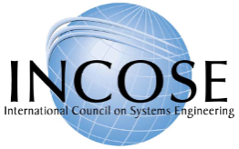

<!-- _class: mim-title -->

Научно-практическая конференция 
«Современная системная инженерия и менеджмент»

# Среда, в которой растёт интеллект

## Как устроена среда, в которой растёт созидатель

Церен Церенов, управляющий партнёр

г. Москва, 18-19 апреля 2026 г.

---

<!-- _class: large -->

# За счёт чего это возможно

В первом докладе — **созидатель успешных систем.** Массово. На всю жизнь.

Первый вопрос после такого обещания: <strong>а как это вообще возможно?</strong> Как растить созидателя массово, если раньше это делал один наставник для одного ученика?

Ответ: растим его через **методологию, сообщество, агентов с разделёнными полномочиями, цифрового двойника** — и главный инструмент, который всё это связывает.

Главный инструмент — <strong>среда IWE.</strong> 
Место, где созидатель растёт рядом с ИИ.

Про устройство этой среды — весь доклад.

---

<!-- _class: dense -->

# 4 месяца в одной среде — один человек

Прежде чем про концепцию — <strong>конкретика.</strong> Что один человек успевает, если работает в такой среде. Мой срез: 17 декабря 2025 — 17 апреля 2026.

### 📊 Объём работы

- **8 501 коммит** в 35 репозиториях
- **117 млн знаков** добавлено (≈1.4 млн строк)
- **85 рабочих продуктов** (41 в работе + 42 в очереди)
- **~8 часов в день** в среднем, 7 дней в неделю
- Мультипликатор по времени: **>2×**

*Это не спринт. Это ритм.*

### 🧩 Что я веду одновременно

- **8 подсистем** платформы
- **35 репозиториев** кода и знаний
- **~30 ролей** (4 лично + 26 ИИ-ролей в среде)
- **Три области знаний:** созидатель, экосистема, цифровая платформа

*Работа уровня команды — в одной среде.*

### 🛠️ На чём построено

- **31 SOTA-метод** встроен в среду
- DDD, Context Engineering, GraphRAG, MCP, Digital Twins...
- ИИ-помощники + Pack + протоколы + двойник

*Не набор инструментов. Интегрированная среда.*

Один человек + среда = <strong>работа, которую раньше делали отделы.</strong>

---

<!-- _class: dense -->

# Три объекта внимания при работе с ИИ

Большинство смотрит на модель — <strong>Claude, ChatGPT, Gemini.</strong> Но внимание перевёрнуто с ног на голову. Результат определяет не модель. Результат определяет <strong>контекст.</strong>

### 1. Модель вендора

Claude, GPT, Gemini. Сменяемы каждые полгода.

Большинство зациклено именно здесь.

*Наименее важный слой.*

### 2. Метод и роль ИИ

Как ИИ настроен: ментор, аналитик, архитектор, редактор. Какой метод выполняет: разбор, синтез, проверка, оформление.

Здесь начинается «умение работать с ИИ» — **промпты, агенты, роли.**

*Средний слой.*

### 3. Контекст

Ваш опыт, решения, история, цели. То, что делает ответ **вашим.**

Самый недооценённый и **решающий** слой.

*Всё определяет контекст.*

Врач-светило без карты пациента <strong>бесполезен именно для вас.</strong> Слабая модель с хорошим контекстом даст лучший результат, чем сильная модель без контекста.

Работа с ИИ — это работа с <strong>контекстом,</strong> а не с моделью.

---

<!-- _class: dense -->

# Соединить человека и ИИ — правильно

У человека контекст <strong>накапливается неосознанно</strong> — через опыт. У ИИ его нужно <strong>каждый раз задавать явно</strong> — каждая сессия с чистого листа. Отсюда инженерная задача: вытащить контекст наружу, структурировать, поддерживать актуальным.

### Наивный подход

«Буду задавать хорошие вопросы, копировать из переписки.»

- Контекст каждый раз с нуля
- Ответы поверхностные
- Знания рассыпаны

*Работа без системы.*

### Системный подход

Контекст формализован по **FPF + SPF.**

- Знания в Pack, проекты в РП
- Роли, протоколы, двойник
- Одна среда — всё связано

*Это и есть среда.*

Соединить человека и ИИ — <strong>инженерная задача.</strong> Её решает системная методология.

---

<!-- _class: dense -->

# Цивилизационный шаг

То, что сейчас происходит с ИИ — <strong>цивилизационный сдвиг.</strong> Аналог — <strong>90-е в России:</strong> поменялся уклад жизни, появились новые роли, одни нашли место, другие — нет. Но сейчас масштаб больше: меняется <strong>весь мир</strong>, и глубже — меняется сама деятельность человека.

### 🖥️ 1980-90-е: ПК

- Мейнфрейм → у каждого на столе
- **Компьютерная грамотность** стала массовой
- Культура работы: файлы, папки, почта, интерфейсы
- Без культуры — дорогая печатная машинка
- С культурой — новая экономика

*Кто освоил раньше — выиграл.*

### 🤖 2025-30-е: ИИ

- Облачный ИИ → у каждого свой
- **Грамотность эпохи ИИ** становится массовой
- Культура работы: контекст, роли, протоколы, двойник, база
- Без культуры — дорогой автокомплит
- С культурой — рост созидателя

*Кто освоит раньше — выиграет.*

<strong>Все следят за вендорами</strong> — кто выпустил модель сильнее, чей GPU быстрее. Но как и в 80-е, ключевая битва идёт не там. <strong>Решается всё на персональном уровне</strong> — у кого есть своя среда работы с ИИ, тот берёт цивилизационный множитель. У кого нет — отстаёт, не замечая.

Гонка вендоров — фон. <strong>Главное — ваша личная среда.</strong>

---

<!-- _class: formula -->

# Зачем это нужно

Созидательная&nbsp;мощь&nbsp;цивилизации = человеческий&nbsp;интеллект × ИИ

В первом докладе — формула. **Мы растим первое.**

Но общечеловеческий интеллект не растёт сам. Он растёт <strong>только в среде</strong>, которая его растит. Без среды — ИИ забирает мышление, человек атрофируется, формула обнуляется.

Чтобы вырастить интеллект у миллионов, нужна среда, в которой он растёт у каждого.

---

<!-- _class: large -->

# Что значит «среда»

Среда — не инструмент. Не чат. Не курс. Это <strong>место, где человек живёт и работает.</strong>

### Аналогия: macOS

macOS — не приложение. Это **операционная система:** файлы, приложения, терминал, интерфейс — всё вместе.

Внутри можно писать, считать, рисовать, связываться с миром.

*Интегрированная среда для цифровой работы.*

### Среда для интеллекта

То же самое, но для мышления. Знания, помощники, протоколы, двойник, сообщество — **всё в одном месте.**

Внутри можно думать, решать, создавать, развиваться.

*Интегрированная среда для интеллектуальной работы.*

Мы называем эту среду <strong>IWE</strong> (Intellectual Work Environment). Дальше — просто «среда».

Инструмент решает задачу. <strong>Среда формирует способ работы.</strong>

---

<!-- _class: dense -->

# Как это работает у меня

Проще всего показать среду на моём примере. Я работаю в ней каждый день.

### 📂 ~30 проектов в параллели

Архитектура платформы, концепция подписки, доклады, руководства, безопасность, реестры, ЦД.

**Я не держу это в голове.**
Это держит среда.

*Каждому проекту — свой контекст, свои решения, свои фазы.*

### ⚡ Мультипликатор >2×

На каждый час физической работы — **больше 2 часов** результата по проектам.

Веду несколько линий одновременно. Среда помнит контекст каждой — переключаюсь за секунды.

*Это не ускорение — это параллелизм.*

### 🧩 Всё связано

Проект связан с опытом. Опыт — с методологией. Методология — с моим состоянием (ЦД).

Решение в одном месте помнится и применяется в другом.

*Одна среда — один организм.*

Один человек + среда = <strong>работа уровня команды.</strong>

---

<!-- _class: dense -->

# Срез этой недели: рабочие продукты

Конкретный список — одна неделя, один человек, одна среда.

### 🏗️ Архитектура и платформа

- Карта данных (8 баз, 77 таблиц)
- Следующая фаза инфраструктуры
- Шлюз знаний для ИИ-агентов
- Конвейер публикаций
- Разделение юрисдикций Россия / мир

### 🛡️ Безопасность и операции

- Программа безопасности (49/65)
- Мониторинг и наблюдаемость
- Реестр подписок, платежи
- Поддержка экосистемы

### 🎓 Содержание и развитие

- Программа личного развития
- Доклады на эту конференцию
- Руководство «Систематический»
- Квалификации в Цифровом двойнике
- Позиционирование подписки

### 💳 Продукт и экономика

- Концепция массового продукта
- Прямые платежи
- Консолидация баз данных
- Отстройка от ИИ-вендоров

<strong>Каждая строка — проект с бюджетом, фазами, критериями готовности.</strong> У каждого своя папка, свой контекст, свои решения. Среда держит их все параллельно.

---

<!-- _class: dense -->

# Что среда делает с одним документом

Пример: <strong>мои руководства и мои посты</strong> переработаны в IWE.

### Вход

**Руководства + 727 моих постов** 2025 года.

Обычный путь: поиском выявлять и по одному разносить, сверять и корректировать редакцию по уже известной сути.

### Что сделала среда

Пока я занимался другими проектами, среда за несколько часов:

- Разобрала тексты по **7 осям** (различения, методы, роли, мемы...)
- Сверила находки с моей базой знаний
- Построила **граф понятий** поверх всей базы

### Выход

Материалы разобраны на **сырьё для будущих проектов.**

- ~**55 кандидатов** на новые понятия
- **Глоссарий** из 42 терминов
- **12 дублей**, **3 противоречия** на разбор
- **Реестр 67 цитат** из постов

### Граф понятий

- **1 180** понятий
- **3 503** связей
- **369** понятий с парой RU↔EN

<strong>Материалы разобраны на сырьё для будущих проектов.</strong> Раньше у методолога — 2-3 недели. В среде — несколько часов фоном. Решения принимаю я. Черновую работу — среда.

---

<!-- _class: dense -->

# От руководства — сразу в проекты

Главное различие от курса: <strong>проработка идёт в ту же среду, где живут мои проекты.</strong> Никаких «скачать и потом применить».

### 1. Руководство приходит в среду

Персональное руководство — по вашей ступени, вашему контексту, вашим проектам.

Не «общий курс для всех», а **то, что нужно именно вам сейчас.**

*Доставка внутрь среды.*

### 2. Среда его прорабатывает

Разбирает на компоненты. Связывает с вашей базой знаний, цифровым двойником, текущими проектами.

ИИ-помощники, наставники, сообщество — все подключаются.

*Проработка в контексте вас.*

### 3. Сразу в работу

Из проработки рождаются **конкретные действия в ваших проектах:**
обновить документ, переписать решение, задать вопрос сообществу.

Не «я что-то узнал» — а «я что-то сделал».

*Применение = продолжение изучения.*

<strong>Обучение не отделено от работы.</strong> Руководство → проработка → изменения в проектах — в одной среде, без переключений. Так <strong>знание становится опытом.</strong>

---

<!-- _class: dense -->

# Сложная архитектура — тоже в среде

Новую архитектуру нашей платформы я проектирую здесь же. Вот <strong>карта данных</strong>, над которой сейчас идёт работа.

### 📥 Источники

- LMS Aisystant
- Discourse Club
- WakaTime
- YooKassa / Stripe
- Telegram Stars
- AIST Bot
- Web App
- IWE / экзокортекс

*8 источников пишут в базы.*

### 🗄️ 8 баз Neon

- #1 platform-core
- #2 digital-twin
- #3 knowledge
- #4 activity-hub
- #5 payment-registry
- #6 aist-bot
- #7 metabase
- #8 health

*77 таблиц, 50+ потоков.*

### 🤖 Агенты и сервисы

- Gateway (шлюз)
- Knowledge MCP
- Digital Twin MCP
- Профайлер
- Портной
- Навигатор
- Composer
- Metabase / Grafana

*13 сервисов читают и анализируют.*

<strong>30+ узлов, 50+ потоков данных, 77 таблиц.</strong> Платежи передают подписки в идентичность. События летят в аналитику. Знания обновляют цифровой двойник. Среда хранит версии схемы, связывает с принципами архитектуры, проверяет согласованность.

Одна среда ведёт и проект, и человека, <strong>и архитектуру платформы.</strong>

---

<!-- _class: dense -->

# Что внутри: шесть опор

Теперь, когда видно, как это работает — <strong>что именно внутри</strong> дало такую работу. Шесть опор одного организма.

### 📚 1. Опыт и проекты

Формализованы по **FPF + SPF.** База, как у врача-светила — но **ваша.**

*Ничего не теряется. Всё находится.*

### 🎯 2. Культура работы

Протоколы ОРЗ, ArchGate, Capture — **встроены в среду.** Не «помни правила» — **среда применяет их за вас.**

*Стиль жизни, не лайфхаки.*

### 🤖 3. ИТ и ИИ как экзоскелет

Берут рутину. **Не забирают мышление.** Агенты с **разделёнными полномочиями**.

*Любая модель (BYOK).*

### 🧬 4. Цифровой двойник

Ваша «карта» — состояние, развитие, ступень, решения. Персонализация идёт **из него.**

*Семейный доктор знает вас.*

### 👥 5. Сообщество

Не чат выпускников — живой контекст: наставники, мемы, сверка, совместная работа. Вход через ту же среду.

*На всю жизнь.*

### 🌱 6. Среда растёт с вами

Чем больше работаете — **тем сильнее помощь.** У других каждый раз с нуля.

*Интеллектуальный капитал.*

<strong>Уберите любую опору — и среда деградирует до альтернативы.</strong> Без методологии — хаотичный чат. Без ЦД — поисковик. Без сообщества — одинокая работа. <strong>Суть — в сцепке всех шести.</strong>

---

<!-- _class: dense -->

# Опоры 1-3 на моём примере

Каждая опора — не декларация. <strong>Конкретный сценарий из моей практики.</strong>

### 📚 1. Опыт и проекты

**Сценарий:** доклад на конференцию МИМ.

Открываю папку доклада — среда сама подтягивает: мои посты 2025 по этой теме, решения из других проектов, черновики, глоссарий.

Не ищу — **оно найдено**, потому что оформлено по FPF.

*База, как у светила. Но моя.*

### 🎯 2. Культура работы

**Сценарий:** запуск новой задачи.

Говорю «начинаем». Среда автоматически: проверяет «есть ли РП в плане?», запрашивает обещание (SC), зовёт ArchGate при архитектурном решении.

Не помню правила — **среда их соблюдает.**

*Стиль жизни, не лайфхаки.*

### 🤖 3. ИТ и ИИ-экзоскелет

**Сценарий:** миграция базы данных.

ИИ пишет черновик SQL, проверяет на тестовой БД, ловит откат. Я **даю решения** (что мигрировать, что не стоит) — не пишу синтаксис.

Черновая работа — ИИ. **Мышление — я.**

*Стратегия от меня. Рутина от среды.*

Опыт, культура, ИИ — <strong>три опоры, которые держат дневную работу.</strong>

---

<!-- _class: dense -->

# Опоры 4-6 на моём примере

Вторая тройка держит <strong>рост со временем</strong> — то, чего нет у вендоров.

### 🧬 4. Цифровой двойник

**Сценарий:** планирование недели.

ЦД знает мою ступень, состояние, калибр, текущие роли. План строится **от него** — не от «что хочется», а от «что соответствует моему уровню».

ИИ-помощник сверяется с ЦД перед советом.

*Персонализация идёт из меня.*

### 👥 5. Сообщество

**Сценарий:** обсуждение архитектуры.

Команда работает в той же среде — свои Pack'и, свои ЦД. Я решение сформулировал — оно **видно коллегам** в их контексте, не в отдельном чате.

Наставники и сверка — рядом с работой.

*Сообщество — не чат, а контекст.*

### 🌱 6. Среда растёт со мной

**Сценарий:** 4 месяца работы.

8 501 коммит, 117 млн знаков, 85 РП, 31 SOTA-метод — всё в среде. ЦД точнее. Pack глубже. Протоколы отточены.

Через год у другого ИИ-вендора — я **начну с нуля.** Среда же помнит всё.

*Это интеллектуальный капитал.*

ЦД, сообщество, рост со временем — <strong>три опоры, которые держат жизнь.</strong>

---

<!-- _class: dense -->

# Экзоскелет, а не протез

Ванильный ИИ работает как <strong>протез:</strong> даёт готовый ответ. Человек отдаёт мышление. Навык атрофируется. Через год — <strong>глупеет, не замечая.</strong>

### ❌ Протез

- ИИ выдаёт готовый ответ
- Человек = потребитель ответов
- Навык видеть проблему атрофируется
- Чем лучше ИИ — тем зависимее пользователь
- Снял протез → работать не может

*«ИИ подсказал» — решение не ваше.*

### ✅ Экзоскелет

- ИИ **предъявляет ваше знание** в нужный момент
- ИИ **спрашивает** перед стратегическим решением
- Поддержка **убывает** по мере роста компетенции
- Чем лучше среда — тем **сильнее** пользователь
- Снял экзоскелет → работает медленнее, но работает

*Тест: «Объясни решение без ссылки на ИИ.»*

<strong>ИИ берёт рутину — не мышление.</strong> Черновики, поиск, проверку, форматирование. Стратегические решения, формулировки, выбор — это человек. Среда следит, чтобы так и было.

Результат: <strong>человек становится компетентнее,</strong> а не только получает результат.

---

<!-- _class: dense -->

# За счёт чего массово

Первый доклад: массовый продукт через <strong>адаптивную персонализацию</strong>. Это возможно только когда есть среда с шестью опорами.

### ❌ Без среды

**Наставник 1-к-1.**

- Один человек — один наставник
- Не масштабируется
- Дорого
- Доступно единицам

*Старая модель образования.*

### ✅ Со средой

**ЦД + платформа = наставник для каждого.**

- ЦД знает человека
- Методология задаёт путь
- ИИ ведёт по пути
- Сообщество поддерживает
- Среда адаптируется автоматически

*Семейный доктор — автоматизирован.*

### 🎯 Результат

**Семейный доктор для интеллекта — массово.**

Раньше — роскошь единиц.
Сейчас — 10 $ + 10 часов в неделю.

На миллионы.

*Массовый продукт эпохи ИИ.*

<strong>Персонализация без человеческого наставника 1-к-1</strong> — вот что раньше было невозможно. Среда делает это возможным. Методология + платформа + ЦД + ИИ-наставник — только вместе снимают ограничение.

Уникальный <strong>способ вырастить интеллект</strong> = уникальная сцепка шести опор. Ни у одного конкурента её нет.

---

<!-- _class: dense -->

# А как же ИИ-вендоры?

Самый частый вопрос: <strong>«Разве Claude или ChatGPT не делают то же самое?»</strong> Нет. Они делают <strong>одну из шести опор.</strong>

### Вендоры (Claude, ChatGPT, Gemini)

Продают **модель + интерфейс.**

- ❌ Вашей базы знаний нет
- ❌ Методологии FPF+SPF нет
- ❌ Цифрового двойника нет
- ❌ Сообщества нет
- ❌ Протоколов работы нет
- ✅ Есть мощная модель

*Stateless: каждая сессия с нуля.*

### Среда МИМ

Продаёт **среду вокруг любой модели.**

- ✅ Ваша база знаний
- ✅ Методология встроена
- ✅ ЦД растёт с вами
- ✅ Сообщество и наставники
- ✅ Протоколы работы
- ✅ Любая модель (BYOK)

*Stateful: помнит, накапливает, растит.*

<strong>Мы не конкурируем с ИИ-вендорами — мы их используем.</strong> Модель поменяется через 2 года (уже меняется каждые полгода). Среда останется. <strong>Среда переживает модели.</strong>

Вендоры продают помощника. <strong>Мы растим интеллект — и среда IWE наш главный инструмент.</strong>

---

<!-- _class: dense -->

# Что внутри подписки

10 $ + 10 часов в неделю. На всю жизнь.

### 🧰 Что вы получаете

- 📚 **Личную базу знаний** — конспекты, проекты, решения в системной форме
- 🎯 **Встроенную культуру работы** — протоколы, проверки, фиксации
- 🤖 **ИИ-экзоскелет** — настроенный под вас, работающий наставником
- 🧬 **Цифровой двойник** — вашу карту для интеллекта
- 👥 **Доступ к сообществу** — 13 672 человека, наставники
- 🌱 **Среду, которая растёт** — чем дольше, тем сильнее

### 🎓 Путь внутри среды

- **Ступени 1-2:** первые шаги, базовая гигиена мышления. Навигатор ведёт по дуге.
- **Ступени 3-4:** система освоена. Разворот наружу: мир как система.
- **Ступень 5:** проактивный созидатель, передаёт культуру дальше.

**Ритм:** 2 → 5 → 6 → 8 → 10 часов в неделю. Интеллект растёт постепенно, как мышцы.

<strong>Доступ к экосистеме.</strong> Осознанный ритм, а не обещание трансформации.

---

<!-- _class: dense -->

# Чтобы среда не стала «печатной машинкой»

В 80-е многие купили компьютер — и использовали его как <strong>дорогую печатную машинку.</strong> Вся мощь рядом, но не раскрыта. То же может случиться с IWE. Среда <strong>не раскроется сама.</strong>

Чтобы взять настоящий множитель от среды, нужны **три внутренних опоры у самого человека:**

### 🌍 1. Системное мировоззрение

Взгляд созидателя, который **хочет менять мир.** Видит себя как систему, видит окружение как систему, берёт ответственность.

Без него — среда используется как улучшенный блокнот.

*«Я — деятель, а не потребитель.»*

### 🦾 2. Культура работы

Понимание: ИИ — **экзоскелет, а не протез.** Рутина — ИИ, стратегия — человек. Тест: «Объясни решение без ссылки на ИИ.»

Без него — зависимость, атрофия, «ИИ всё сделал за меня».

*Работать с ИИ, не вместо себя.*

### 🧠 3. Системное мышление

Умение разобрать любую ситуацию на **роли, системы, методы, обещания.** Язык, на котором среда понимает задачу.

Без него — среда не знает, что делать. ИИ отвечает «в общем».

*Совместное мышление человека и ИИ.*

<strong>Среда + три опоры у человека = цивилизационный множитель.</strong> Среда без опор = дорогая печатная машинка. Опоры без среды = умный человек без инструментов. Программа личного развития МИМ даёт все три — это вход в среду.

Не среда делает вас сильнее. <strong>Среда делает сильного сильнее.</strong>

---

<!-- _class: dense -->

# Вывод: как среда закрывает цели МИМ

### Цели первого доклада

- 🎯 **Массовый продукт** — интеллект на всю жизнь, не для элиты
- 🎯 **10 $ + 10 часов в неделю** — доступно каждому
- 🎯 **Не атрофия, а рост интеллекта** в эпоху ИИ
- 🎯 **Новый стиль жизни и культура работы**
- 🎯 **Цивилизационный множитель** — вклад в общечеловеческий интеллект

*Обещание — большое.*

### Чем закрывает среда

- ✅ **Адаптивная персонализация** вместо наставника 1-к-1 → масштабируется
- ✅ **ЦД + ИИ-наставник + методология** = стоимость уровня подписки
- ✅ **Экзоскелет, не протез** → навык растёт, не атрофируется
- ✅ **Шесть опор** = культура работы, встроенная в день
- ✅ **Персональная среда у каждого** → цивилизационный сдвиг на уровне миллионов

*Среда — это инструмент достижения.*

<strong>Без среды</strong> массовый продукт невозможен — он сваливается либо в курс (не персонально), либо в наставника (не массово). <strong>Среда снимает ограничение:</strong> персонализация + масштаб одновременно. Это и есть уникальное предложение МИМ в эпоху ИИ.

Среда растит <strong>созидателя успешных систем.</strong> Массово. На всю жизнь.

---

<!-- _class: title -->

# Среда, в которой растёт созидатель

## IWE — среда, где интеллект и ИИ работают как одна система. Внутри — созидатель успешных систем.

*Шесть опор одной среды:*
*Опыт. Культура работы. ИИ-экзоскелет.*
*Цифровой двойник. Сообщество. Рост со временем.*

**Это грамотность новой эпохи.
Массово. На всю жизнь.**
