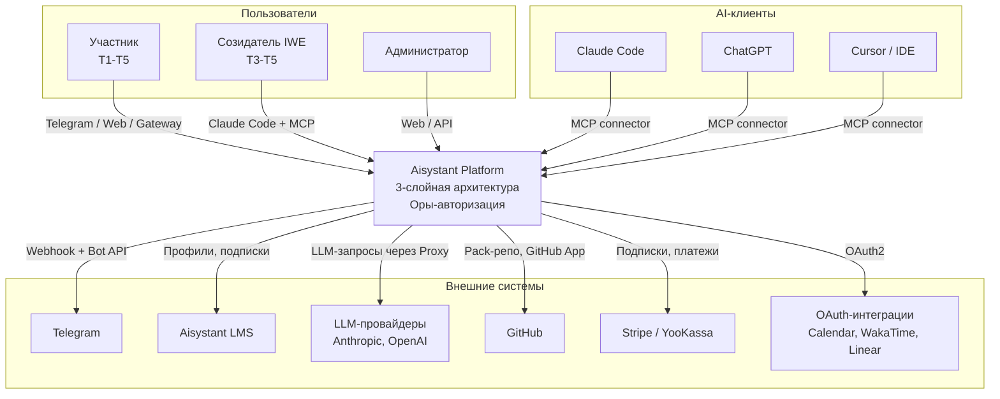
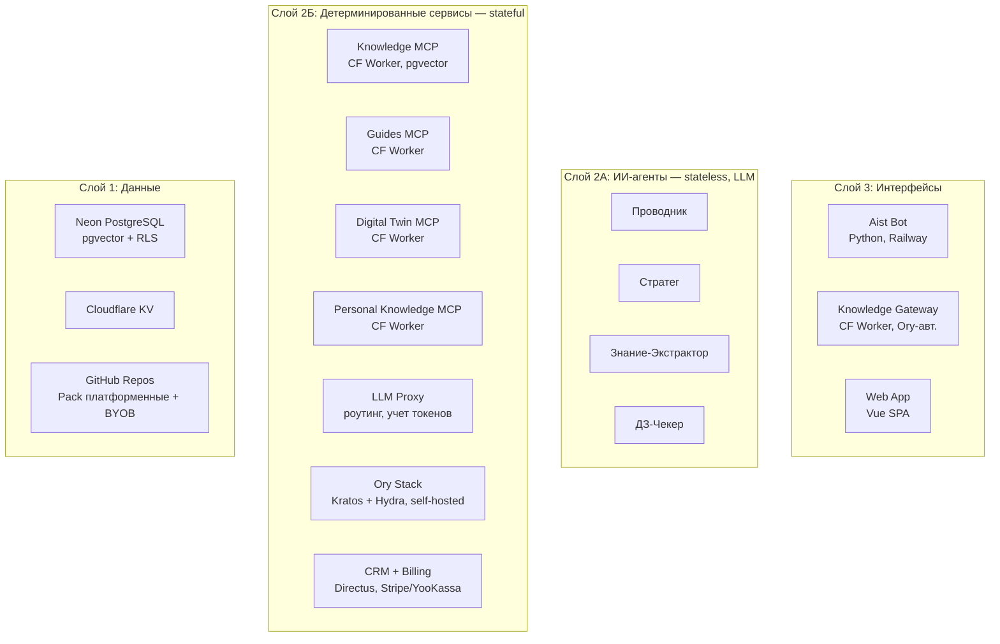
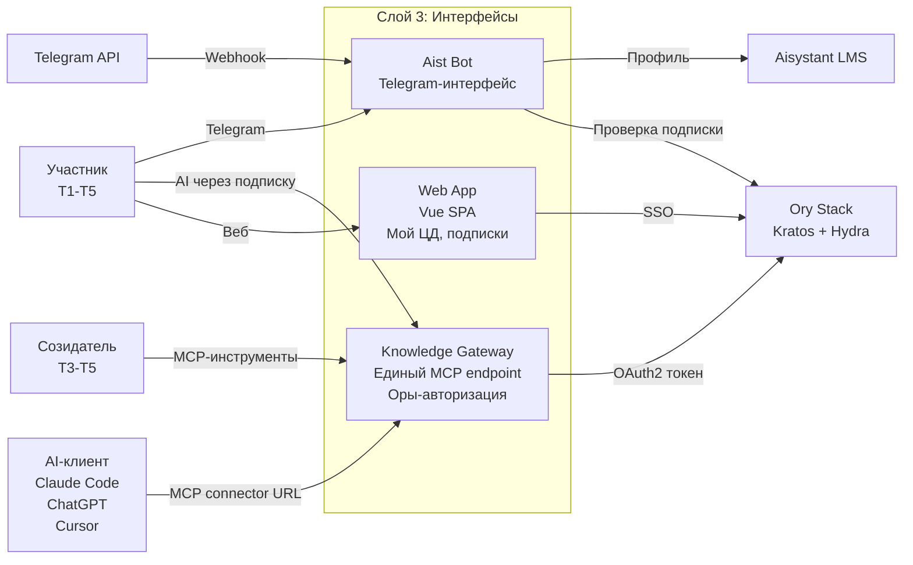
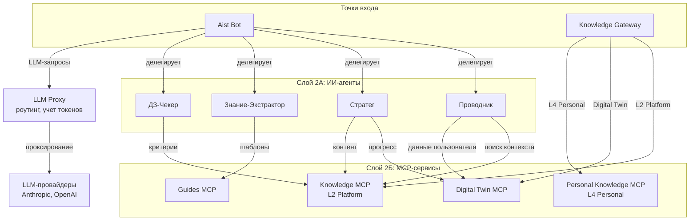
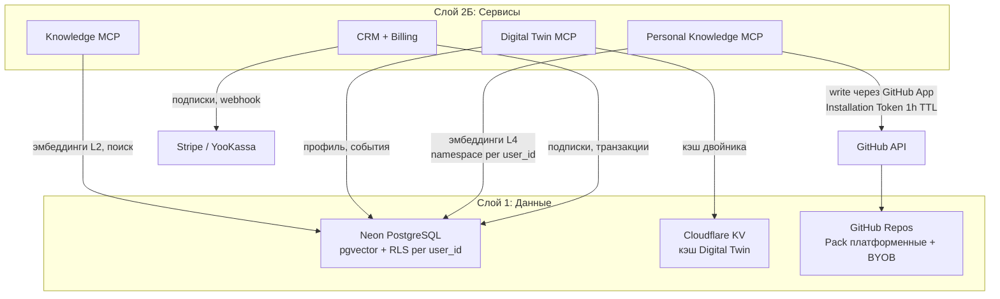

# C4-диаграммы платформы Aisystant

> **Source-of-truth архитектуры:** [DP.ARCH.001](../../PACK-digital-platform/pack/digital-platform/02-domain-entities/DP.ARCH.001-platform-architecture.md)
> **Deployment:** [deployment.md](deployment.md)
> **ADR:** [ADR-IWE-001](../../Data-Stores/ADR-IWE-001-embeddings-isolation.md), [ADR-IWE-003](../../System-Implementations/ADR-IWE-003-gateway-backend-interface.md), [ADR-IWE-004](../../System-Implementations/ADR-IWE-004-github-app-installation-token.md)

---

<b>C4 L1 -- Системный контекст</b>

Кто использует платформу и с какими внешними системами она взаимодействует.

---

<b>C4 L2 -- Overview (карта контейнеров по слоям)</b>

Все контейнеры платформы. Потоки данных -- в view-диаграммах ниже.

| Слой | Зона | Контейнеры | Характер |
|------|------|-----------|---------|
| 3. Интерфейсы | -- | Aist Bot, Knowledge Gateway, Web App | Тонкие клиенты, без бизнес-логики |
| 2. Обработка | А: ИИ-системы | Проводник, Стратег, KE, ДЗ-Чекер | Stateless, LLM |
| 2. Обработка | Б: Детерминированные | Knowledge MCP, Guides MCP, DT MCP, Personal Knowledge MCP, LLM Proxy, Ory Stack, CRM + Billing | Stateful |
| 1. Данные | -- | Neon PostgreSQL, Cloudflare KV, GitHub Repos | Персистентность |

---

<b>C4 L2-a -- Interface View</b>

Как пользователь входит в платформу.

**Gateway** -- единая точка входа для всех AI-клиентов (один URL, Ory-авторизация, fan-out по backend MCP).
**Web App** -- SPA для управления ЦД, подписками, настройками (не AI-интерфейс).
**Бот** -- Telegram-интерфейс, тонкий клиент.

---

<b>C4 L2-b -- Processing View</b>

Как обрабатывается запрос.

- **S-1 (coupling):** агенты пока внутри бота. Путь к разделению -- серверные агенты через Gateway (WP-201)
- **LLM Proxy:** все LLM-вызовы через единую точку (роутинг, лимиты по тарифу)
- **Gateway fan-out:** ADR-IWE-003 формализует контракт backend MCP

---

<b>C4 L2-c -- Data View</b>

Где хранятся данные и как обеспечена изоляция.

- **ADR-IWE-001:** multi-tenant изоляция эмбеддингов -- namespace per user_id в pgvector (до 30k, затем Qdrant)
- **ADR-IWE-004:** запись в Pack пользователя через GitHub App Installation Token (минимальный scope contents:write)
- **BYOB:** данные пользователя в его GitHub-репо, эмбеддинги на платформе (Neon с RLS)

---

<b>Сигналы для WP-73</b>

> Полный маппинг C4 L2 -> deployment: [deployment.md](deployment.md)

| ID | Компонент | Описание | Тип | Статус |
|----|-----------|---------|-----|--------|
| **S-1** | Aist Bot | ИИ-агенты (2А) и Telegram-интерфейс (3) в одном сервисе | Coupling 2А+3 | Открыт. Путь: WP-201 |
| **S-2** | Aist Bot -> Neon | Бот напрямую пишет в Neon, минуя MCP | Bypass слоя 2Б | Открыт |
| ~~**S-3**~~ | ~~AI-клиент -> MCP~~ | ~~Нет единой точки авторизации~~ | ~~Нет Gateway~~ | Resolved: WP-187 |
| **S-4** | Langfuse | Observability только localhost, нет трейсинга в prod | Наблюдаемость | Открыт |
| **S-5** | LLM-вызовы | Каждый агент держит свой API-ключ. Нет учета токенов, роутинга | Нет LLM Proxy | Открыт. Путь: WP-200 |

---

<b>История</b>

| Дата | Фаза | Изменение |
|------|------|---------|
| 2026-04-01 | Ф0-Ф3 | C4 L1 + L2 в Mermaid, ревью, сигналы S-1..S-4 |
| 2026-04-03 | Ф4 | Актуализация по ADR-IWE-001/003/004. View-диаграммы (overview + Interface/Processing/Data). Flowchart вместо C4-нотации для читаемости |

