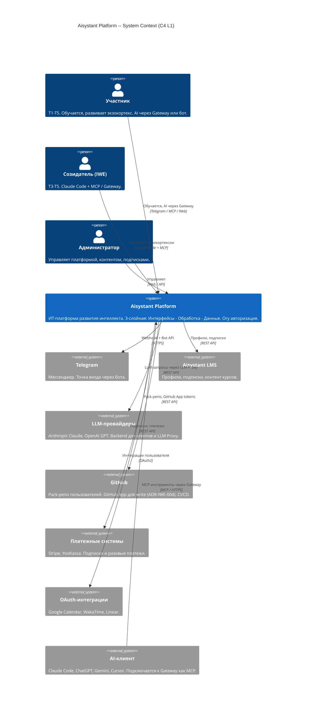
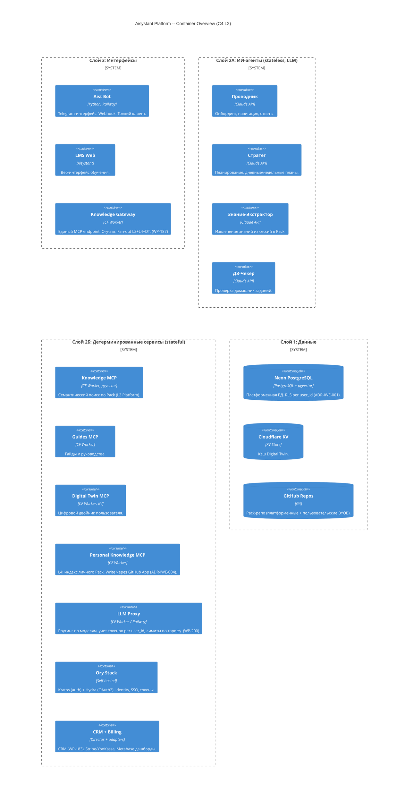
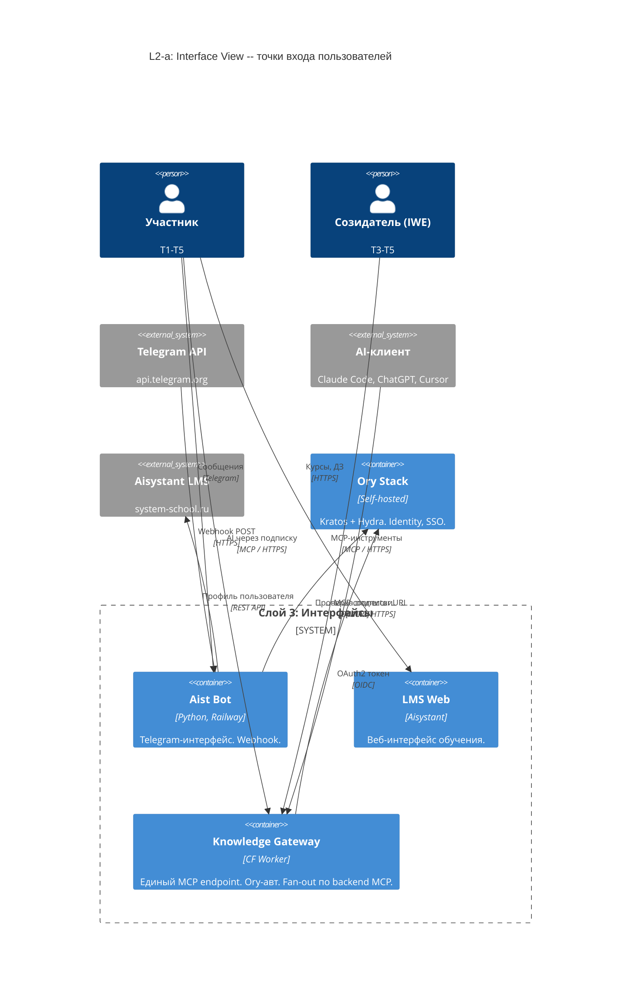
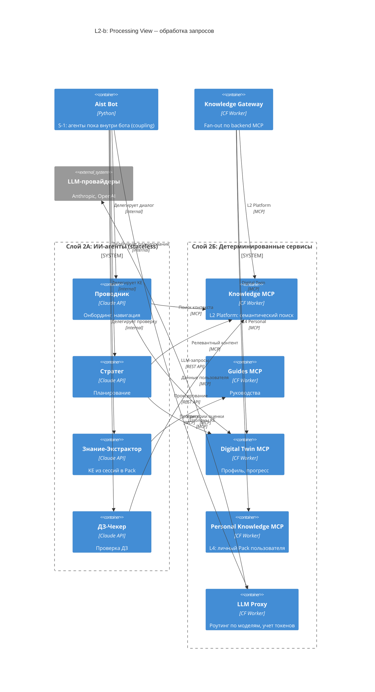
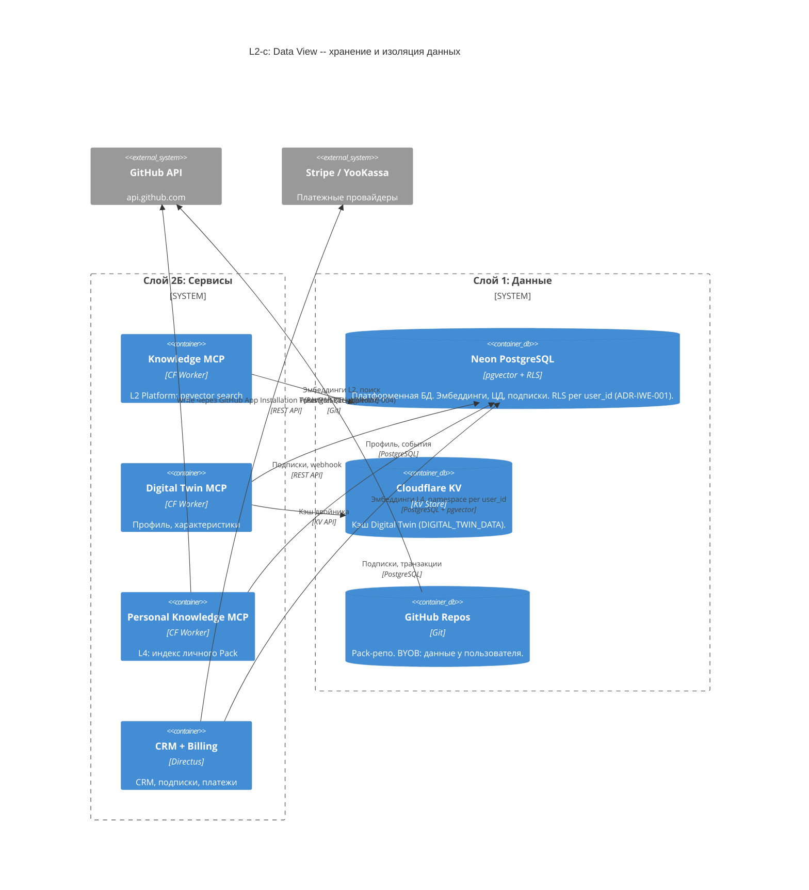

# C4-диаграммы платформы Aisystant

> **Source-of-truth архитектуры:** [DP.ARCH.001](../../PACK-digital-platform/pack/digital-platform/02-domain-entities/DP.ARCH.001-platform-architecture.md)
> **Deployment as-is:** [deployment.md](deployment.md)
> **ADR:** [ADR-IWE-001](../../Data-Stores/ADR-IWE-001-embeddings-isolation.md), [ADR-IWE-003](../../System-Implementations/ADR-IWE-003-gateway-backend-interface.md), [ADR-IWE-004](../../System-Implementations/ADR-IWE-004-github-app-installation-token.md)

---

<b>C4 L1 -- Системный контекст</b>

Показывает: кто использует платформу и с какими внешними системами она взаимодействует.

**Изменения 3 апреля vs 1 апреля:**
- Ory перенесён внутрь платформы (self-hosted, не external)
- Добавлены платежные системы (Stripe/YooKassa)
- LLM-провайдеры обобщены (Anthropic + OpenAI, через LLM Proxy)
- Участник тоже имеет доступ к AI через Gateway (не только Созидатель)

---

<b>C4 L2 -- Overview (карта контейнеров)</b>

Все контейнеры платформы, сгруппированные по слоям. Без потоков данных (потоки -- в view-диаграммах ниже).

### Маппинг контейнеров - слои DP.ARCH.001

| Слой | Зона | Контейнеры | Характер |
|------|------|-----------|---------|
| 3. Интерфейсы | -- | Aist Bot, LMS Web, **Knowledge Gateway** | Тонкие клиенты, без бизнес-логики |
| 2. Обработка | А: ИИ-системы | Проводник, Стратег, KE, ДЗ-Чекер | Stateless, LLM, высокая стоимость |
| 2. Обработка | Б: Детерминированные | Knowledge MCP, Guides MCP, DT MCP, **Personal Knowledge MCP**, **LLM Proxy**, Ory Stack, **CRM + Billing** | Stateful, точное тестирование |
| 1. Данные | -- | Neon PostgreSQL, Cloudflare KV, GitHub Repos | Персистентность |

**Изменения 3 апреля vs 1 апреля:**
- Knowledge Gateway: `⏳ будущее` -> **active** (WP-187 done, E2E verified)
- Personal Knowledge MCP: `⏳ будущее` -> **active** (write через GitHub App, ADR-IWE-004)
- **+LLM Proxy** (WP-200): роутинг, учет токенов, Ory-авт.
- **+CRM + Billing** (WP-183 Phase 3): Directus, Stripe/YooKassa
- Ory: "cloud" -> **self-hosted** (Kratos + Hydra)
- FSM MCP удален (FSM внутри бота, не отдельный сервис)
- Gateway перенесен в Слой 3 (интерфейс, точка входа для AI-клиентов)

---

<b>C4 L2-a -- Interface View (как пользователь входит)</b>

**Ключевое:** Gateway -- единая точка входа для всех AI-клиентов. Бот -- для Telegram. LMS Web -- legacy-интерфейс.

---

<b>C4 L2-b -- Processing View (как обрабатывается запрос)</b>

**Ключевое:**
- **S-1 (coupling):** агенты пока физически внутри бота. Путь к разделению -- серверные агенты через Gateway (WP-201)
- **LLM Proxy:** все LLM-вызовы через единую точку (не напрямую в Anthropic)
- **Gateway fan-out:** ADR-IWE-003 формализует контракт backend MCP (initialize, tools/list, tools/call, search)

---

<b>C4 L2-c -- Data View (где хранятся данные)</b>

**Ключевое:**
- **ADR-IWE-001:** multi-tenant изоляция эмбеддингов через namespace per user_id в pgvector (до 30k пользователей, затем Qdrant)
- **ADR-IWE-004:** запись в Pack пользователя через GitHub App Installation Token (1h TTL, минимальный scope contents:write)
- **BYOB:** данные пользователя в его GitHub-репо, эмбеддинги на платформе (Neon с RLS)

---

<b>Сигналы для WP-73</b>

> Полный маппинг C4 L2 -> deployment nodes: [deployment.md](deployment.md)

| ID | Компонент | Описание | Тип | Статус |
|----|-----------|---------|-----|--------|
| **S-1** | Aist Bot | ИИ-агенты (Слой 2А) и Telegram-интерфейс (Слой 3) в одном сервисе. Нельзя масштабировать независимо. | Coupling 2А+3 | Открыт. Путь: серверные агенты через Gateway (WP-201) |
| **S-2** | Aist Bot -> Neon | Бот напрямую пишет в Neon, минуя MCP. Интерфейс не должен знать о хранении. | Bypass слоя 2Б | Открыт |
| ~~**S-3**~~ | ~~AI-клиент -> MCP~~ | ~~Нет единой точки авторизации~~ | ~~Отсутствие Gateway~~ | **Resolved 3 апр:** Knowledge Gateway live (WP-187) |
| **S-4** | Langfuse | Observability только localhost, нет трейсинга в prod. | Наблюдаемость | Открыт |
| **S-5** | LLM-вызовы | Каждый агент/бот держит свой API-ключ Anthropic. Нет единого учета токенов, роутинга, лимитов. | Отсутствие LLM Proxy | Открыт. Путь: WP-200 |

---

<b>История</b>

| Дата | Фаза | Изменение |
|------|------|---------|
| 2026-04-01 | Ф0 | Концепция, акторы L1, контейнеры L2 по 3 слоям, ключевой инвариант IWE |
| 2026-04-01 | Ф1 | C4 L1 System Context в Mermaid |
| 2026-04-01 | Ф2 | C4 L2 Containers в Mermaid |
| 2026-04-01 | Ф3 | Ревью: сигналы S-1..S-4, перекрестные ссылки с deployment.md |
| 2026-04-03 | Ф4 | Актуализация по ADR-IWE-001/003/004, WP-187 done, WP-200/183. View-диаграммы (L2-a/b/c). S-3 resolved, S-5 новый |

