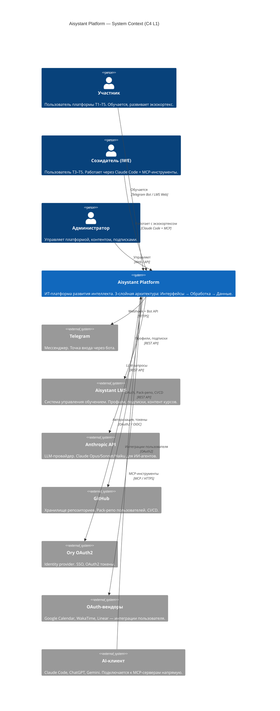

# C4-диаграммы платформы Aisystant

> **Source-of-truth архитектуры:** [DP.ARCH.001](../../PACK-digital-platform/pack/digital-platform/02-domain-entities/DP.ARCH.001-platform-architecture.md)
> **Deployment as-is:** [deployment.md](deployment.md)
> **Deployment маппинг:** [deployment.md](deployment.md) (WP-159 Ф3 — C4 L2 → deployment nodes)

---

<b>C4 L1 — Системный контекст</b>

Показывает: кто использует платформу и с какими внешними системами она взаимодействует.

**Ключевой инвариант IWE (DP.ARCH.001 §2):**
- Интерфейс не знает, какой агент обрабатывает запрос
- ИИ-система не знает, какой UI у пользователя
- Данные пользователя (User-space) изолированы от Platform-space

---

<b>C4 L2 — Контейнеры платформы</b>

Показывает: контейнеры внутри платформы и их взаимодействие. Структурировано по 3 слоям DP.ARCH.001.

```mermaid
C4Container
    title Aisystant Platform — Containers (C4 L2)

    Person(user_learner, "Участник", "T1–T5")
    Person(user_iwe, "Созидатель (IWE)", "T3–T5, Claude Code")

    System_Ext(telegram, "Telegram API", "api.telegram.org")
    System_Ext(anthropic, "Anthropic API", "api.anthropic.com")
    System_Ext(lms, "Aisystant LMS", "system-school.ru")
    System_Ext(ory, "Ory OAuth2", "ory.sh cloud")
    System_Ext(github_oauth, "GitHub OAuth", "github.com")

    System_Boundary(platform, "Aisystant Platform") {

        %% ── СЛОЙ 3: ИНТЕРФЕЙСЫ ─────────────────────────────────
        Container(aist_bot, "Aist Bot", "Python, Railway", "Telegram-интерфейс. Webhook. ⚠️ S-1: рассуждение+действие coupled.")
        Container(lms_web, "LMS Web", "Aisystant", "Веб-интерфейс для обучения. Внешняя система, точка входа.")

        %% ── СЛОЙ 2А: ИИ-СИСТЕМЫ (stateless, LLM) ───────────────
        Container(agent_guide, "Проводник", "Claude API, stateless", "Онбординг, навигация, ответы на вопросы.")
        Container(agent_strategist, "Стратег", "Claude API, stateless", "Планирование, дневные/недельные планы (WP-196).")
        Container(agent_ke, "Знание-Экстрактор", "Claude API, stateless", "Извлечение знаний из сессий в Pack.")
        Container(agent_checker, "ДЗ-Чекер", "Claude API, stateless", "Проверка домашних заданий (WP-171).")

        %% ── СЛОЙ 2Б: ДЕТЕРМИНИРОВАННЫЕ СИСТЕМЫ (stateful, MCP) ──
        Container(knowledge_mcp, "Knowledge MCP", "CF Worker, pgvector", "Семантический поиск по Pack (5400+ doc). knowledge-mcp.aisystant.workers.dev")
        Container(guides_mcp, "Guides MCP", "CF Worker", "Гайды и руководства. guides-mcp.aisystant.workers.dev")
        Container(dt_mcp, "Digital Twin MCP", "CF Worker, KV", "Цифровой двойник пользователя. dt.aisystant.workers.dev")
        Container(fsm_mcp, "FSM MCP", "CF Worker", "FSM конечный автомат (рассуждение/действие). fsm-mcp.aisystant.workers.dev")
        Container(ory_svc, "Ory OAuth2 Svc", "Ory cloud", "Identity, SSO, токены. Точка авторизации всех MCP.")

        %% ── СЛОЙ 1: ДАННЫЕ ──────────────────────────────────────
        ContainerDb(neon_db, "Neon PostgreSQL", "PostgreSQL + pgvector", "Платформенная БД. Пользователи, события, подписки, эмбеддинги.")
        ContainerDb(neon_kv, "Cloudflare KV", "KV Store", "Данные цифрового двойника (DIGITAL_TWIN_DATA).")
        ContainerDb(github_repos, "GitHub Repos", "Git", "Pack-репо (платформенные + пользовательские). User-space BYOB.")

        %% ── БУДУЩИЕ (WP-187, WP-189) ────────────────────────────
        Container(knowledge_gw, "Knowledge Gateway", "CF Worker ⏳", "Объединяет L2 Platform + L4 Personal MCP. Единый endpoint с Ory-авт. (WP-187)")
        Container(l4_mcp, "L4 Personal MCP", "BYOB ⏳", "Индексация личного Pack пользователя. Данные на ресурсах пользователя. (WP-187)")
    }

    %% Пользователи → интерфейсы
    Rel(user_learner, aist_bot, "Сообщения", "Telegram")
    Rel(user_learner, lms_web, "Курсы, ДЗ", "HTTPS")
    Rel(user_iwe, knowledge_mcp, "Поиск знаний", "MCP / HTTPS")
    Rel(user_iwe, dt_mcp, "Цифровой двойник", "MCP / HTTPS")
    Rel(user_iwe, guides_mcp, "Руководства", "MCP / HTTPS")

    %% Telegram → бот
    Rel(telegram, aist_bot, "Webhook POST /telegram", "HTTPS")

    %% Бот → ИИ-агенты (слой 2А)
    Rel(aist_bot, agent_guide, "Делегирует диалог", "internal")
    Rel(aist_bot, agent_strategist, "Делегирует планирование", "internal")
    Rel(aist_bot, agent_ke, "Делегирует извлечение знаний", "internal")
    Rel(aist_bot, agent_checker, "Делегирует проверку ДЗ", "internal")

    %% Бот/агенты → внешние API
    Rel(aist_bot, anthropic, "LLM-запросы", "REST API")
    Rel(aist_bot, lms, "Профиль, подписка", "REST API")
    Rel(aist_bot, ory_svc, "OAuth токены", "OAuth2")

    %% Агенты → MCP-сервисы (слой 2Б)
    Rel(agent_guide, knowledge_mcp, "Поиск контекста", "MCP")
    Rel(agent_guide, dt_mcp, "Данные пользователя", "MCP")
    Rel(agent_strategist, dt_mcp, "Прогресс, активность", "MCP")
    Rel(agent_strategist, knowledge_mcp, "Релевантный контент", "MCP")
    Rel(agent_ke, guides_mcp, "Шаблоны KE", "MCP")
    Rel(agent_checker, knowledge_mcp, "Критерии оценки", "MCP")

    %% MCP → данные (слой 1)
    Rel(knowledge_mcp, neon_db, "Эмбеддинги, поиск", "PostgreSQL")
    Rel(guides_mcp, neon_db, "Гайды", "PostgreSQL")
    Rel(dt_mcp, neon_db, "Профиль, события", "PostgreSQL")
    Rel(dt_mcp, neon_kv, "Кэш двойника", "KV API")
    Rel(dt_mcp, ory_svc, "Верификация токена", "OIDC")

    %% Данные → GitHub
    Rel(neon_db, github_repos, "Pack синхронизация", "GitHub API")

    %% Будущие потоки (WP-187)
    Rel(user_iwe, knowledge_gw, "⏳ единый MCP-endpoint", "MCP")
    Rel(knowledge_gw, knowledge_mcp, "⏳ L2 Platform", "MCP")
    Rel(knowledge_gw, l4_mcp, "⏳ L4 Personal (fan-out)", "MCP")
    Rel(knowledge_gw, ory_svc, "⏳ авторизация", "OAuth2")
    Rel(l4_mcp, github_repos, "⏳ индексация Pack пользователя", "GitHub API")
```

### Маппинг контейнеров → слои DP.ARCH.001

| Слой | Зона | Контейнеры | Характер |
|------|------|-----------|---------|
| 3. Интерфейсы | — | Aist Bot, LMS Web | Тонкие клиенты, без бизнес-логики |
| 2. Обработка | А: ИИ-системы | Проводник, Стратег, KE, ДЗ-Чекер | Stateless, LLM, высокая стоимость |
| 2. Обработка | Б: Детерминированные | Knowledge MCP, Guides MCP, Digital Twin MCP, FSM MCP, Ory | Stateful, точное тестирование |
| 1. Данные | — | Neon PostgreSQL, Cloudflare KV, GitHub Repos | Персистентность |

### Сигналы для WP-73

> Полный маппинг C4 L2 → deployment nodes + детали сигналов: [deployment.md](deployment.md) §Сигналы

| ID | Компонент | Описание | Тип | Рекомендация |
|----|-----------|---------|-----|-------------|
| **S-1** | Aist Bot (Railway) | ИИ-агенты (Слой 2А) и Telegram-интерфейс (Слой 3) физически в одном сервисе. Нельзя масштабировать/заменять независимо. | Coupling слоёв 2А+3 | Выделить Agent Runtime в отдельный сервис. Бот → тонкий клиент. |
| **S-2** | Aist Bot → Neon | Бот напрямую пишет в Neon (Слой 1), минуя Слой 2Б (MCP). Интерфейс не должен знать о хранении данных. | Bypass слоя 2Б | Доступ к данным только через MCP. Прямой DATABASE_URL — только у Workers. |
| **S-3** | AI-клиент → MCP | AI-клиент подключается к каждому MCP напрямую (3 URL). Нет единой точки авторизации. | Отсутствие Gateway | Knowledge Gateway (WP-187): один URL, Ory-авт., fan-out. |
| **S-4** | Langfuse | Observability только локально (docker-compose). Нет трейсинга в prod. | Наблюдаемость | Задеплоить Langfuse на Hetzner/cloud. Подключить prod. |

---

## История

| Дата | Фаза | Изменение |
|------|------|---------|
| 2026-04-01 | Ф0 | Концепция, акторы L1, контейнеры L2 по 3 слоям, ключевой инвариант IWE |
| 2026-04-01 | Ф1 | C4 L1 System Context в Mermaid |
| 2026-04-01 | Ф2 | C4 L2 Containers в Mermaid |
| 2026-04-01 | Ф3 | Ревью: сигналы S-1..S-4, перекрёстные ссылки с deployment.md |
