```mermaid
graph TB
    %% ─── Пользователи / клиенты ───────────────────────────────
    subgraph USERS["Пользователи"]
        TG_USER["Участник\nTelegram"]
        AI_CLIENT["Созидатель IWE\n(Claude Code / GPT / Gemini)"]
        BROWSER["Браузер\n(LMS, Ory OAuth)"]
        PACK_REPO["GitHub репо\n(личный Pack)"]
    end

    %% ─── Telegram ──────────────────────────────────────────────
    subgraph TELEGRAM_INFRA["Telegram (внешний)"]
        TG_API["Telegram API\napi.telegram.org"]
    end

    %% ─── Railway — Слой 3 Интерфейсы ──────────────────────────
    subgraph RAILWAY["Railway (peaceful-vision)\n🟦 Слой 3: Интерфейсы + ⚠️ Слой 2А"]
        direction TB
        AIST_BOT["aist_me_bot\n[prod, new-architecture]\naistmebot-production.up.railway.app\n─────────────────────\nC4: Aist Bot\n🟦 Слой 3: Интерфейс (webhook)\n⚠️ Слой 2А: ИИ (Anthropic API, агенты)\n⚠️ S-1: COUPLING слоёв 3+2А"]
        PILOT_BOT["aist_pilot_bot\n[pilot]\nC4: Aist Bot (pilot)\n🟦 Слой 3: Интерфейс"]
        PG_DEV["Postgres\n[dev/internal]\n🟩 Слой 1: Данные"]
    end

    subgraph RAILWAY_OLD["Railway (lavish-delight) ⛔"]
        AIST_BOT_OLD["aist_bot (legacy)\n⛔ не трогать"]
    end

    %% ─── Cloudflare Workers — Слой 2Б Детерминированные ───────
    subgraph CF["Cloudflare Workers\n🟨 Слой 2Б: Детерминированные + MCP"]
        direction TB

        subgraph CF_IWE["iwe/* (платформенные)"]
            KNOWLEDGE_MCP["knowledge-mcp\nknowledge-mcp.aisystant.workers.dev/mcp\nC4: Knowledge MCP\n🟨 Слой 2Б: pgvector поиск (5400+ doc)"]
            GUIDES_MCP["guides-mcp\nguides-mcp.aisystant.workers.dev/mcp\nC4: Guides MCP\n🟨 Слой 2Б: руководства"]
            DT_MCP["digital-twin-mcp\ndigital-twin-mcp.aisystant.workers.dev/mcp\nC4: Digital Twin MCP\n🟨 Слой 2Б: цифровой двойник"]
            DT_MCP_ORY["digital-twin-mcp (ory-auth)\ndigital-twin-mcp-ory-auth.aisystant.workers.dev\nC4: Digital Twin MCP (тест Ory)\n🟨 Слой 2Б"]
            FSM_MCP["fsm-mcp\nfsm-mcp.aisystant.workers.dev/mcp\nC4: FSM MCP\n🟨 Слой 2Б: конечный автомат"]
        end
    end

    %% ─── Neon / AWS — Слой 1 Данные ────────────────────────────
    subgraph NEON["Neon (AWS EU-Central-1)\n🟩 Слой 1: Данные"]
        NEON_DB["aist_bot PostgreSQL\nep-dark-hall-ag8bo8lf-pooler\n.c-2.eu-central-1.aws.neon.tech\nC4: Neon PostgreSQL\n🟩 Слой 1: users, events,\nsubscriptions, embeddings"]
    end

    subgraph CF_KV["Cloudflare KV\n🟩 Слой 1: Данные"]
        NEON_KV["KV: DIGITAL_TWIN_DATA\n640bc613...b5800897\nC4: Cloudflare KV\n🟩 Слой 1: кэш двойника"]
    end

    %% ─── Ory — Инфра ───────────────────────────────────────────
    subgraph ORY["Ory (ory.sh cloud)\n🟪 Инфра: Identity"]
        ORY_SVC["Ory OAuth2\nC4: Ory OAuth2 Svc\n🟪 Инфра: SSO, токены, OIDC"]
    end

    %% ─── Aisystant LMS (внешняя) ───────────────────────────────
    subgraph LMS["Aisystant LMS (внешняя)\n⬜ За границей C4 L2"]
        LMS_PROD["aisystant.system-school.ru\n/api/profile/find-by-tg\n/api/subscriptions/active-subscription"]
        LMS_STAGING["188.73.162.175:8064\n[Hetzner, staging]"]
    end

    %% ─── GitHub ─────────────────────────────────────────────────
    subgraph GITHUB["GitHub\n🟩 Слой 1: Данные (Pack-репо)"]
        GITHUB_REPOS["Pack-репо\n(платформенные + BYOB)\nC4: GitHub Repos\n🟩 Слой 1: User-space"]
        GITHUB_OAUTH["GitHub OAuth App"]
        GITHUB_ACTIONS["GitHub Actions\n(CI/CD)"]
    end

    %% ─── Внешние OAuth-вендоры ──────────────────────────────────
    subgraph OAUTH_VENDORS["ext/* (вендорские интеграции)"]
        GOOGLE_CAL["Google Calendar"]
        WAKATIME["WakaTime"]
        LINEAR["Linear"]
        ANTHROPIC["Anthropic API\napi.anthropic.com\n(LLM-провайдер)"]
    end

    %% ─── Langfuse (local) ───────────────────────────────────────
    subgraph LANGFUSE["Langfuse (localhost, docker-compose)\n🟪 Инфра: Observability"]
        LANGFUSE_UI["Langfuse UI :3000"]
        LANGFUSE_DB["langfuse-db :5433"]
    end

    %% ─── Будущие компоненты ─────────────────────────────────────
    subgraph FUTURE["⏳ Будущие компоненты (WP-187/189)"]
        KNOWLEDGE_GW["Knowledge Gateway\nC4: Knowledge Gateway\n🟦 Слой 3: единый MCP-endpoint\nОбъединяет L2+L4, Ory-авт."]
        L4_MCP["L4 Personal MCP\nC4: L4 Personal MCP\n🟨 Слой 2Б: индексация Pack"]
        QDRANT["Qdrant\n🟩 Слой 1: векторы"]
    end

    %% ─── ПОТОКИ ─────────────────────────────────────────────────

    %% Telegram webhook → бот
    TG_USER -->|"сообщение"| TG_API
    TG_API -->|"POST /telegram\n(webhook)"| AIST_BOT

    %% Бот → MCP-сервисы (кросс-слой: 3+2А → 2Б)
    AIST_BOT -->|"KNOWLEDGE_MCP_URL"| KNOWLEDGE_MCP
    AIST_BOT -->|"DIGITAL_TWIN_MCP_URL"| DT_MCP

    %% Бот → Neon (кросс-слой: 3+2А → 1)
    AIST_BOT -->|"DATABASE_URL (pooler)"| NEON_DB

    %% Бот → LMS (кросс-слой: 3 → внешняя)
    AIST_BOT -->|"find-by-tg / subscription"| LMS_PROD

    %% Бот → Anthropic (кросс-слой: 2А → LLM)
    AIST_BOT -->|"ANTHROPIC_API_KEY"| ANTHROPIC

    %% Workers → Neon (2Б → 1)
    KNOWLEDGE_MCP -->|"DATABASE_URL"| NEON_DB
    GUIDES_MCP -->|"DATABASE_URL"| NEON_DB
    DT_MCP -->|"DATABASE_URL"| NEON_DB
    DT_MCP_ORY -->|"DATABASE_URL"| NEON_DB

    %% Workers → KV (2Б → 1)
    DT_MCP -->|"KV binding"| NEON_KV

    %% Workers → Ory (2Б → инфра)
    DT_MCP_ORY -->|"ORY_PROJECT_URL"| ORY_SVC

    %% AI-клиент → MCP (прямой, без Gateway)
    AI_CLIENT -->|"MCP connector\n(прямой, без Gateway)"| KNOWLEDGE_MCP
    AI_CLIENT -->|"MCP connector"| GUIDES_MCP
    AI_CLIENT -->|"MCP connector"| DT_MCP

    %% OAuth: браузер ↔ бот ↔ вендоры
    BROWSER -->|"OAuth redirect"| AIST_BOT
    GITHUB_OAUTH -->|"OAuth token"| AIST_BOT
    GOOGLE_CAL -->|"OAuth token"| AIST_BOT
    WAKATIME -->|"OAuth token"| AIST_BOT
    LINEAR -->|"OAuth token"| AIST_BOT

    %% CI/CD
    GITHUB_ACTIONS -->|"deploy"| RAILWAY

    %% Observability
    AIST_BOT -.->|"traces (TODO)"| LANGFUSE_UI
    LANGFUSE_UI --- LANGFUSE_DB

    %% Будущие потоки (WP-187/189)
    AI_CLIENT -.->|"⏳ единый MCP-endpoint"| KNOWLEDGE_GW
    KNOWLEDGE_GW -.->|"L2 Platform"| KNOWLEDGE_MCP
    KNOWLEDGE_GW -.->|"L4 Personal"| L4_MCP
    KNOWLEDGE_GW -.->|"Ory авторизация"| ORY_SVC
    PACK_REPO -.->|"⏳ GitHub OAuth → индексация"| L4_MCP
    L4_MCP -.->|"эмбеддинги"| QDRANT

    %% Pilot bot
    TG_API -.->|"webhook (pilot)"| PILOT_BOT
    PILOT_BOT -.->|"DB"| PG_DEV
```

# Deployment-диаграмма инфраструктуры Aisystant

> **Статус:** Ф3 (C4 L2 маппинг + слои) | **Дата:** 2026-04-01
> **РП:** WP-159 | **Связанные:** WP-73, WP-158, WP-187, WP-189
> **C4 L2 source:** [c4-platform.md](../../C.IT-Platform/C2.IT-Platform/C2.2.Architecture/Stack-and-Infrastructure/c4-platform.md)
>
> Диаграмма показывает **физическое размещение** контейнеров C4 L2 по deployment nodes.
> Каждый компонент аннотирован слоем DP.ARCH.001 (Интерфейсы / ИИ-системы / Детерминированные / Данные).

---

<b>Deployment-диаграмма (as-is + C4 L2 маппинг)</b>

---

<b>Маппинг C4 L2 контейнеров → Deployment Nodes</b>

### Слой 3: Интерфейсы

| C4 контейнер | Deployment node | URL | Статус |
|-------------|----------------|-----|--------|
| **Aist Bot** (prod) | Railway `peaceful-vision` | `aistmebot-production.up.railway.app` | ✅ active |
| **Aist Bot** (pilot) | Railway `peaceful-vision` | — | ✅ active |
| **LMS Web** | Hetzner / внешний | `aisystant.system-school.ru` | ✅ active (внешняя) |
| **Knowledge Gateway** ⏳ | Cloudflare Workers (план) | — | WP-187 Ф1 |

### Слой 2А: ИИ-системы (stateless, LLM)

| C4 контейнер | Deployment node | Замечание |
|-------------|----------------|-----------|
| **Проводник** | ⚠️ Railway (внутри aist_me_bot) | S-1: coupled со Слоем 3 |
| **Стратег** | ⚠️ Railway (внутри aist_me_bot) | S-1: coupled |
| **Знание-Экстрактор** | ⚠️ Railway (внутри aist_me_bot) | S-1: coupled |
| **ДЗ-Чекер** | ⚠️ Railway (внутри aist_me_bot) | S-1: coupled |

> **⚠️ Все ИИ-агенты физически живут внутри бота.** Это — главный сигнал S-1.

### Слой 2Б: Детерминированные системы (stateful, MCP)

| C4 контейнер | Deployment node | URL | MCP namespace |
|-------------|----------------|-----|--------------|
| **Knowledge MCP** | Cloudflare Workers | `knowledge-mcp.aisystant.workers.dev/mcp` | `iwe/knowledge` |
| **Guides MCP** | Cloudflare Workers | `guides-mcp.aisystant.workers.dev/mcp` | `iwe/guides` |
| **Digital Twin MCP** | Cloudflare Workers | `digital-twin-mcp.aisystant.workers.dev/mcp` | `iwe/digital-twin` |
| **FSM MCP** | Cloudflare Workers | `fsm-mcp.aisystant.workers.dev/mcp` | `iwe/fsm` |
| **Ory OAuth2 Svc** | Ory.sh cloud | ORY_PROJECT_URL (secret) | — |
| **L4 Personal MCP** ⏳ | BYOB (план) | — | `user/knowledge` |

### Слой 1: Данные

| C4 контейнер | Deployment node | Endpoint |
|-------------|----------------|----------|
| **Neon PostgreSQL** | Neon / AWS EU-Central-1 | `ep-dark-hall-...neon.tech:5432` (pooler) |
| **Cloudflare KV** | Cloudflare | KV id: `640bc613...` |
| **GitHub Repos** | GitHub | Pack-репо (платформенные + BYOB) |
| **Qdrant** ⏳ | не задеплоен | — |

---

<b>MCP Namespace зоны (WP-189)</b>

| Зона | Назначение | Компоненты | Deployment |
|------|-----------|-----------|------------|
| `iwe/*` | Платформенные сервисы | knowledge-mcp, guides-mcp, digital-twin-mcp, fsm-mcp | Cloudflare Workers |
| `user/*` | Пользовательские MCP | L4 Personal MCP ⏳ | BYOB (план) |
| `ext/*` | Вендорские интеграции | Google Calendar, WakaTime, Linear | OAuth через бота |

---

<b>Сигналы в WP-73</b>

| ID | Фаза | Компонент | Описание | Тип | Рекомендация |
|----|------|-----------|----------|-----|-------------|
| **S-1** | Ф1 | `aist_me_bot` (Railway) | ИИ-агенты (Слой 2А: Проводник, Стратег, KE, ДЗ-Чекер) и Telegram-интерфейс (Слой 3) физически в одном Railway service. Нельзя масштабировать/заменять независимо. | Coupling слоёв 2А+3 | Выделить Agent Runtime в отдельный сервис (CF Worker / отдельный Railway service). Бот → тонкий клиент с webhook + маршрутизация. |
| **S-2** | Ф3 | `aist_me_bot` → Neon | Бот напрямую пишет в Neon (Слой 1), минуя Слой 2Б (MCP). Нарушает принцип: интерфейс не должен знать о хранении данных. | Bypass слоя 2Б | Бот должен обращаться к данным только через MCP-сервисы (digital-twin-mcp, knowledge-mcp). Прямой DATABASE_URL — только у Workers. |
| **S-3** | Ф3 | AI-клиент → MCP | AI-клиент (Claude/GPT) подключается к каждому MCP напрямую (3 URL). Нет единой точки авторизации. При добавлении нового MCP — ручная перенастройка клиента. | Отсутствие Gateway | Knowledge Gateway (WP-187) решит: один URL, Ory-авт., fan-out на все MCP. |
| **S-4** | Ф3 | Langfuse | Observability только локально (docker-compose). Нет трейсинга в prod. | Наблюдаемость | Задеплоить Langfuse на Hetzner или использовать cloud-версию. Подключить aist_me_bot в prod. |

---

<b>Что НЕ отражено (требует уточнения)</b>

- [ ] Pilot bot (`aist_pilot_bot`) — URL и точки подключения неизвестны
- [ ] Ory — cloud (ory.sh) или self-hosted на Hetzner? (на диаграмме — cloud)
- [ ] `blog.aisystant.com` — статус неизвестен
- [x] ~~C4 L2 маппинг~~ — **сделано** (Ф3)
- [x] ~~MCP namespace зоны~~ — **сделано** (WP-189)
- [ ] Qdrant, Knowledge Gateway, L4 MCP — будущие, показаны пунктиром

---

<b>Критерии готовности (WP-159)</b>

- [x] Все deployment nodes: Railway, Hetzner, Neon, GitHub, Cloudflare Workers, Ory
- [x] Маппинг сервисов → deployment nodes
- [x] Маппинг контейнеров C4 L2 (WP-158) → deployment nodes
- [x] Явная разметка слоёв (Интерфейсы / ИИ-системы / Детерминированные / Данные)
- [x] Сети, домены, webhook-маршруты
- [x] Вендорские интерфейсы: MCP connector URL, GitHub OAuth, Ory OIDC, Neon conn string
- [x] Путь Pack: GitHub repo → (⏳ L4 MCP → Gateway →) AI-клиент
- [x] MCP namespace зоны: iwe/*, user/*, ext/*
- [x] Coupling-аннотации: S-1, S-2, S-3, S-4
- [x] Формат Mermaid, рендерится в GitHub
- [ ] Согласовано с WP-73 (Ф4 — передать сигналы)

---

## История

| Дата | Фаза | Изменение |
|------|------|-----------|
| 2026-04-01 | Ф0 | Концепция, цели, фазы |
| 2026-04-01 | Ф1 | Инвентаризация инфраструктуры |
| 2026-04-01 | Ф2 | Черновая as-is диаграмма |
| 2026-04-01 | Ф3 | Маппинг C4 L2 → deployment nodes, слои DP.ARCH.001, MCP namespace, coupling-аннотации (S-1..S-4) |
