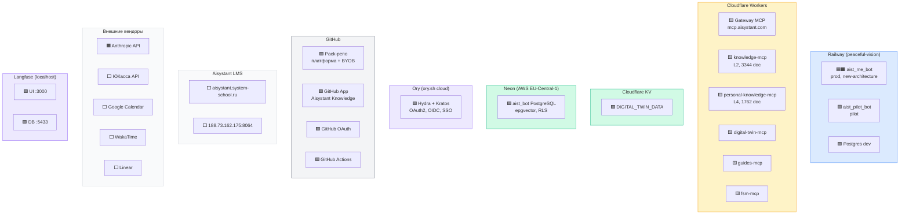
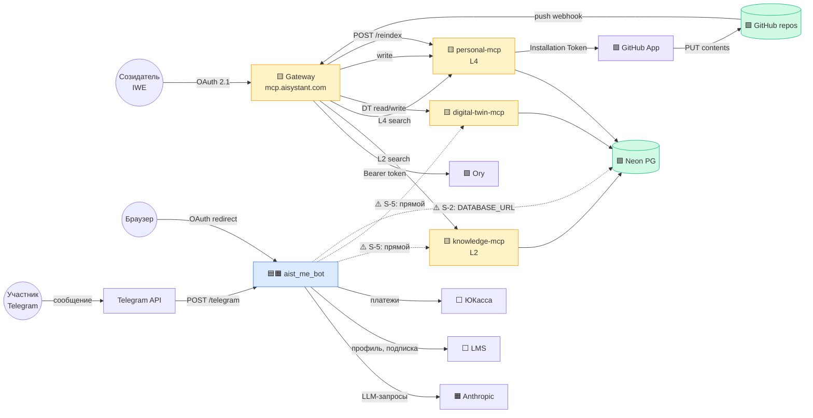
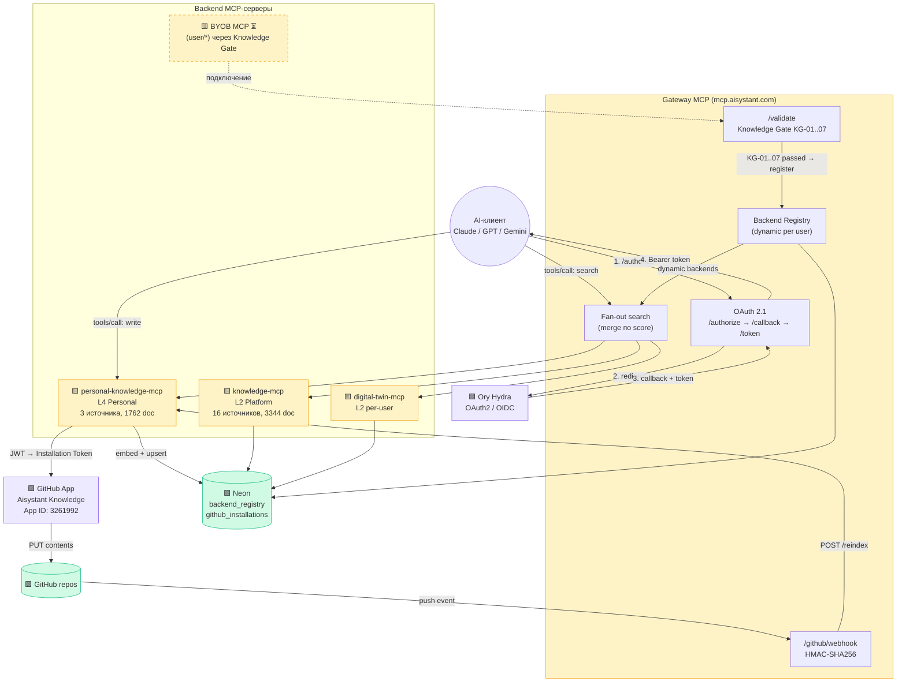

# Deployment-диаграмма инфраструктуры Aisystant

> **Статус:** актуально | **Дата:** 2026-04-03
> **РП:** WP-159 | **Связанные:** WP-73, WP-158, WP-187, WP-189
> **C4 L2 source:** [c4-platform.md](c4-platform.md)
>
> Диаграмма показывает **физическое размещение** контейнеров C4 L2 по deployment nodes.
> Цветовое кодирование слоёв DP.ARCH.001: 🟦 Интерфейсы / 🟧 ИИ-системы / 🟨 Детерминированные / 🟩 Данные / 🟪 Инфра.
>
> **Три диаграммы:** D1 (где что живёт), D2 (как данные текут), D3 (Gateway детально).

---

<b>D1: Deployment nodes -- где что живёт</b>

**Легенда узлов:**

| Узел | Полное имя | URL | C4 контейнер | Слой |
|------|-----------|-----|-------------|------|
| BOT | aist_me_bot | `aistmebot-production.up.railway.app` | Aist Bot | 🟦 Слой 3 + ⚠️ 🟧 Слой 2А |
| PILOT | aist_pilot_bot | — | Aist Bot (pilot) | 🟦 Слой 3 |
| GW | Gateway MCP | `mcp.aisystant.com` | Knowledge Gateway | 🟨 Слой 2Б |
| KN | knowledge-mcp v3.4 | `knowledge-mcp.aisystant.workers.dev/mcp` | Knowledge MCP (L2) | 🟨 Слой 2Б |
| PKN | personal-knowledge-mcp v1.0 | `personal-knowledge-mcp.aisystant.workers.dev` | Personal Knowledge MCP (L4) | 🟨 Слой 2Б |
| DT | digital-twin-mcp | `digital-twin-mcp.aisystant.workers.dev/mcp` | Digital Twin MCP | 🟨 Слой 2Б |
| GU | guides-mcp | `guides-mcp.aisystant.workers.dev/mcp` | Guides MCP | 🟨 Слой 2Б |
| FSM | fsm-mcp | `fsm-mcp.aisystant.workers.dev/mcp` | FSM MCP | 🟨 Слой 2Б |
| DB | Neon PostgreSQL | `ep-dark-hall-ag8bo8lf-pooler...neon.tech` | Neon PostgreSQL | 🟩 Слой 1 |
| KV | Cloudflare KV | KV id: `640bc613...` | Cloudflare KV | 🟩 Слой 1 |
| REPOS | GitHub Repos | — | GitHub Repos | 🟩 Слой 1 |
| APP | GitHub App | App ID: 3261992 | — | 🟪 Инфра |
| ORY_SVC | Ory Hydra + Kratos | ORY_PROJECT_URL (secret) | Ory OAuth2 Svc | 🟪 Инфра |
| ANTH | Anthropic API | `api.anthropic.com` | — | 🟧 Внешний LLM |
| YOOKASSA | ЮКасса | API магазин 1317530 | — | ⬜ Внешний |

---

<b>D2: Потоки данных -- как данные текут</b>

**Ключевые потоки:**

| Поток | Путь | Протокол |
|-------|------|----------|
| **Telegram → бот** | TG User → TG API → `POST /telegram` → aist_me_bot | HTTPS webhook |
| **IWE → Gateway** | Созидатель → `mcp.aisystant.com` (OAuth 2.1) → fan-out L2+L4+DT | MCP / HTTPS |
| **Write** | Gateway → personal-mcp → GitHub App (JWT→Installation Token) → GitHub Contents API | HTTPS |
| **Reindex** | GitHub push → Gateway `/github/webhook` (HMAC) → personal-mcp `/reindex` → Neon | HTTPS webhook |
| **Бот → LLM** | aist_me_bot → `api.anthropic.com` | REST API |
| **Бот → LMS** | aist_me_bot → `aisystant.system-school.ru` (find-by-tg, subscription) | REST API |
| **Бот → ЮКасса** | aist_me_bot → ЮКасса API (создание платежа, webhook) | REST API |
| ⚠️ **Бот → MCP (прямой)** | aist_me_bot → knowledge-mcp, digital-twin-mcp (минуя Gateway) | S-5 |
| ⚠️ **Бот → Neon (прямой)** | aist_me_bot → Neon DATABASE_URL | S-2 |

---

<b>D3: Gateway -- детальная архитектура</b>

**Компоненты Gateway:**

| Компонент | Endpoint | Назначение |
|-----------|---------|-----------|
| OAuth 2.1 | `/authorize`, `/callback`, `/token`, `/.well-known/oauth-authorization-server` | Авторизация через Ory Hydra (implicit + authorization_code) |
| Fan-out search | `tools/call: search` | Unified search по всем backend (merge по score) |
| Knowledge Gate | `POST /validate` | Проверки KG-01..07 при подключении нового backend |
| Webhook handler | `POST /github/webhook` | HMAC-SHA256, push → reindex changed files |
| Backend Registry | Neon `backend_registry` | Динамические backend per user (RLS по user_id) |

**Репозитории Gateway:**

| Репо | Назначение |
|------|-----------|
| `aisystant/gateway-mcp` | Gateway: fan-out, auth, validate, webhook |
| `aisystant/personal-knowledge-mcp` | L4: search, write, reindex |
| `aisystant/knowledge-mcp-template` | BYOB шаблон для T4-пользователей |

---

<b>Маппинг C4 L2 контейнеров → Deployment Nodes</b>

### Слой 3: Интерфейсы

| C4 контейнер | Deployment node | URL | Статус |
|-------------|----------------|-----|--------|
| **Aist Bot** (prod) | Railway `peaceful-vision` | `aistmebot-production.up.railway.app` | ✅ active |
| **Aist Bot** (pilot) | Railway `peaceful-vision` | — | ✅ active |
| **LMS Web** | Hetzner / внешний | `aisystant.system-school.ru` | ✅ active (внешняя) |

### Слой 2А: ИИ-системы (stateless, LLM)

| C4 контейнер | Deployment node | Замечание |
|-------------|----------------|-----------|
| **Проводник** | ⚠️ Railway (внутри aist_me_bot) | S-1: coupled со Слоем 3 |
| **Стратег** | ⚠️ Railway (внутри aist_me_bot) | S-1: coupled |
| **Знание-Экстрактор** | ⚠️ Railway (внутри aist_me_bot) | S-1: coupled |
| **ДЗ-Чекер** | ⚠️ Railway (внутри aist_me_bot) | S-1: coupled |

> **⚠️ Все ИИ-агенты физически живут внутри бота.** Это -- главный сигнал S-1.

### Слой 2Б: Детерминированные системы (stateful, MCP)

| C4 контейнер | Deployment node | URL | MCP namespace |
|-------------|----------------|-----|--------------|
| **Knowledge Gateway** | Cloudflare Workers | `mcp.aisystant.com` | — (агрегатор) |
| **Knowledge MCP** (L2) | Cloudflare Workers | `knowledge-mcp.aisystant.workers.dev/mcp` | `iwe/knowledge` |
| **Personal Knowledge MCP** (L4) | Cloudflare Workers | `personal-knowledge-mcp.aisystant.workers.dev` | `user/knowledge` |
| **Guides MCP** | Cloudflare Workers | `guides-mcp.aisystant.workers.dev/mcp` | `iwe/guides` |
| **Digital Twin MCP** | Cloudflare Workers | `digital-twin-mcp.aisystant.workers.dev/mcp` | `iwe/digital-twin` |
| **FSM MCP** | Cloudflare Workers | `fsm-mcp.aisystant.workers.dev/mcp` | `iwe/fsm` |
| **Ory OAuth2 Svc** | Ory.sh cloud | ORY_PROJECT_URL (secret) | — |

### Слой 1: Данные

| C4 контейнер | Deployment node | Endpoint |
|-------------|----------------|----------|
| **Neon PostgreSQL** | Neon / AWS EU-Central-1 | `ep-dark-hall-...neon.tech:5432` (pooler) |
| **Cloudflare KV** | Cloudflare | KV id: `640bc613...` |
| **GitHub Repos** | GitHub | Pack-репо (платформенные + BYOB) |
| **backend_registry** | Neon | Таблица с RLS по user_id |
| **github_installations** | Neon | Таблица с RLS по user_id |

---

<b>MCP Namespace зоны (WP-189)</b>

| Зона | Назначение | Компоненты | Deployment |
|------|-----------|-----------|------------|
| `iwe/*` | Платформенные сервисы | knowledge-mcp, guides-mcp, digital-twin-mcp, fsm-mcp | Cloudflare Workers |
| `user/*` | Пользовательские MCP | personal-knowledge-mcp (L4), BYOB через Knowledge Gate ⏳ | Cloudflare Workers |
| `ext/*` | Вендорские интеграции | Google Calendar, WakaTime, Linear | OAuth через бота |

---

<b>Сигналы в WP-73</b>

| ID | Фаза | Компонент | Описание | Тип | Статус | Рекомендация |
|----|------|-----------|----------|-----|--------|-------------|
| **S-1** | Ф1 | `aist_me_bot` (Railway) | ИИ-агенты (Слой 2А: Проводник, Стратег, KE, ДЗ-Чекер) и Telegram-интерфейс (Слой 3) физически в одном Railway service. Нельзя масштабировать/заменять независимо. | Coupling слоёв 2А+3 | ⚠️ открыт | Выделить Agent Runtime в отдельный сервис. Бот → тонкий клиент. |
| **S-2** | Ф3 | `aist_me_bot` → Neon | Бот напрямую пишет в Neon (Слой 1), минуя Слой 2Б (MCP). Интерфейс не должен знать о хранении данных. | Bypass слоя 2Б | ⚠️ открыт | Доступ к данным только через MCP. Прямой DATABASE_URL -- только у Workers. |
| **S-3** | Ф3 | AI-клиент → MCP | AI-клиент подключался к каждому MCP напрямую (3 URL). Не было единой точки авторизации. | Отсутствие Gateway | ✅ **закрыт** (3 апр) | Gateway live: `mcp.aisystant.com`, OAuth 2.1 через Ory, fan-out по 3 backend. |
| **S-4** | Ф3 | Langfuse | Observability только локально (docker-compose). Нет трейсинга в prod. | Наблюдаемость | ⚠️ открыт | Задеплоить Langfuse на Hetzner/cloud. Подключить prod. |
| **S-5** | Ф5 | `aist_me_bot` → MCP | Бот обращается к knowledge-mcp и digital-twin-mcp напрямую (env `KNOWLEDGE_MCP_URL`, `DIGITAL_TWIN_MCP_URL`), минуя Gateway. При появлении Ory-авторизации на Gateway бот должен перейти на единый endpoint. | Бот минует Gateway | ⚠️ открыт (blocked: бот+Ory) | После интеграции бот+Ory: заменить прямые URL на `mcp.aisystant.com` с Bearer token. |

---

<b>Что НЕ отражено (требует уточнения)</b>

- [ ] Pilot bot (`aist_pilot_bot`) -- URL и точки подключения неизвестны
- [ ] Ory -- cloud (ory.sh) или self-hosted на Hetzner? (на диаграмме -- cloud)
- [ ] `blog.aisystant.com` -- статус неизвестен
- [ ] **LLM-прокси** (WP-200) -- будущий: роутинг по моделям, учёт токенов per user_id
- [ ] **Directus + Metabase** (WP-183) -- будущие UI-слои CRM поверх Neon
- [ ] **Серверные агенты** (WP-201) -- будущие: серверные агенты через Gateway
- [ ] Qdrant -- будущее хранилище векторов (замена pgvector при >30к doc)
- [ ] BYOB MCP (user/*) -- спецификация готова (ADR-IWE-003), шаблон готов, но T4-пользователей пока нет
- [x] ~~Knowledge Gateway~~ -- **live** (3 апр)
- [x] ~~L4 Personal MCP~~ -- **live** (2 апр)
- [x] ~~C4 L2 маппинг~~ -- **сделано** (Ф3)
- [x] ~~MCP namespace зоны~~ -- **сделано** (WP-189)

---

<b>Критерии готовности (WP-159)</b>

- [x] Все deployment nodes: Railway, Hetzner, Neon, GitHub, Cloudflare Workers, Ory
- [x] Маппинг сервисов → deployment nodes
- [x] Маппинг контейнеров C4 L2 (WP-158) → deployment nodes
- [x] Явная разметка слоёв (Интерфейсы / ИИ-системы / Детерминированные / Данные)
- [x] Сети, домены, webhook-маршруты
- [x] Вендорские интерфейсы: MCP connector URL, GitHub OAuth, Ory OIDC, Neon conn string
- [x] Путь Pack: GitHub repo → L4 MCP → Gateway → AI-клиент
- [x] MCP namespace зоны: iwe/*, user/*, ext/*
- [x] Coupling-аннотации: S-1, S-2, S-3 (закрыт), S-4, S-5 (новый)
- [x] Формат Mermaid, рендерится в GitHub
- [x] Согласовано с WP-73 (сигналы S-1..S-5)

---

## История

| Дата | Фаза | Изменение |
|------|------|-----------|
| 2026-04-01 | Ф0 | Концепция, цели, фазы |
| 2026-04-01 | Ф1 | Инвентаризация инфраструктуры |
| 2026-04-01 | Ф2 | Черновая as-is диаграмма |
| 2026-04-01 | Ф3 | Маппинг C4 L2 → deployment nodes, слои DP.ARCH.001, MCP namespace, coupling-аннотации (S-1..S-4) |
| 2026-04-01 | Ф4 | Сигналы S-1..S-4 переданы в WP-73 (Design input). Все критерии готовности закрыты. |
| 2026-04-03 | Ф5 | **Актуализация после Gateway launch.** 3 диаграммы (D1/D2/D3) вместо одной монолитной. Gateway и personal-knowledge-mcp из «будущего» в «текущее». Новые компоненты: GitHub App, Backend Registry, Knowledge Gate, ЮКасса. knowledge-mcp разделён на L2 (3344 doc) + L4 (1762 doc). S-3 закрыт. Новый сигнал S-5 (бот минует Gateway). Цветовое кодирование по слоям. Короткие подписи + легенда-таблица. |
