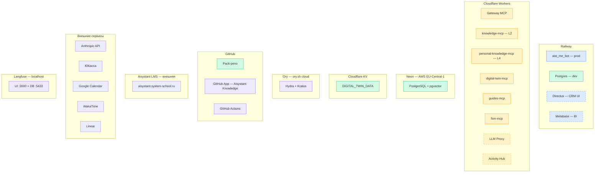
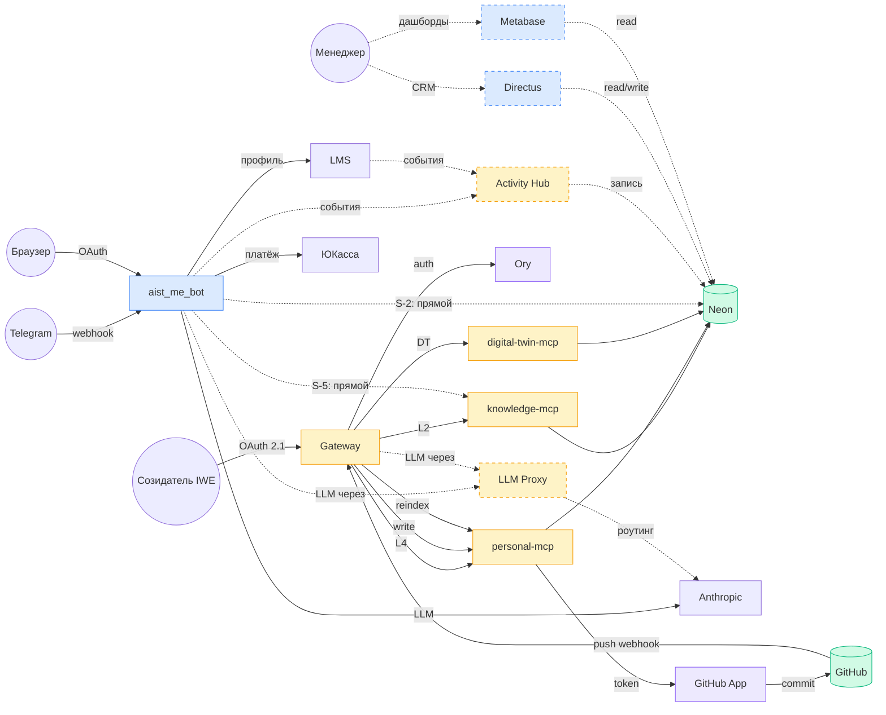
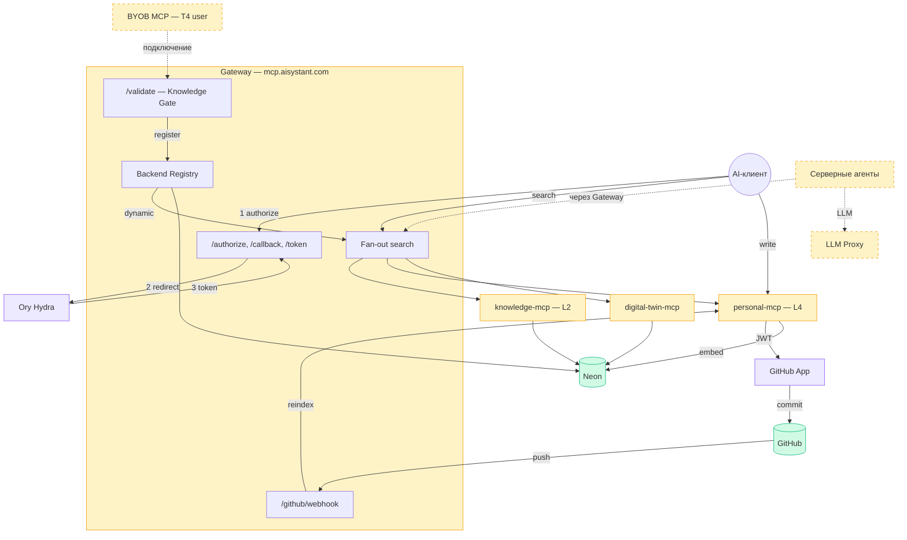

# Deployment-диаграмма инфраструктуры Aisystant

> **Актуально на:** 2026-04-03
> **РП:** WP-159 | **Связанные:** WP-73, WP-158, WP-187, WP-189
> **C4 L2 source:** [c4-platform.md](c4-platform.md)
>
> Физическое размещение контейнеров C4 L2 по deployment nodes.
> Цвет = слой DP.ARCH.001: синий = Интерфейсы, оранжевый = ИИ, жёлтый = Детерминированные, зелёный = Данные, фиолетовый = Инфра.
> Пунктир = планируемые компоненты (ближайшие РП).

---

<b>D1: Deployment nodes</b>

| Узел | URL / endpoint | Слой | Статус |
|------|---------------|------|--------|
| aist_me_bot | `aistmebot-production.up.railway.app` | Интерфейсы + ИИ (S-1) | live |
| Gateway MCP | `mcp.aisystant.com` | Детерминированные | live |
| knowledge-mcp | `knowledge-mcp.aisystant.workers.dev/mcp` | Детерминированные | live |
| personal-knowledge-mcp | `personal-knowledge-mcp.aisystant.workers.dev` | Детерминированные | live |
| digital-twin-mcp | `digital-twin-mcp.aisystant.workers.dev/mcp` | Детерминированные | live |
| guides-mcp | `guides-mcp.aisystant.workers.dev/mcp` | Детерминированные | live |
| fsm-mcp | `fsm-mcp.aisystant.workers.dev/mcp` | Детерминированные | live |
| Neon PostgreSQL | Neon pooler (AWS EU-Central-1) | Данные | live |
| Cloudflare KV | KV namespace (secret) | Данные | live |
| GitHub App | Aisystant Knowledge | Инфра | live |
| Ory Hydra + Kratos | `auth.system-school.ru` (ory.sh cloud) | Инфра | live |
| Anthropic API | `api.anthropic.com` | Внешний LLM | live |
| ЮКасса | ЮКасса API | Внешний | live |
| Langfuse | localhost:3000 | Инфра | live (только dev) |
| **Directus** | Railway (план) | **Интерфейсы** | **WP-183** |
| **Metabase** | Railway (план) | **Интерфейсы** | **WP-183** |
| **LLM Proxy** | CF Workers (план) | **Детерминированные** | **WP-200** |
| **Activity Hub** | CF Workers (план) | **Детерминированные** | **WP-109** |

---

<b>D2: Потоки данных</b>

| Поток | Путь | Протокол | Статус |
|-------|------|----------|--------|
| Telegram --> бот | TG User --> TG API --> `POST /telegram` --> aist_me_bot | HTTPS webhook | live |
| IWE --> Gateway | Созидатель --> `mcp.aisystant.com` (OAuth 2.1) --> fan-out L2+L4+DT | MCP / HTTPS | live |
| Write | Gateway --> personal-mcp --> GitHub App (Installation Token) --> GitHub API | HTTPS | live |
| Reindex | GitHub push --> Gateway `/github/webhook` (HMAC) --> personal-mcp `/reindex` --> Neon | HTTPS webhook | live |
| Бот --> LLM | aist_me_bot --> `api.anthropic.com` | REST API | live |
| Бот --> LMS | aist_me_bot --> `aisystant.system-school.ru` | REST API | live |
| Бот --> ЮКасса | aist_me_bot --> ЮКасса API | REST API | live |
| S-5 Бот --> MCP | aist_me_bot --> knowledge-mcp, digital-twin-mcp напрямую | S-5 | live (сигнал) |
| S-2 Бот --> Neon | aist_me_bot --> Neon DATABASE_URL напрямую | S-2 | live (сигнал) |
| Бот/LMS --> Activity Hub | события --> Activity Hub --> Neon | REST API | **WP-109** |
| Бот/Gateway --> LLM Proxy | запросы --> роутинг по моделям --> Anthropic (и др.) | REST API | **WP-200** |
| Менеджер --> Directus | CRM UI --> Neon (crm.*, finance.*) | HTTPS | **WP-183** |
| Менеджер --> Metabase | BI дашборды --> Neon (read-only) | HTTPS | **WP-183** |

---

<b>D3: Gateway</b>

| Endpoint | Назначение |
|---------|-----------|
| `GET /authorize` --> `GET /callback` --> `POST /token` | OAuth 2.1 через Ory Hydra |
| `GET /.well-known/oauth-authorization-server` | MCP client discovery |
| `POST /mcp` (tools/list, tools/call) | MCP JSON-RPC: unified search, write, DT |
| `POST /validate` | Knowledge Gate (KG-01..07) для подключения backend |
| `POST /github/webhook` | HMAC-SHA256: push --> reindex changed files |
| `GET /health` | Healthcheck |

| Репозиторий | Назначение |
|------------|-----------|
| `aisystant/gateway-mcp` | Gateway: fan-out, auth, validate, webhook |
| `aisystant/personal-knowledge-mcp` | L4: search, write, reindex |
| `aisystant/knowledge-mcp-template` | BYOB шаблон для T4-пользователей |

---

<b>Маппинг C4 L2 --> Deployment</b>

### Интерфейсы (Слой 3)

| C4 контейнер | Deployment | URL | Статус |
|-------------|-----------|-----|--------|
| Aist Bot (prod) | Railway | `aistmebot-production.up.railway.app` | live |
| LMS Web | Hetzner / внешний | `aisystant.system-school.ru` | live |
| Directus (CRM) | Railway | — | WP-183 |
| Metabase (BI) | Railway | — | WP-183 |

### ИИ-системы (Слой 2А, stateless)

| C4 контейнер | Deployment | Статус |
|-------------|-----------|--------|
| Проводник | Railway (внутри бота) | live, S-1: coupled |
| Стратег | Railway (внутри бота) | live, S-1: coupled |
| Знание-Экстрактор | Railway (внутри бота) | live, S-1: coupled |
| ДЗ-Чекер | Railway (внутри бота) | live, S-1: coupled |
| Серверные агенты | Gateway / CF Workers | WP-201 |

### Детерминированные (Слой 2Б, stateful MCP)

| C4 контейнер | Deployment | URL | Namespace | Статус |
|-------------|-----------|-----|-----------|--------|
| Knowledge Gateway | Cloudflare Workers | `mcp.aisystant.com` | агрегатор | live |
| Knowledge MCP (L2) | Cloudflare Workers | `knowledge-mcp.aisystant.workers.dev/mcp` | `iwe/knowledge` | live |
| Personal Knowledge MCP (L4) | Cloudflare Workers | `personal-knowledge-mcp.aisystant.workers.dev` | `user/knowledge` | live |
| Guides MCP | Cloudflare Workers | `guides-mcp.aisystant.workers.dev/mcp` | `iwe/guides` | live |
| Digital Twin MCP | Cloudflare Workers | `digital-twin-mcp.aisystant.workers.dev/mcp` | `iwe/digital-twin` | live |
| FSM MCP | Cloudflare Workers | `fsm-mcp.aisystant.workers.dev/mcp` | `iwe/fsm` | live |
| Ory OAuth2 | ory.sh cloud | `auth.system-school.ru` | — | live |
| LLM Proxy | CF Workers / Railway | — | — | WP-200 |
| Activity Hub | CF Workers | — | — | WP-109 |

### Данные (Слой 1)

| C4 контейнер | Deployment | Endpoint | Статус |
|-------------|-----------|----------|--------|
| Neon PostgreSQL | Neon / AWS EU-Central-1 | pooler endpoint (secret) | live |
| Cloudflare KV | Cloudflare | KV namespace (secret) | live |
| GitHub Repos | GitHub | Pack-репо (платформенные + BYOB) | live |
| Qdrant | — | — | WP-187 (при >30к doc) |

---

<b>MCP Namespace (WP-189)</b>

| Зона | Назначение | Компоненты | Deployment |
|------|-----------|-----------|------------|
| `iwe/*` | Платформенные | knowledge-mcp, guides-mcp, digital-twin-mcp, fsm-mcp | Cloudflare Workers |
| `user/*` | Пользовательские | personal-knowledge-mcp (L4), BYOB через Knowledge Gate | Cloudflare Workers |
| `ext/*` | Вендорские | Google Calendar, WakaTime, Linear | OAuth через бота |

---

<b>Сигналы в WP-73</b>

| ID | Компонент | Описание | Тип | Статус |
|----|-----------|----------|-----|--------|
| **S-1** | aist_me_bot | ИИ-агенты (Проводник, Стратег, KE, ДЗ-Чекер) и Telegram-интерфейс в одном Railway service. Нельзя масштабировать независимо. | Coupling 2А+3 | открыт |
| **S-2** | aist_me_bot --> Neon | Бот пишет в Neon напрямую (DATABASE_URL), минуя MCP. | Bypass 2Б | открыт |
| **S-3** | AI-клиент --> MCP | AI-клиент подключается через Gateway (`mcp.aisystant.com`), OAuth 2.1, fan-out. | Gateway | **закрыт** |
| **S-4** | Langfuse | Observability только локально. Нет трейсинга в prod. | Наблюдаемость | открыт |
| **S-5** | aist_me_bot --> MCP | Бот обращается к knowledge-mcp и digital-twin-mcp напрямую, минуя Gateway. | Бот минует Gateway | открыт (blocked: бот+Ory) |

---

<b>Критерии готовности (WP-159)</b>

- [x] Все deployment nodes: Railway, Neon, GitHub, Cloudflare Workers, Ory, Langfuse
- [x] Маппинг сервисов --> deployment nodes (live + planned)
- [x] Маппинг C4 L2 (WP-158) --> deployment nodes
- [x] Разметка слоёв DP.ARCH.001 (цветовое кодирование)
- [x] Домены, webhook-маршруты, OAuth endpoints
- [x] Путь Pack: GitHub --> L4 MCP --> Gateway --> AI-клиент
- [x] MCP namespace: iwe/*, user/*, ext/*
- [x] Coupling-аннотации: S-1..S-5
- [x] Планируемые компоненты пунктиром: LLM Proxy, Activity Hub, Directus, Metabase, серверные агенты
- [x] Mermaid, рендерится в GitHub
- [x] Согласовано с WP-73

